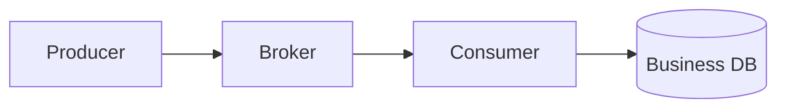

# 消息队列架构设计

> 前置：[03-缓存架构设计](./03-缓存架构设计.md)
> 后续：[05-数据库扩展与读写分离](./05-数据库扩展与读写分离.md)、[06-分布式一致性与CAP](./06-分布式一致性与CAP.md)
> 目标：从 Go 后端视角掌握消息可靠投递、幂等消费、顺序与延迟边界，以及可观测的故障恢复。
## 1. 定位与学习分层

消息队列不是“让系统更高级”的装饰。它主要解决三类问题：

- **异步**：把不需要阻塞用户响应的工作移出主请求。
- **解耦**：生产者发布业务事实，不直接依赖所有下游。
- **削峰**：短时突发先进入 Broker，消费者按可承受速率处理。

它同时引入新的成本：消息可能重复、延迟、乱序、积压，Broker 和消费者也会故障。

### 1.1 现在必须掌握

1. ACK 只能发生在业务成功或任务已可靠落盘之后。
2. 常见 Broker 提供的是 **at-least-once**，重复投递是正常现象。
3. 消费幂等必须和业务写放进同一个本地事务。
4. DB 与 MQ 的双写用 transactional outbox 收口。
5. Confirm、持久化、DLQ 都不能单独等价为“不丢消息”。

### 1.2 面试阶段再深化

- Kafka 分区与消费者组。
- RabbitMQ quorum queue、publisher confirm 和 mandatory return。
- 局部顺序、延迟消息、重试队列和毒消息。
- Outbox、Inbox 与“恰好一次业务效果”的条件。

### 1.3 生产阶段必须补齐

- 消息 schema 演进和兼容策略。
- 积压处置、容量预算、故障演练和数据对账。
- Broker 多副本、跨可用区部署、RPO/RTO。
- 发布与消费链路的 trace、lag、失败率和告警。

## 2. 核心不变量

设计 MQ 链路时，先写下必须始终成立的业务条件。

以“订单创建后扣库存”为例：

- 同一个订单最多成功扣一次库存。
- 库存不足时订单不能进入可支付状态。
- 订单已经创建，就不能永久漏掉库存处理任务。
- 消息重复、服务重启、网络超时后，上述条件仍成立。

由此得到工程规则：

| 不变量 | 机制 |
|---|---|
| 业务写和待发布事件不能只成功一半 | 业务表 + Outbox 同一本地事务 |
| 同一消息不能重复改变业务状态 | Inbox 唯一键 + 业务更新同一本地事务 |
| 发布成功但状态未更新会重复 | 接受重复，消费者必须幂等 |
| 消费失败不能先 ACK | 成功提交事务后才 ACK |
| 核心状态不能只存在 MQ | DB 是业务事实源，MQ 传播事件 |

不要把“绝不重复”和“绝不丢失”当作一句配置可以实现的目标。正确目标是：在明确的故障假设下，允许重复投递，但业务结果可验证且能收敛。

## 3. 什么时候用，什么时候不用

### 3.1 适合使用

- 通知、搜索索引、审计、统计等可异步下游。
- 突发写流量明显高于数据库可持续处理能力。
- 一个业务事件需要被多个独立下游订阅。
- 任务需要持久化重试、限速和失败隔离。
- 事件需要回放，或需要构建异步投影。

### 3.2 不适合直接使用

- 用户必须立即拿到最终业务结果。
- 操作必须在一个本地事务里原子完成。
- 简单单体且没有异步、削峰、回放需求。
- 团队没有运维、监控和故障恢复能力。
- 极低延迟读路径，例如短链跳转的主查找链路。

同步 RPC 能及时返回成功或失败，但**不等于跨服务强一致**；MQ 能形成最终一致流程，但**不等于一定比 RPC 慢或更可靠**。两者解决的是不同问题。

## 4. 选型维度

不要只背“某 MQ 是万级、某 MQ 是百万级”。吞吐取决于消息大小、批量、确认方式、副本数、磁盘、网络和业务处理耗时。

| 维度 | RabbitMQ | Kafka | RocketMQ | Redis Stream |
|---|---|---|---|---|
| 主要模型 | Exchange → Queue | 分区日志 | Topic → Queue | Stream + Consumer Group |
| 路由能力 | 强，direct/topic/fanout | 主要按 key 分区 | 业务消息能力丰富 | 较轻量 |
| 回放 | 较弱，ACK 后通常删除 | 强，按 offset 重放 | 支持保留与重投 | 支持范围读取 |
| 顺序范围 | 单队列交付；处理仍需限制并发 | 分区内 | 队列内 | Stream 内有序，组内处理可乱序 |
| 延迟消息 | TTL+DLX 或插件，均有边界 | 非原生定时器 | 原生能力较完整 | 非原生，通常另建调度 |
| 常见场景 | 业务任务、复杂路由 | 事件流、日志、回放 | 订单、事务与延迟事件 | 已有 Redis 的轻量任务 |

选型时依次问：

1. 是否需要回放和长时间保留？
2. 是否需要复杂路由、优先级、延迟或事务消息？
3. 顺序范围是全局、业务键，还是完全不要求？
4. 峰值与持续吞吐分别是多少？
5. 团队最熟悉、最容易托管和监控的是什么？
6. 故障时允许的 RPO、RTO 和最大积压时间是多少？

## 5. 端到端可靠性

可靠链路至少分成三个环节：



### 5.1 Producer → Broker

需要同时考虑：

- 业务 DB 与发布动作的双写窗口：用 Outbox。
- Broker 是否接收：用 publisher confirm。
- 消息是否路由到队列：RabbitMQ 使用 `mandatory` + return。
- 发布重试是否会重复：消息必须有稳定 `message_id`。
- 超时代表结果未知：先查询状态或安全重试，不能把超时等同于失败。

RabbitMQ 的 confirm 表示 Broker 接受了发布，不自动证明消息进入了目标队列。Exchange、Queue、Binding 配错时，只有 mandatory return 或替代交换机等机制才能发现不可路由消息。

### 5.2 Broker 存储

RabbitMQ 的生产配置通常包括：

- durable exchange；
- durable queue；
- persistent message；
- 多副本队列，优先理解 **quorum queue**；
- 跨可用区部署与磁盘告警。

经典 mirrored queue 已不应作为新系统主线。即使使用 quorum queue，也要定义多数副本不可用时是拒绝写，还是接受更高数据风险。

### 5.3 Consumer → Business DB

正确顺序是：

```text
收到消息
  → 开启本地事务
  → 写 Inbox 唯一键
  → 更新业务状态
  → 提交事务
  → ACK
```

如果事务失败，不 ACK。若错误可重试，进入有上限、带退避的重试链路；若是格式错误或永久业务错误，进入 DLQ 或业务失败流程。

绝不能把消息丢进内存线程池后立刻 ACK。进程在后台任务完成前崩溃时，消息会永久丢失。

## 6. 投递语义与故障窗口

| 时刻 | 故障 | 结果 | 正确处理 |
|---|---|---|---|
| 发布前 | 业务事务回滚 | 无业务、无消息 | 正常返回失败 |
| DB 已提交，尚未发布 | 进程崩溃 | 可能漏消息 | Outbox 后台继续发布 |
| Broker 已接收，生产者没收到确认 | 网络断开 | 结果未知 | 用同一 message_id 重试 |
| 消费事务已提交，ACK 前崩溃 | Broker 重投 | 重复消息 | Inbox 唯一键识别 |
| ACK 已发但连接断开 | Broker 可能重投 | 重复消息 | 仍靠幂等 |
| 消费一直失败 | 毒消息阻塞 | 队列积压 | 有界重试 + DLQ + 告警 |

At-most-once 可能丢但不重投；at-least-once 可能重复但尽量不漏；所谓 exactly-once 通常只在特定系统边界内成立。

工程上常追求“恰好一次业务效果”，前提是：

- 消息具有稳定唯一标识；
- 去重记录和业务变更在同一个原子事务；
- 外部副作用本身支持幂等键或状态查询；
- 对账任务能发现长期未收敛状态。

短信、邮件、第三方支付等外部系统不天然满足这些条件。

## 7. Outbox 与 Inbox 分离

### 7.1 Producer Outbox

Outbox 只负责记录“生产者需要发布什么”。

```sql
CREATE TABLE outbox_message (
    id             BIGINT PRIMARY KEY,
    message_id     VARCHAR(64) NOT NULL,
    event_type     VARCHAR(64) NOT NULL,
    aggregate_id   VARCHAR(64) NOT NULL,
    payload        JSON NOT NULL,
    status         VARCHAR(16) NOT NULL,
    attempts       INT NOT NULL DEFAULT 0,
    next_retry_at  DATETIME NOT NULL,
    claimed_until  DATETIME NULL,
    created_at     DATETIME NOT NULL,
    published_at   DATETIME NULL,
    UNIQUE KEY uk_message_id (message_id),
    KEY idx_publish (status, next_retry_at)
);
```

业务表和 Outbox 必须由同一个数据库连接、同一个本地事务提交。

### 7.2 Publisher Claim

多个发布器不能无保护地扫描同一批 `PENDING`。可使用：

- `SELECT ... FOR UPDATE SKIP LOCKED`；
- 原子更新为 `PUBLISHING` 并写 lease；
- 按稳定分片键划分扫描范围。

推荐状态机：

```text
PENDING → PUBLISHING → PUBLISHED
              └──────→ PENDING（超时或失败后重试）
```

Broker 确认后、更新 `PUBLISHED` 前崩溃，消息会再次发布。这个窗口无法靠普通 DB+MQ 双写完全消除，因此消费者幂等是必需条件。

### 7.3 Consumer Inbox

Inbox 位于消费者自己的数据库，不能让消费者跨服务更新生产者 Outbox。

```sql
CREATE TABLE inbox_message (
    consumer_name VARCHAR(64) NOT NULL,
    message_id    VARCHAR(64) NOT NULL,
    processed_at  DATETIME NOT NULL,
    PRIMARY KEY (consumer_name, message_id)
);
```

插入 Inbox 和业务更新必须处于同一个本地事务。Redis `SETNX` 可以作为减压手段，但不能替代这个原子边界。

## 8. RabbitMQ 拓扑与 Go 发布示例

下面示例使用 `github.com/rabbitmq/amqp091-go`，突出可靠性要点。生产代码还应处理重连、通道重建和并发发布序号关联。

```go
func declare(ch *amqp.Channel) error {
	if err := ch.ExchangeDeclare(
		"order.events", "topic", true, false, false, false, nil,
	); err != nil {
		return err
	}

	q, err := ch.QueueDeclare(
		"order.created.inventory", true, false, false, false,
		amqp.Table{"x-queue-type": "quorum"},
	)
	if err != nil {
		return err
	}
	return ch.QueueBind(q.Name, "order.created", "order.events", false, nil)
}
```

```go
func publishOne(ctx context.Context, ch *amqp.Channel, body []byte, id string) error {
	if err := ch.Confirm(false); err != nil {
		return err
	}
	confirms := ch.NotifyPublish(make(chan amqp.Confirmation, 1))
	returns := ch.NotifyReturn(make(chan amqp.Return, 1))

	err := ch.PublishWithContext(
		ctx,
		"order.events",
		"order.created",
		true,  // mandatory：不可路由时返回
		false,
		amqp.Publishing{
			DeliveryMode: amqp.Persistent,
			MessageId:    id,
			ContentType:  "application/json",
			Body:         body,
		},
	)
	if err != nil {
		return err
	}

	select {
	case c := <-confirms:
		if !c.Ack {
			return errors.New("broker nack")
		}
		// RabbitMQ 对 mandatory 不可路由消息会先 basic.return，再 confirm。
		// 单条在途时，confirm 后检查已缓冲的 return。
		select {
		case ret := <-returns:
			return fmt.Errorf("unroutable: %s", ret.ReplyText)
		default:
		}
		return nil
	case <-ctx.Done():
		return fmt.Errorf("publish outcome unknown: %w", ctx.Err())
	}
}
```

这个函数适合帮助理解“单通道、单条在途”的确认过程。生产发布器应复用 confirm 模式，按 delivery tag 关联多条消息，并把超时视为未知结果，而不是直接把 Outbox 标成失败。

## 9. Go 幂等消费示例

`autoAck=false`，业务事务成功后才 ACK：

```go
func consume(deliveries <-chan amqp.Delivery, db *sql.DB) {
	for d := range deliveries {
		err := handleOrderCreated(context.Background(), db, d.MessageId, d.Body)
		if err == nil {
			_ = d.Ack(false)
			continue
		}

		// false,false：不立即回原队列；由 DLX 进入有界重试或 DLQ。
		// 不要对未知异常无限 requeue=true，否则会形成热循环。
		_ = d.Nack(false, false)
	}
}
```

```go
func handleOrderCreated(ctx context.Context, db *sql.DB, messageID string, body []byte) error {
	var e OrderCreated
	if err := json.Unmarshal(body, &e); err != nil {
		return fmt.Errorf("invalid event: %w", err)
	}

	tx, err := db.BeginTx(ctx, nil)
	if err != nil {
		return err
	}
	defer tx.Rollback()

	res, err := tx.ExecContext(ctx, `
		INSERT IGNORE INTO inbox_message(consumer_name, message_id, processed_at)
		VALUES ('inventory', ?, NOW())`, messageID)
	if err != nil {
		return err
	}
	n, err := res.RowsAffected()
	if err != nil {
		return err
	}
	if n == 0 {
		return tx.Commit() // 已处理过，安全 ACK
	}

	res, err = tx.ExecContext(ctx, `
		UPDATE stock
		SET available = available - ?
		WHERE sku_id = ? AND available >= ?`, e.Qty, e.SKUID, e.Qty)
	if err != nil {
		return err
	}
	n, err = res.RowsAffected()
	if err != nil {
		return err
	}
	if n != 1 {
		return ErrInsufficientStock
	}

	return tx.Commit()
}
```

永久业务失败与瞬时基础设施失败应分开处理。库存不足应产生可审计的业务失败事件；数据库超时可进入退避重试。若要重新发布到 retry queue，必须先可靠发布并拿到 confirm，再 ACK 原消息。

## 10. 顺序消息的边界

### 10.1 只承诺局部顺序

全局单队列、单消费者吞吐很低。常见需求是同一 `order_id` 或 `link_id` 有序：

- Kafka：同一 key 进入同一 partition。
- RabbitMQ：应用计算 `hash(key) % N` 选择固定队列，或使用一致性哈希交换机。
- 每个分片限制并发，或使用 single-active-consumer。

“Broker 按顺序交付”不等于“业务按顺序完成”。多个消费者、异步线程池和不同处理耗时都可能改变完成顺序。

业务仍应使用状态机或版本号拒绝旧事件：

```sql
UPDATE orders
SET status = ?, version = version + 1
WHERE order_id = ? AND version = ? AND status = ?;
```

Kafka 增加 partition 后，默认 key 映射可能变化。需要跨扩容时点保持严格顺序的 key，必须设计稳定分区策略或迁移窗口。

## 11. 延迟消息不是精确定时器

典型场景：订单 30 分钟未支付取消、链接到期、失败退避。

| 实现 | 适合 | 限制 |
|---|---|---|
| RabbitMQ TTL + DLX | 延迟档位少、精度要求不高 | 可能受队头过期检查影响 |
| RabbitMQ 延迟插件 | 使用方便 | 依赖插件，需验证版本和容量 |
| RocketMQ 延迟消息 | 已使用 RocketMQ | 受产品语义与版本约束 |
| Redis ZSet / 时间轮 | 自建调度 | 需处理持久化、抢占、重试 |
| DB 扫描 `next_run_at` | 规模中小、易审计 | 扫描延迟和 DB 压力 |

无论采用哪种方式，触发时都必须重新读取当前业务状态：

```text
收到“订单到期”事件
  → 查询订单
  → 仅 PAID 前的 PENDING 状态允许取消
  → 条件更新状态
  → 幂等释放库存
```

消息只负责唤醒检查，不应被当成当前状态的唯一证明。

## 12. 重试、DLQ 与毒消息

不要使用无限 `requeue=true`。推荐链路：

```text
主队列
  → 第 1 次失败：5s retry queue
  → 第 2 次失败：30s retry queue
  → 第 3 次失败：5min retry queue
  → 超限：DLQ + 告警 + 人工/自动修复
```

消息头或业务表记录 attempt、last_error、next_retry_at。重试必须有：

- 最大次数；
- 指数退避与抖动；
- 错误分类；
- DLQ 回放工具；
- 回放前幂等验证。

DLQ 不是垃圾桶。必须有人负责告警、定位、修复、重放和关闭事件。

## 13. 积压与容量估算

粗略并发需求可用 Little 定律理解：

```text
并发数 ≈ 到达速率 × 单条平均处理时长 ÷ 目标利用率
```

例如 5000 msg/s、平均 50ms、目标利用率 70%，理论并发约为 `5000 × 0.05 / 0.7 ≈ 358`。这只是起点，还要压测数据库、网络和外部 API。

积压处理顺序：

1. 判断生产突增还是消费变慢。
2. 查看 CPU、GC、数据库连接池、慢 SQL 和下游错误。
3. 能水平扩容时增加消费者；Kafka 并行度受 partition 数限制。
4. 数据库已到瓶颈时，盲目扩消费者只会放大故障。
5. 暂停或降级非核心消费，优先保护核心队列。
6. 估算清空时间：`backlog / (consume_rate - produce_rate)`。

批量消费和 prefetch 可提升吞吐，但会增加单批失败范围、内存占用和尾延迟。不要通过提前 ACK 换吞吐。

## 14. 事件设计与演进

事件表达已经发生的业务事实，使用过去式命名：

```json
{
  "messageId": "01J...",
  "eventType": "LinkCreated",
  "schemaVersion": 2,
  "aggregateId": "link_123",
  "occurredAt": "2026-07-15T03:00:00Z",
  "traceId": "...",
  "payload": {}
}
```

设计原则：`messageId` 标识一次事件，业务幂等键可另用 `aggregateId + operation`；schema 只做兼容演进，新增字段优先可选并提供默认值。

大对象只传存储地址与校验值；消息不携带密钥或完整敏感数据；事件时间与处理时间分开；未知字段尽量忽略，未知版本应告警。

## 15. 观测与故障验收

### 15.1 必看指标

| 层级 | 指标 |
|---|---|
| Producer | 发布速率、confirm nack、return、超时、Outbox oldest age |
| Broker | ready/unacked 数、磁盘、内存、quorum 健康、连接数 |
| Consumer | 成功率、失败率、处理时长、重试率、DLQ 速率 |
| 业务 | PENDING 状态年龄、对账差异、重复命中数 |

只看 queue depth 不够。`oldest_message_age` 和端到端业务延迟通常更能说明用户影响。

### 15.2 上线前故障演练

- DB 提交后、发布前杀掉 Producer，Outbox 是否补发？
- Broker 收到后断开连接，重复发布是否只产生一次业务效果？
- 消费事务提交后、ACK 前杀掉 Consumer，是否只扣一次？
- 制造不可路由 routing key，告警是否触发？
- 制造毒消息，是否有界重试并进入 DLQ？
- 停止消费者 10 分钟，恢复后多久清空积压？
- Broker 少数副本故障时，系统行为是否符合预期？

### 15.3 验收标准

- 无消息时不会凭空改变业务状态。
- 同一消息投递 10 次，最终业务结果只生效一次。
- 任一进程在关键窗口崩溃，任务最终仍能被处理或进入可见失败态。
- DLQ、Outbox 堆积和长时间 PENDING 都有明确负责人和告警。

## 16. 短链服务中的 MQ

短链的跳转路径追求低延迟，不能同步等待 MQ：

```text
GET /{code} → 本地/Redis/DB 查映射 → 302
                         └→ 异步上报点击事件
```

适合 MQ 的部分：

- `LinkCreated`：异步构建搜索或分析投影。
- `LinkDisabled`：通知缓存失效和风控系统。
- `LinkExpired`：延迟唤醒后再次查 DB 状态，再决定失效。
- `LinkClicked`：高频点击日志进入事件流，批量落分析库。

核心不变量：

- 创建成功的短码映射必须先可靠写 DB，再对外返回。
- 禁用链接后，权威校验不能只依赖可能延迟的事件。
- 点击统计允许最终一致，跳转目标和禁用状态不允许由统计链路决定。

完整业务设计见 [08-短链服务设计](./08-短链服务设计.md)。

## 17. 复习清单

- [ ] 能解释异步、解耦、削峰以及不用 MQ 的场景。
- [ ] 能画出 Producer、Broker、Consumer 三段可靠性链路。
- [ ] 知道 confirm 与 mandatory return 分别证明什么。
- [ ] 知道 durable queue、persistent message、quorum queue 的边界。
- [ ] 能解释为什么业务成功后才能 ACK。
- [ ] 能写出 Inbox 唯一键与业务更新同事务的 Go 逻辑。
- [ ] 能解释 Outbox 发布成功后仍可能重复的崩溃窗口。
- [ ] 能区分 Outbox 与 Inbox，消费者不跨库更新 Producer 状态。
- [ ] 能说明局部顺序为什么仍需状态机或版本号。
- [ ] 知道 TTL+DLX 不是精确定时器。
- [ ] 能设计有界重试、DLQ、告警和回放流程。
- [ ] 能用 lag、oldest age、失败率和业务 PENDING 做验收。

下一章：[05-数据库扩展与读写分离](./05-数据库扩展与读写分离.md)。
