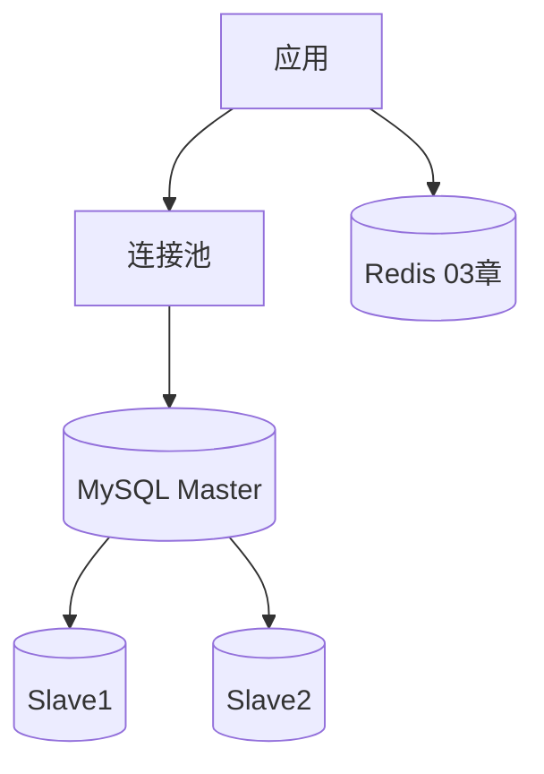
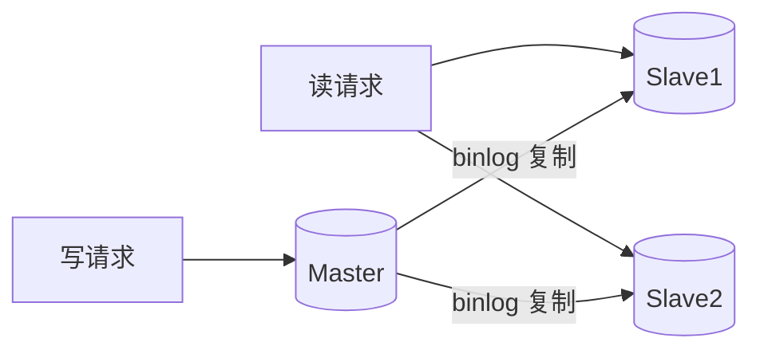
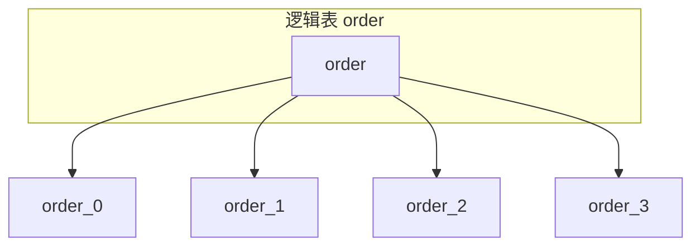
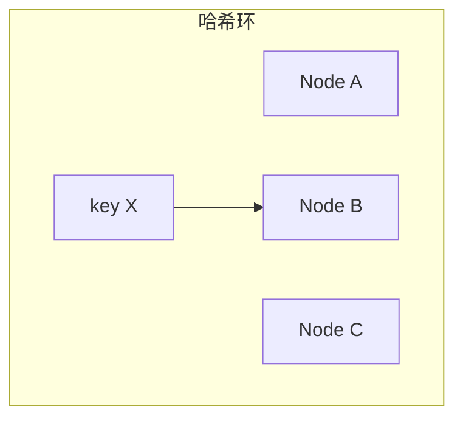
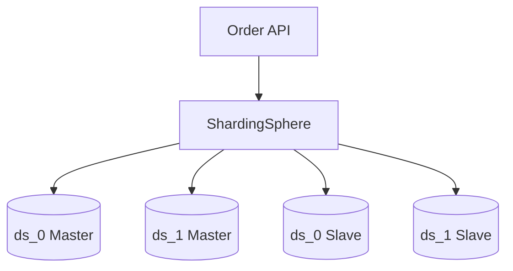
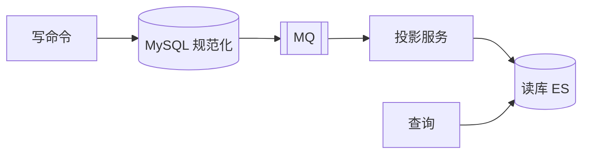
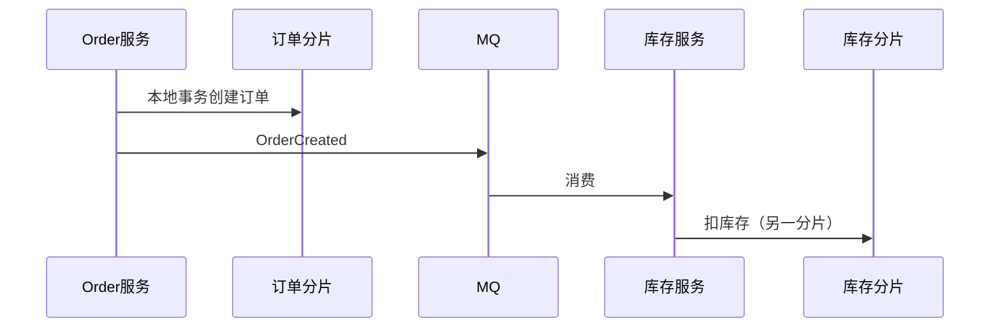
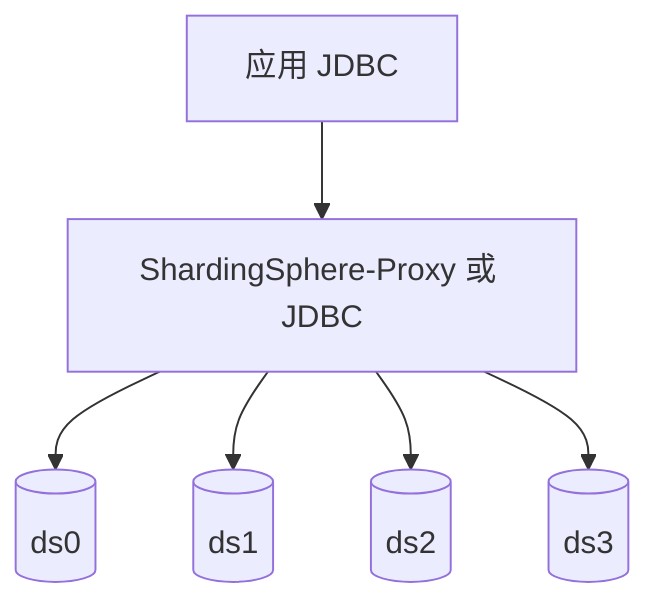

# 数据库扩展与读写分离

> **文件编码**：UTF-8  
> **前置**：[04 消息队列](./04-消息队列架构设计.md)、[Java/06 MySQL](../Java/06-MySQL基础索引与事务.md)  
> **后续**：[06 分布式一致性](./06-分布式一致性与CAP.md)

---

## 0. 读前导读（零基础也能跟上）

### 0.1 用一句话弄懂本章

一个 MySQL 扛不住读写——先**读写分离**（一个写、多个读），还不够再**分库分表**；本章讲怎么扩、分片键怎么选、有什么坑。

### 0.2 你需要提前知道什么（真不会就先跳到哪一章）

| 你已会 | 可以直接学本章 |
|--------|----------------|
| [Java 06 MySQL](../Java/06-MySQL基础索引与事务.md) 索引与事务 | ✅ 本章 |
| [03 缓存](./03-缓存架构设计.md) | ✅ 本章 |
| 不会写 JOIN 和索引 | 先 Java 06 |

### 0.3 本章知识地图（学完后应能勾选全部 ☐→☑）

- ☐ 画 **一主两从** 读写分离图
- ☐ 说清 **写后读主** 场景
- ☐ 掌握 **分片键选择** 原则（查带 shard key）
- ☐ 了解 **一致性哈希** 与双倍扩容
- ☐ 完成 **电商订单库 Case**（§10）步骤表
- ☐ 闭卷自测（§31）≥ 8/10

### 0.4 建议学习时长与节奏

| 阶段 | 内容 | 建议时长 |
|------|------|----------|
| 第 1 天 | §1～§4 瓶颈 + 读写分离 | 2～3 小时 |
| 第 2 天 | §5～§8 分库分表 + 一致性哈希 | 2～3 小时 |
| 第 3 天 | §10～§12 Case | 2 小时 |
| 第 4 天 | 15 分钟模拟（§27） | 2 小时 |

### 0.5 学完本章你能做什么（可验证的具体动作）

1. 画一主两从 + 应用读写路由
2. 写 `user_id % 16` 分表路由伪代码
3. 举写后读主的一个业务例子（下单后立即查详情）
4. 口述 §10 订单库从 8000 万行到 64 表的演进
5. 说明为何「上来就分库分表」是面试陷阱

---

## 本章与上一章的关系

[04 章](./04-消息队列架构设计.md) 用 MQ 削峰异步写；当**单库单表**成为瓶颈（连接数、磁盘 IOPS、行数过大），需要从**数据层**扩展。[Java/06](../Java/06-MySQL基础索引与事务.md) 讲了索引与事务；本章讲**读写分离、主从复制、分库分表入门、一致性哈希**，以及在 [01 方法论](./01-系统设计方法论与面试框架.md) +1 步中的选型位置。

---

## 1. 数据库瓶颈从哪来

### 1.1 常见瓶颈

| 瓶颈 | 表现 | 方向 |
|------|------|------|
| 读 QPS | SELECT 慢、CPU 高 | 缓存、读副本 |
| 写 QPS | INSERT/UPDATE 排队 | 分库、异步 |
| 单表数据量 | 查询变慢、索引变大 | 分表 |
| 连接数 | Too many connections | 连接池、Proxy |
| 磁盘 | IOPS 打满 | SSD、分片 |



### 1.2 优化顺序（务实）

```text
1. SQL + 索引（06 章）
2. 缓存（03 章）
3. 读写分离
4. 分库分表
5. 换存储（ES、ClickHouse）— 按场景
```

不要跳过前两步直接分库分表。

---

## 2. 读写分离（Read/Write Splitting）

### 2.1 架构



- **写**：只走 Master
- **读**：走 Slave（可多实例负载均衡）

### 2.2 主从复制原理（简述）

```text
Master 写 binlog → Slave IO 线程拉取 → relay log → Slave SQL 线程重放
```

延迟通常 **毫秒～秒级**；高负载时可能更大。

### 2.3 主从延迟问题

| 场景 | 风险 | 对策 |
|------|------|------|
| 注册后立刻登录 | 读不到新用户 | 写后读 Master（路由标记） |
| 下单后查订单 | 订单不存在 | 同用户短期读主 |
| 后台列表 | 可接受延迟 | 读从 |

**写后读主**实现：

```java
@DataSourceRouting
public OrderDetail getAfterCreate(Long orderId, boolean forceMaster) {
    if (forceMaster) {
        DataSourceContext.setMaster();
    }
    try {
        return orderMapper.selectById(orderId);
    } finally {
        DataSourceContext.clear();
    }
}
```

**写后读主 逐行读**：

| 行号/代码 | 含义 | 改错会怎样 |
|-----------|------|------------|
| `forceMaster` 参数 | 创建订单后立即查询时传 true | 始终 false 可能读从库旧数据 |
| `DataSourceContext.setMaster()` | ThreadLocal 标记本线程走主库 | 忘记 clear 污染后续请求 |
| `finally { clear() }` | 防止连接泄漏到错误库 | 缺 finally 导致读主/读从混乱 |
| `@Transactional(readOnly=true)` | 声明只读事务路由从库 | 写操作误标 readOnly 会失败 |

### 2.5 读写分离部署手把手

| 步骤 | 动作 | 预期 | 若不对 |
|------|------|------|--------|
| 1 | 云 RDS 开 2 只读实例 | 复制延迟 <1s | 检查 binlog |
| 2 | 应用配置 master/slave 数据源 | 双 DataSource | 见 Java 06 |
| 3 | 写接口走默认 master | INSERT 成功 | 路由错则写从失败 |
| 4 | 列表读 `@Transactional(readOnly=true)` | 走 slave | APM 看 SQL 目标 |
| 5 | 下单后详情 `forceMaster=true` | 立刻可见 | 见 §2.3 |

或使用 **同步复制**（半同步插件）换一致性，代价是写 RT。

### 2.4 读写分离中间件

| 方案 | 说明 |
|------|------|
| 应用层路由 | `@Transactional(readOnly=true)` 走从 |
| ShardingSphere | 读写分离 + 分片 |
| MyCat | 老牌 Proxy |
| 云 RDS | 托管只读实例 |

```java
@Transactional(readOnly = true)
public List<Product> listProducts() {
    return productMapper.selectAll(); // 路由到从库
}
```

---

## 3. 垂直拆分 vs 水平拆分

### 3.1 垂直拆分（按业务）

```text
库1: user, account
库2: order, order_item
库3: product, inventory
```

| 优点 | 缺点 |
|------|------|
| 业务清晰 | 跨库 JOIN 难 |
| 隔离故障 | 分布式事务 |

对应 [Java/11 微服务](../Java/11-微服务与SpringCloud基础.md) 一服务一库。

### 3.2 水平拆分（分库分表）

同一逻辑表按规则分散到多个物理表/库：

```text
order_0, order_1, ... order_15
```

| 触发条件（经验） | 说明 |
|------------------|------|
| 单表 > 500万～2000万行 | 视行宽与查询 |
| 单库写 QPS 到顶 | 分库 |
| 磁盘单库上限 | 分库 |



---

## 4. 分片键（Sharding Key）选择

### 4.1 好的分片键

- **高基数**、分布均匀
- 多数查询**带分片键**（避免全库扫描）
- 业务自然维度：`user_id`、`order_id`、`tenant_id`

### 4.2 差的分片键

- 按城市（热点：北上广深）
- 按时间单独分（最新月热点）
- 无法出现在 WHERE 的字段

### 4.3 常见路由

| 策略 | 公式 | 场景 |
|------|------|------|
| 取模 | `hash(key) % N` | 均匀、扩容麻烦 |
| 范围 | 时间/ID 段 | 归档方便、可能热点 |
| 一致性哈希 | 见 §5 | 扩容减少迁移 |

**例题**：`user_id` 取模 4 库

```text
db_index = user_id % 4
表: order_{db_index}
```

---

## 5. 一致性哈希（Consistent Hashing）

### 5.1 为什么需要

普通 `hash(key) % N`，**N 变化**时几乎所有 key 要迁移。一致性哈希在节点增删时只影响相邻一段 key。

### 5.2 原理

```text
哈希环 0 ~ 2^32-1
节点（库）映射到环上多个虚拟节点
key 顺时针找最近节点
```



### 5.3 虚拟节点

每物理节点对应多个虚拟节点，**均衡分布**，减少数据倾斜。

### 5.4 应用

- 分库分表路由
- 缓存分布式（Redis Cluster slot 思想相关）
- CDN、负载均衡

与 [08 短链](./08-短链服务设计.md) 存储分片预告联动。

### 5.5 简化 Java 取模（面试够用）

```java
public int shardIndex(long userId, int shardCount) {
    return (int) (userId % shardCount);
}
```

生产用 ShardingSphere 配置：

```yaml
rules:
  - !SHARDING
    tables:
      t_order:
        actualDataNodes: ds_${0..3}.t_order_${0..15}
        tableStrategy:
          standard:
            shardingColumn: user_id
            shardingAlgorithmName: mod
```

---

## 6. 分库分表带来的问题

### 6.1 跨分片查询

| 问题 | 方案 |
|------|------|
| 不带分片键 | 禁止、或 ES 宽表、或扫全分片（慢） |
| 跨库 JOIN | 应用层组装、冗余字段、宽表 |
| 全局 ID | 雪花、号段（见 [01 章](./01-系统设计方法论与面试框架.md)） |
| 分页 | 各分片取 TopN 再归并 |
| 排序 | 复杂，尽量带分片键 |

### 6.2 分布式主键

| 方案 | 说明 |
|------|------|
| 雪花 | 趋势递增，索引友好 |
| 号段 | DB 批量取段，性能好 |
| UUID | 无序，不推荐做主键索引 |

### 6.3 扩容

- **取模扩容**：双倍扩容 + 数据迁移（翻倍法）
- **一致性哈希**：加节点只迁部分数据
- 双写过渡：新旧规则并行一段时间

**双倍扩容手把手（4 库 → 8 库）**：

| 步骤 | 动作 | 预期 | 若不对 |
|------|------|------|--------|
| 1 | 部署新 8 库集群 | 空表结构就绪 |  schema 一致 |
| 2 | 应用**双写**新旧库 | 新数据两库都有 | 开关控制 |
| 3 | 后台任务迁移历史数据 | 按 user_id 重算路由 | 校验 checksum |
| 4 | 读流量切到新库 | 对比抽样一致 | 灰度 |
| 5 | 停旧库写、下线 | 仅 8 库 | 回滚预案 |


---

## 7. 与缓存、MQ 组合

### 7.1 读路径

```text
读 → Redis（03）→ Slave MySQL
```

### 7.2 写路径

```text
写 → Master → binlog → Canal → MQ（04）→ 刷新缓存/ES
```

### 7.3 秒杀库存

库存行热点：可 **Redis 预扣** + 分库按 `product_id` 拆 `inventory` 表，见 [07 秒杀](./07-秒杀系统简化设计.md)。

---

## 8. 连接池与 Proxy

### 8.1 应用连接池（HikariCP）

```yaml
spring:
  datasource:
    hikari:
      maximum-pool-size: 20
      minimum-idle: 5
```

**实例数 × 连接池大小** 不能超过 MySQL `max_connections`。

### 8.2 数据库 Proxy 价值

- 统一读写分离
- 连接复用
- 分片透明

---

## 9. 索引与分表协同（复习 06 章）

分表后每表数据量小，索引更高效；但**全局唯一**约束变难，需业务或全局表保证。

```sql
-- 单分片内仍要合理索引
CREATE INDEX idx_user_time ON t_order_3 (user_id, create_time DESC);
```

**最左前缀**、**覆盖索引**原则不变，见 [Java/06](../Java/06-MySQL基础索引与事务.md)。

---

## 10. Case Study：电商订单库扩展

### 10.0 手把手步骤表

| 步骤 | 动作 | 预期产出 | 若卡住 |
|------|------|----------|--------|
| 1 现状 | 8000 万行、写 2000 TPS、读 8000 QPS | §10.1 | §1 |
| 2 读写分离 | 1 主 2 从 + 读走从 | §10.2-1 | §2 |
| 3 缓存 | Redis 热点订单 | 配合 [03](./03-缓存架构设计.md) | — |
| 4 分片 | user_id % 4 库 × 16 表 = 64 | §10.2-2 | §5 |
| 5 ID | 雪花替代自增 | §10.2-3 | §8 |
| 6 跨片 | 运营后台走 ES | §10.2-4 | §7 |
| 7 SQL | 好/坏查询对比 | §10.3 | — |

### 10.1 现状

- `order` 单表 8000 万行，写 2000 TPS，读 8000 QPS
- 按 `user_id` 查询为主

### 10.2 方案

1. **读写分离**：1 主 2 从，读走从 + Redis 热点订单
2. **分库分表**：`user_id % 4` 库，每库 `user_id % 16` 表 → 64 张物理表
3. **订单 ID**：雪花
4. **跨用户查询**（运营后台）：同步到 ES 或离线数仓



### 10.3 查询示例

```sql
-- 好：带分片键
SELECT * FROM t_order WHERE user_id = 10001 AND order_id = 888;

-- 差：仅 order_id，需扫 64 表或维护 order_id → user_id 映射表
```

### 10.4 演进阶段对照表（面试「如何一步步扩展」）

| 阶段 | 触发信号 | 手段 | 本章 |
|------|----------|------|------|
| 0 | 慢 SQL | 索引、EXPLAIN | Java 06 |
| 1 | 读 QPS 高 | Redis 缓存 | [03](./03-缓存架构设计.md) |
| 2 | 读仍不够 | 一主两从 | §2 |
| 3 | 写 TPS/行数 | 4×16 分片 | §10 |
| 4 | 跨用户报表 | ES / 数仓 | §10.2-4 |
| 5 | 跨片一致 | MQ + Saga | [04](./04-消息队列架构设计.md)、[06](./06-分布式一致性与CAP.md) |

**面试话术**：「我不会一上来分库；先确认索引和缓存；读瓶颈加从库；写瓶颈再按 user_id 分片。」

---

## 11. Case Study：多租户 SaaS

### 11.0 手把手步骤表

| 步骤 | 动作 | 产出 |
|------|------|------|
| 1 | 选分片键 `tenant_id` | hash % N |
| 2 | 大租户 | 独立库（垂直拆分） |
| 3 | 小租户 | 共享分片 |
| 4 | 跨租户查询 | 管理后台聚合或 ES |
| 5 | 扩容 | 一致性哈希 / 双倍法 |

分片键 `tenant_id`：

```text
shard = hash(tenant_id) % N
```

大租户可**独立库**（垂直），小租户共享分片。

---

## 12. 归档与冷热分离

历史订单迁到 **归档表 / ClickHouse**：

```text
近 3 个月：在线 MySQL 分片
3 个月前：对象存储 + 离线查询
```

降低在线库体积，比无限分表更简单的情况常用。

---

## 13. 监控与慢 SQL

| 指标 | 工具 |
|------|------|
| 慢查询 | slow log、APM |
| 主从延迟 | `Seconds_Behind_Master` |
| 连接数 | `Threads_connected` |
| 分片均衡 | 各分片行数对比 |

与 [Java/14 慢接口](../Java/14-高频场景设计与面试专题.md) 排查链路一致。

---

## 14. CQRS 简述

**命令查询职责分离**：写模型在 MySQL，读模型在 ES/Redis 宽表。



适合读写法差异大、复杂列表查询多的系统（与 [09 Feed](./09-Feed流与时间线设计.md) 相关）。

---

## 15. 分级练习

### 15.1 基础档

**题 1**：读写分离后，什么场景必须读主库？

**题 2**：单表多少行考虑分表（数量级）？

**题 3**：取模分片 `user_id % 4` 用的是哪个字段？

### 15.2 进阶档

**题 4**：主从延迟 2s，用户支付成功页立刻查订单状态，如何设计？

**题 5**：解释一致性哈希如何解决「扩容迁移全部 key」问题。

**题 6**：订单按 `user_id` 分片，运营要按 `create_time` 全局导出，怎么办？

### 15.3 挑战档

**题 7**：4 库扩 8 库，双倍扩容步骤概述（双写、迁移、切换）。

**题 8**：设计 `order_id` 全局查询路由表结构（仅 order_id 查详情场景）。

---

## 16. 分级练习参考答案

### 16.1 基础档

**题 1**：写后立刻读、强一致读（余额、支付结果）、会话敏感操作。

**题 2**：通常 **500 万～2000 万** 行量级评估，结合行宽与查询模式。

**题 3**：`user_id`（分片键）。

### 16.2 进阶档

**题 4**：支付回调写主后，详情页带 `forceMaster`；或前端轮询；或展示「处理中」直到从库追上。

**题 5**：仅新节点相邻区间 key 迁移到新节点；普通取模则 N 变化导致几乎全部 remap。

**题 6**：离线导出走数仓/ES；在线禁止大范围扫；或按时间分片 + 并行扫各片。

### 16.3 挑战档

**题 7**：

```text
1. 部署 8 库，应用开启双写（写旧+写新）
2. 后台迁移历史数据 old→new
3. 校验一致性
4. 读切新库
5. 停写旧库，下线旧规则
```

**题 8**：

```sql
CREATE TABLE order_route (
    order_id BIGINT PRIMARY KEY,
    user_id BIGINT NOT NULL,
    shard_db TINYINT NOT NULL,
    shard_table TINYINT NOT NULL
);
-- 创建订单时同事务写入；查询先查 route 再定位分片
```

---

## 17. 学完标准

- [ ] 能画 **一主多从** 读写分离图
- [ ] 能解释 **主从延迟** 及写后读主策略
- [ ] 能说明 **垂直 vs 水平** 拆分区别
- [ ] 能选择合理 **分片键** 并说明原因
- [ ] 能口述 **一致性哈希** 解决的问题
- [ ] 知道分库后 **跨片查询、全局 ID、扩容** 难点
- [ ] 复习 [Java/06](../Java/06-MySQL基础索引与事务.md) 索引与事务

---

## 18. FAQ

**Q：读写分离和分库分表先做哪个？**  
先读写分离 + 缓存，成本低；单库写仍不够再分片。

**Q：分表后还能用 MyBatis 吗？**  
能，配合 ShardingSphere 等，对 Mapper 透明。

**Q：分布式事务怎么办？**  
能避免则避免；最终一致用 MQ/本地消息表，见 [06 章](./06-分布式一致性与CAP.md) 与 [04 章](./04-消息队列架构设计.md)。

**Q：云数据库只读实例算读写分离吗？**  
算，应用配置主从数据源即可。

**Q：和 [03 缓存](./03-缓存架构设计.md) 谁优先？**  
读多先缓存；缓存后仍不够再加从库；写瓶颈再分片。

**Q：主从延迟 5 秒业务怎么办？**  
写后读主；或关键读走主库；或接受短暂不一致。

**Q：分片后 JOIN 怎么办？**  
应用层组装；宽表冗余；或 ES/数仓离线 JOIN。

**Q：全局唯一 order_id 怎么查？**  
维护 `order_id → user_id` 映射表；或 order_id 嵌入 shard 信息（雪花）。

**Q：ShardingSphere Proxy 和 JDBC 区别？**  
Proxy 独立进程对应用透明；JDBC 客户端嵌入，少一跳。

**Q：双倍扩容法步骤？**  
新建 2N 集群 → 双写 → 数据迁移 → 切读 → 停旧写 → 下线旧集群。

**Q：从库可以几个？**  
看读 QPS 与复制延迟；过多从库加重主库 binlog 压力。

---

## 19. 与 Java 章节交叉索引

| 话题 | Java |
|------|------|
| 索引、事务 | [06](../Java/06-MySQL基础索引与事务.md) |
| 慢 SQL | [06 EXPLAIN](../Java/06-MySQL基础索引与事务.md) |
| DB 扛不住 | [14 §6](../Java/14-高频场景设计与面试专题.md) |
| 微服务分库 | [11](../Java/11-微服务与SpringCloud基础.md) |

---

## 20. 扩展阅读

- 《DDIA》第 6 章 分区
- ShardingSphere 官方文档 — 分片算法
- 阿里云 RDS 只读实例最佳实践

---

## 21. 分库分表演进路线（实战路径）

### 21.1 四阶段模型


| 阶段 | 触发信号 | 典型动作 |
|------|----------|----------|
| 单库单表 | 初创 | 索引优化 |
| 单库分表 | 单表过大 | `order_0~15` 同库 |
| 分库分表 | 写 QPS/连接数到顶 | `ds_0~3` + 表 |
| 多活 | 容灾、地域延迟 | 单元化、双向同步 |

### 21.2 单库分表过渡

先在同库内 `order_0`～`order_15`，验证路由逻辑与 SQL 改造，再拆物理库——**降低一次性风险**。

---

## 22. 全局二级索引问题

按 `user_id` 分片后，按 `mobile` 查询用户：

| 方案 | 说明 |
|------|------|
| 映射表 | `mobile → user_id` 独立小表 |
| 冗余 ES | 搜索走 ES |
| 扫全分片 | 仅低频管理后台 |

```sql
CREATE TABLE user_mobile_index (
    mobile VARCHAR(20) PRIMARY KEY,
    user_id BIGINT NOT NULL,
    shard_hint TINYINT NOT NULL
);
```

---

## 23. 事务在分片环境下的现实

### 23.1 单分片事务

`user_id` 相同订单在同一分片 → **本地事务**仍可用 `@Transactional`。

### 23.2 跨分片

- 避免跨库事务
- 业务拆为 Saga：创建订单 → 发 MQ → 扣库存（不同分片）
- 见 [04 Outbox](./04-消息队列架构设计.md)、[06 CAP](./06-分布式一致性与CAP.md)



---

## 24. 数据库中间件 ShardingSphere 概念图



**逻辑表** `t_order` → **实际节点** `ds_{0..3}.t_order_{0..15}`，SQL 解析改写后路由。

---

## 25. 只读副本扩展读能力估算

```text
主库写 2000 TPS
单从库读能力约 5000 QPS（视查询复杂度）
2 从 → 读 10000 QPS
仍不够 → 加 Redis（03 章）或 ES
```

**注意**：从库过多会加大主库 binlog 复制压力，需监控 `Seconds_Behind_Master`。

---

## 26. 与 AI Agent 知识库分片

文档向量库按 `tenant_id` 或 `collection_id` 分片，与 MySQL 分片思想一致：

| 维度 | 后端 OLTP | 向量库 |
|------|-----------|--------|
| 分片键 | user_id | tenant_id |
| 跨片查询 | 映射表 | 多 collection 聚合检索 |
| 扩容 | 一致性哈希 | 重建索引 / 多副本 |

见 [AIAgent](../AIAgent/00-学习路线图与说明.md)。

---

## 27. 模拟面试：15 分钟讲 DB 扩展

```text
【1min】单库瓶颈：读 8000 QPS、表 8000 万行
【3min】读写分离：一主两从，写后读主场景
【4min】分片：user_id 取模 4×16，雪花 ID
【3min】问题：跨片查询用 ES；扩容双倍法
【2min】组合：Redis 缓存 + MQ 异步 + 从库读
【2min】监控：慢 SQL、主从延迟、分片均衡
```

---

## 28. 我的笔记区

```text
读写分离写后读主场景：
我的分片键会选：
一致性哈希一句话：
从单库到分库分表演进阶段：
```

---

## 29. 常见面试陷阱

| 陷阱 | 正确答法 |
|------|----------|
| 「上来就分库分表」 | 先索引、缓存、读写分离 |
| 「从库一定能读」 | 写后读主要延迟问题 |
| 「分片键随便选」 | 结合查询模式与热点 |
| 「跨库 JOIN」 | 应用组装或宽表/ES |
| 「分布式事务万能」 | 能避免则避免，最终一致优先 |

---

## 30. 复习检查清单（考前 10 分钟）

- [ ] 能画一主两从 + 应用读写路由
- [ ] 能写 `user_id % N` 路由一句代码
- [ ] 能讲双倍扩容四步
- [ ] 能举写后读主的一个业务例子
- [ ] 知道与 03 缓存、04 MQ 的组合顺序

---

## 31. 闭卷自测

完成后再看 §31.1 参考答案。

1. **概念** DB 优化顺序（索引→？→？→？）？
2. **概念** 读写分离写走哪、读走哪？
3. **概念** 写后读主是什么？举一例。
4. **概念** 分片键选择原则？
5. **概念** 一致性哈希解决什么问题？
6. **概念** 跨分片查询为何是坑？
7. **动手** `user_id=10001` 分 4 库 16 表，库号表号公式？
8. **动手** §10 Case：64 表怎么来的？
9. **综合** 读 8000 QPS，2 从各 5000，够吗？还差什么？
10. **综合** 分库后本地事务跨两个 user 的订单怎么办？

### 31.1 自测参考答案

1. 索引/SQL → 缓存 → 读写分离 → 分库分表。
2. 写 Master；读 Slave（写后关键读可 Master）。
3. 下单 insert 后立即 GET 详情可能读到从库旧数据 → 改走主或延迟 UI。
4. 高频查询必须带 shard key；避免扫全部分片。
5. 扩容时减少 key 迁移量；仅迁移部分 slot。
6. 需扫 N 个分片，延迟高；应用组装或 ES。
7. 库 `10001 % 4 = 1`；表 `(10001 / 4) % 16` 或 `10001 % 16`（看路由策略）。
8. 4 库 × 每库 16 表 = 64 物理表。
9. 2×5000=10000 理论够；复杂查询可能不够 → 加 Redis（03）。
10. 避免跨片事务；Saga/MQ 最终一致（04、06 章）。

---

## 32. 费曼检验

用 **3 分钟**解释：**「数据库扛不住怎么办？顺序是什么？」**

**对照提纲**：

1. **先别分库**：SQL 慢先加索引；读多先 Redis。
2. **读写分离**：一个柜台写、多个窗口读。
3. **分库分表**：按 user_id 分到不同抽屉；查询必须知道去哪个抽屉。

---

## 33. 本章核心速记卡

| 阶段 | 手段 |
|------|------|
| 读瓶颈 | 缓存 → 从库 |
| 写瓶颈 | 分片 → MQ 异步 |
| 陷阱 | 上来就分库、从库写后读、跨片 JOIN |

---

## 34. 模拟面试：订单库扩展 3 分钟话术（扩展版）

```text
【30s 现状】8000 万行，写 2000 TPS，读 8000 QPS，按 user_id 查为主
【30s 顺序】先索引→Redis 热点→1 主 2 从→仍不够再 4 库×16 表=64 片
【30s 路由】user_id % 4 定库，% 16 定表；雪花 order_id
【30s 坑】写后读主；跨 user 查 ES；扩容双倍法双写迁移
【30s 组合】03 缓存扛读；04 MQ 削写峰；06 跨片 Saga
```

### 34.1 分片键选型对照表

| 业务 | 推荐 shard key | 原因 | 反例 |
|------|----------------|------|------|
| 订单 | user_id | 按用户查单 | order_id alone |
| 社交帖 | user_id | 个人主页 | tweet_id |
| SaaS | tenant_id | 租户隔离 | 全局自增 id |
| 日志 | time + hash | 时间范围查 | 随机 uuid |
| IM 消息 | conversation_id | 会话内有序 | user_id（跨会话乱） |

### 34.2 读写分离 vs 分片：何时用哪个

| 信号 | 读写分离 | 分库分表 |
|------|----------|----------|
| 读 QPS 高、写不高 | ✅ 优先 | 暂缓 |
| 单表行数 > 2000 万 | 辅助 | ✅ |
| 写 TPS 打满单 Master | 无法解决写 | ✅ |
| 跨 user 报表多 | 从库+ES | 分片更难 |

---

## 下一章预告

[06-分布式一致性与 CAP](./06-分布式一致性与CAP.md)（若已发布）在扩展后的分布式环境里，讲 **CAP、最终一致、分布式事务选型**——读写分离和分片之后，跨库一致性成为核心议题。

---

*画一张图：你的 demo 项目若日订单 100 万，从索引到缓存到读写分离到分表，逐步演进路径*
