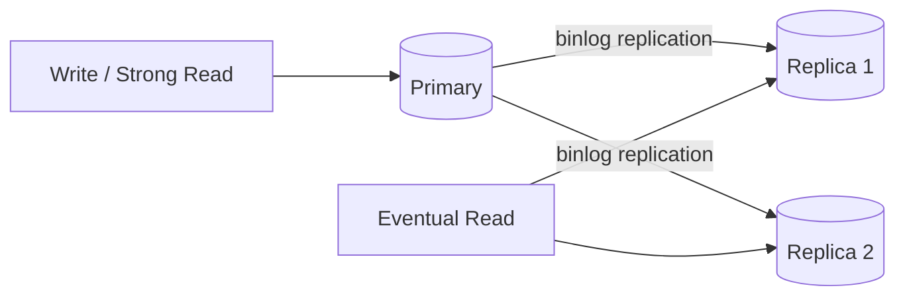

# 数据库扩展与读写分离

> 前置：[03-缓存架构设计](./03-缓存架构设计.md)、[04-消息队列架构设计](./04-消息队列架构设计.md)
> 后续：[06-分布式一致性与CAP](./06-分布式一致性与CAP.md)
> 目标：从 Go 后端视角掌握连接池、只读副本、读己之写、固定逻辑槽、在线迁移与数据库高可用。

---

## 1. 定位与学习分层

数据库扩展不是从“分库分表”开始。更稳妥的顺序通常是：

```text
测量瓶颈
  → SQL / 索引 / 数据模型
  → 连接池和限流
  → 缓存与读模型
  → 只读副本
  → 归档和冷热分离
  → 写入或容量仍到顶时再分片
```

### 1.1 现在必须掌握

- `database/sql` 连接池不是“越大越好”。
- 只读副本会延迟，写后立即读不能默认走副本。
- 分片键必须匹配主要查询，并避免热点。
- 4 库 × 16 表必须真正产生 64 个独立槽。
- 数据迁移不能只写一句“新旧双写”。

### 1.2 面试阶段再深化

- GTID、复制位点和 causal read。
- 全局二级索引、跨片分页、全局 ID。
- 固定逻辑槽、路由表与在线扩容。
- RPO、RTO、主库提升和故障切换。

### 1.3 生产阶段必须补齐

- 容量模型、备份恢复、在线 DDL、schema rollout。
- 分片均衡、热点租户、历史归档和对账。
- 数据迁移的快照、增量追平、校验、灰度与回滚。
- 故障演练和连接风暴保护。

---

## 2. 核心不变量

无论是否分片，都应先明确以下条件：

1. 权威数据只有一个可识别的 source of truth。
2. 一次本地事务中的数据必须落在同一数据库事务边界。
3. 读请求必须知道自己允许多旧的数据。
4. 给定分片键，同一版本路由必须稳定、可复现。
5. 迁移期间任一写入最终只能收敛到一个确定结果。
6. 故障切换不能产生两个同时可写的 Primary。

这些不变量决定了技术选择：

| 问题 | 首选思路 |
|---|---|
| 写后立刻读 | 读 Primary、会话粘滞或等待复制位点 |
| 读流量高 | 缓存、只读副本、专用读模型 |
| 单库持续写到顶 | 按业务所有权拆库或水平分片 |
| 单热点行 | 串行化、分桶、预聚合，不是简单加分片 |
| 跨库事务 | 重新划边界，或采用最终一致流程 |
| 扩容迁移 | 固定逻辑槽 + 可恢复迁移状态机 |

---

## 3. 先证明瓶颈在哪里

不要因为“表有两千万行”就直接分表。B+Tree 不会在某个行数突然失效，真正信号来自延迟、资源和运维窗口。

### 3.1 关键指标

| 层级 | 指标 |
|---|---|
| 请求 | p50/p95/p99、超时率、错误率 |
| SQL | 执行次数、扫描行数、锁等待、临时表、排序 |
| 实例 | CPU、IOPS、吞吐、buffer pool 命中、磁盘容量 |
| 连接 | 活跃连接、等待连接、事务时长、连接创建率 |
| 复制 | receive lag、apply lag、复制错误、GTID 差距 |
| 运维 | 备份时长、恢复时长、DDL 时长、归档速度 |

### 3.2 常见误判

- SELECT 慢不一定是行数大，可能是索引错误或返回过多数据。
- 连接数高不一定要加实例，可能是连接泄漏或慢事务。
- 写入峰值高不等于持续写能力不足，MQ 只能削峰，不能增加 DB 的长期处理上限。
- 单表很大但查询始终命中小范围索引，可能无需立即分表。
- 分表后跨片查询、迁移和全局唯一约束的成本可能高于收益。

---

## 4. Go `database/sql` 连接池

`sql.DB` 本身就是并发安全的连接池句柄，不应每个请求创建一个。

```go
func openDB(dsn string) (*sql.DB, error) {
	db, err := sql.Open("mysql", dsn)
	if err != nil {
		return nil, err
	}

	db.SetMaxOpenConns(40)
	db.SetMaxIdleConns(20)
	db.SetConnMaxLifetime(30 * time.Minute)
	db.SetConnMaxIdleTime(5 * time.Minute)

	ctx, cancel := context.WithTimeout(context.Background(), 3*time.Second)
	defer cancel()
	if err := db.PingContext(ctx); err != nil {
		db.Close()
		return nil, err
	}
	return db, nil
}
```

连接预算必须按整个集群计算：

```text
应用实例数 × 每实例 MaxOpenConns
  + 管理连接
  + 复制与后台任务连接
  < 数据库安全连接上限
```

调参原则：

- `MaxOpenConns` 以压测和数据库容量为准，不按 CPU 核数机械设置。
- 池过大可能放大慢 SQL 和锁竞争，导致数据库雪崩。
- `ConnMaxLifetime` 应略短于网络设备、代理或云数据库的连接回收周期，并加入实例间抖动。
- 每个查询都使用 context deadline；超时后结果可能未知，写操作需要幂等和状态查询。
- 监控 `DB.Stats()` 中 `WaitCount`、`WaitDuration`、`InUse` 和 `Idle`。

在考虑副本或分片前，先确保连接池、慢 SQL、索引和事务时长已受控。

---

## 5. 读写分离

### 5.1 基本拓扑



- 写请求只发往当前 Primary。
- 可接受陈旧的读请求可以负载到 Replica。
- 事务内的读写必须固定到同一个 Primary 连接。
- Replica 不是备份；错误删除也会被复制，仍需独立备份和 PITR。

### 5.2 复制延迟

复制包含“接收日志”和“应用日志”两个阶段。高写入、长事务、大 DDL、磁盘抖动或热点冲突都会扩大 apply lag。

半同步复制通常只表示至少一个 Replica 收到或持久化了日志，不表示该 Replica 已应用，更不表示任意只读副本都能读到新值。

不要只依赖一个 `Seconds_Behind_Source` 数字。它可能为 NULL、粒度粗或无法表达完整延迟，应配合：

- `performance_schema` 复制状态；
- GTID/binlog position 差距；
- 应用心跳表测得的端到端 apply lag；
- 每个 Replica 的错误与停顿时间。

### 5.3 读己之写

用户刚完成注册、下单、改密码或禁用短链后，通常要求下一次读看到自己的写。

常用策略：

1. **写后短期读 Primary**：实现简单，适合关键详情页。
2. **写接口直接返回新状态**：减少一次立即回读。
3. **会话粘滞**：一段时间内把该用户读请求固定到 Primary。
4. **携带复制位点**：写返回 GTID/token，读侧等待目标 Replica 追到该位置。
5. **有界陈旧**：Replica lag 超阈值时摘除或回退 Primary。

`readOnly` 注解或 HTTP GET 本身不会自动把请求路由到 Replica。路由必须由应用、驱动、代理或数据库中间件明确实现。

### 5.4 Go 路由示例

```go
type DBSet struct {
	Writer  *sql.DB
	Readers []*sql.DB
	next    atomic.Uint64
}

func (d *DBSet) Reader() *sql.DB {
	if len(d.Readers) == 0 {
		return d.Writer
	}
	i := d.next.Add(1)
	return d.Readers[int(i%uint64(len(d.Readers)))]
}

func (d *DBSet) GetOrder(ctx context.Context, id int64, strong bool) (Order, error) {
	db := d.Reader()
	if strong {
		db = d.Writer
	}
	var o Order
	err := db.QueryRowContext(ctx,
		"SELECT id, user_id, status FROM orders WHERE id = ?", id,
	).Scan(&o.ID, &o.UserID, &o.Status)
	return o, err
}
```

真实系统还应按 Replica 健康、lag、地域和权重选路，而不是只有轮询。

---

## 6. 高可用、RPO 与 RTO

读写分离解决扩读，不自动解决高可用。

- **RPO**：故障时允许丢多少已确认数据。
- **RTO**：故障后允许多久恢复服务。

设计 Primary 故障切换时至少回答：

1. 谁判断 Primary 不可用，如何防止瞬时网络抖动误切？
2. 候选 Replica 是否追平，可能丢多少事务？
3. 如何通过多数派或外部协调避免双 Primary？
4. 其他 Replica 如何重新指向新 Primary？
5. 应用连接如何刷新，旧连接如何隔离？
6. 旧 Primary 恢复后如何重新加入，而不是直接接受写？
7. 备份恢复和时间点恢复是否定期演练？

托管数据库降低操作成本，但不会替业务定义 RPO/RTO，也不会自动保证每次切换零数据损失。

---

## 7. 垂直拆分与水平分片

### 7.1 垂直拆分

按业务所有权拆库，例如用户、订单、库存分别拥有自己的数据。

优点：故障隔离、团队边界清晰、每个服务可独立演进。

代价：跨库 JOIN、跨服务事务和全局查询变复杂。

垂直拆分不是把任意几张大表挪出去，而是让一个服务成为数据和业务规则的唯一所有者。

### 7.2 水平分片

把同一逻辑表的行按稳定规则分散到多个物理节点。

好的分片键通常具备：

- 高频请求带该键；
- 基数高、分布较均匀；
- 相关数据可以共置，例如 order 与 order_item；
- 生命周期稳定，不会频繁修改；
- 能明确大租户或热点键的隔离策略。

差的分片键包括：

- 城市、状态等低基数字段；
- 单独按当前月份，导致最新分片持续热点；
- 查询中拿不到的字段；
- `product_id` 用来解决单个爆款 SKU 热点——同一 SKU 仍在同一行。

热点不能只靠“多分几个库”解决。可采用大租户独立库、库存桶、写入串行化、队列化、聚合写或专用存储模型。

---

## 8. 正确的 64 槽路由

假设初始为 4 个数据库，每库 16 张订单表，共 64 个逻辑槽。

错误公式：

```text
db = user_id % 4
table = user_id % 16
```

因为 `%16` 的结果已经决定 `%4`，这只会产生 16 种组合，而不是 64 种。

正确公式之一：

```text
slot  = stable_hash(user_id) % 64
db    = slot / 16
table = slot % 16
```

Go 示例：

```go
const (
	SlotCount   = uint64(64)
	TablesPerDB = uint64(16)
)

func shardForUser(userID uint64) (slot, db, table uint64) {
	// stableHash 必须跨进程、跨版本稳定，不能使用带随机种子的运行时 hash。
	h := stableHash(userID)
	slot = h % SlotCount
	db = slot / TablesPerDB
	table = slot % TablesPerDB
	return
}
```

如果直接使用均匀递增的 `user_id`，取模也可能足够；使用 hash 前必须确认不会破坏范围查询和数据局部性。

SQL 标识符不能使用参数占位符，表名必须由受控数字生成，不能拼接用户输入：

```go
func orderTable(table uint64) (string, error) {
	if table >= TablesPerDB {
		return "", errors.New("invalid table shard")
	}
	return fmt.Sprintf("t_order_%02d", table), nil
}
```

### 8.1 固定逻辑槽

不要让物理数据库数量直接成为 hash 取模的 N。更稳妥的是预先定义固定逻辑槽，例如 64、256 或 1024 个，再维护：

```text
logical slot → physical datasource + physical table
```

扩容时迁移一部分槽并更新版本化路由，而不是把所有 key 对新的物理节点数重新取模。

路由配置必须：

- 有版本号和灰度能力；
- 应用启动时校验完整性；
- 变更可回滚；
- 旧版本在迁移窗口内仍可识别；
- 不同应用实例最终使用同一版本。

---

## 9. 全局 ID 与路由索引

### 9.1 全局 ID

常见选择：

| 方案 | 特点 | 风险 |
|---|---|---|
| Snowflake 类 | 趋势递增、可嵌入机房或槽信息 | 时钟回拨、worker id 冲突 |
| 号段 | DB 批量分配，索引友好 | 号段服务和缓存恢复 |
| UUIDv7 / ULID | 分布式生成、近似时间有序 | 索引宽度和编码约定 |
| 自增 + shard 前缀 | 简单可路由 | 暴露拓扑、迁移约束强 |

“UUID 都无序”已经不准确；UUIDv7 和 ULID 可提供时间有序特征。无论使用哪种方案，都要验证碰撞、时钟、索引宽度和可路由性。

### 9.2 只按 `order_id` 查询

订单按 `user_id` 分片后，只有 `order_id` 时有三种常见方案：

1. 在 ID 中编码逻辑槽，可直接计算路由。
2. 调用方始终携带 `user_id`。
3. 维护 `order_id → logical_slot` 的全局路由索引。

全局路由索引如果位于中央数据库，就不能与订单分片通过普通本地事务原子写入。可用 Outbox/CDC 最终一致维护，并准备：

- 索引未就绪时的回源方式；
- 重复与冲突处理；
- 对账和重建任务；
- 索引库本身的容量和高可用。

不要声称“创建订单时由同一个本地事务写中央路由表”，除非两个表确实属于同一个数据库事务边界。

---

## 10. 分片后的查询与事务边界

| 问题 | 常见处理 |
|---|---|
| 不带分片键查询 | 路由索引、读模型、搜索或受控 scatter-gather |
| 跨片 JOIN | 数据共置、冗余快照、应用聚合、离线数仓 |
| 全局排序分页 | 各片 Top-K 归并；深分页改游标 |
| 全局唯一约束 | 全局索引服务、预分配、业务所有者集中校验 |
| 跨片事务 | 重划边界、本地事务 + Outbox/Saga |
| schema 变更 | 分批 DDL、兼容读写、进度与失败恢复 |

本地事务只在一个物理数据库连接内成立。相同 `user_id` 的 order 和 order_item 应尽量共置，使创建订单仍能使用一个 `sql.Tx`。

如果一个操作天然要求频繁原子更新多个分片，优先重新评估分片键和聚合边界，而不是先上分布式事务。

---

## 11. 在线扩容与迁移闭环

简单的“应用同时写旧库和新库”有部分失败窗口，不能作为完整方案。

推荐流程：

### 11.1 准备

1. 选择迁移的逻辑槽和目标节点。
2. 建立兼容 schema、索引和容量余量。
3. 固定旧库为 source of truth。
4. 为每个槽记录迁移状态、位点和校验进度。

### 11.2 快照与增量

1. 记录一致性快照位点。
2. 分批回填快照数据，操作必须幂等。
3. 通过 binlog CDC 或可靠变更日志同步快照后的增量。
4. 持续比较行数、checksum、关键字段和业务聚合值。

### 11.3 灰度读取

1. 主读旧库，同时影子读取新库并比较。
2. 对少量租户/槽切读新库，错误时可回旧库。
3. 观察 p99、错误率、数据差异和复制追平时间。

### 11.4 切换与收尾

1. 短暂冻结该槽写入，或确认增量已追平。
2. 原子发布新路由版本。
3. 保留旧数据和回滚窗口，不立即删除。
4. 全量对账通过后停止旧同步。
5. 归档迁移记录，再清理旧数据。

若业务必须双写，应由 Outbox/变更日志驱动第二份写入，并定义重试、幂等和真值源；不能在请求代码里顺序执行两个独立 INSERT 后假设都成功。

---

## 12. 一致性哈希的正确位置

一致性哈希适合节点频繁增删、按 key 定位单节点的缓存、对象存储或负载分配场景。虚拟节点可改善分布，但仍需搬迁、复制和热点处理。

在关系型数据库分片中，它不是默认答案，因为还要处理：

- 事务和数据共置；
- SQL 路由与范围查询；
- schema 和索引；
- 数据迁移的可恢复性；
- 主从复制和高可用。

因此本章主线使用固定逻辑槽。理解一致性哈希“节点变化只影响部分 key”即可，不要把它等同于完整的数据库扩容方案。

---

## 13. 归档、冷热分离与读模型

有时无需分片，只需把在线工作集缩小：

- 近 3 个月订单保留在线库；
- 历史订单进入归档库或对象存储；
- 分析查询进入 ClickHouse/数仓；
- 模糊检索和运营查询进入 ES；
- 通过 CDC/MQ 构建最终一致读模型。

归档不是简单 DELETE。需要先验证可查询性、审计保留、恢复流程和删除批次对主库复制延迟的影响。

CQRS 只在读写模型差异明显时采用：写模型维护业务不变量，读模型服务复杂查询。读模型延迟必须对产品可见，不能被当作权威支付或库存状态。

---

## 14. 观测与验收

### 14.1 必看指标

- Writer/Reader 连接池等待时间和使用率。
- Primary 写入 p99、锁等待、长事务和磁盘余量。
- 每个 Replica 的 receive/apply lag 与错误。
- 每个逻辑槽的行数、QPS、存储和热点键。
- 路由失败、scatter 查询数量、跨片聚合延迟。
- 迁移 backlog、CDC lag、checksum 差异和灰度错误率。
- 备份成功率、最近一次恢复演练耗时。

### 14.2 故障演练

- Replica 延迟 10 秒时，写后读是否仍正确？
- 摘除一个 Replica 后连接池是否产生风暴？
- Primary 故障切换时是否出现双写节点？
- 迁移任务中途重启是否能从位点继续？
- 新旧节点写入部分失败时是否能对账修复？
- 路由版本不一致时是否会拒绝启动或快速告警？
- 从备份恢复后能否追到目标时间点？

### 14.3 验收标准

- 64 槽测试中每个 `(db, table)` 都可被命中。
- 相同分片键在不同进程、不同版本中路由一致。
- 强读不会因 Replica lag 返回旧状态。
- 单个数据库故障有明确 RPO/RTO 和恢复步骤。
- 迁移完成前后关键业务聚合值一致，可随时回滚。

---

## 15. 短链服务中的数据库扩展

短链核心查询是：

```text
short_code → target_url + status + expire_at
```

适合的扩展思路：

1. 跳转路径先使用缓存，DB 是权威回源。
2. 读流量仍高时可用只读副本，但禁用/改目标后的关键读应读 Primary 或使用版本化缓存失效。
3. 若按 short code 分片，路由必须只依赖 short code，不能要求先查中央表再知道分片。
4. 可在短码生成时嵌入逻辑槽，或使用稳定 hash 映射到固定槽。
5. 点击明细与链接映射的生命周期和访问模式不同，应独立存储或进入事件流。

短链禁用后必须尽快停止跳转，这是读己之写和缓存一致性问题；点击统计晚几秒收敛通常可以接受。

完整设计见 [08-短链服务设计](./08-短链服务设计.md)。

---

## 16. 复习清单

- [ ] 能说明为什么先优化 SQL、连接池和缓存，再考虑分片。
- [ ] 能配置并解释 Go `database/sql` 四个连接池参数。
- [ ] 知道副本“收到日志”不等于“已经应用”。
- [ ] 能给出至少三种读己之写方案。
- [ ] 能区分扩读、分片和高可用解决的问题。
- [ ] 能写出正确的 `slot → db → table` 64 槽公式。
- [ ] 知道错误的 `%4 + %16` 为什么只有 16 种组合。
- [ ] 能解释固定逻辑槽为什么比直接对物理节点数取模更易扩容。
- [ ] 能说明全局路由索引为什么不能天然和分片订单同事务。
- [ ] 能口述快照、CDC、校验、灰度、切换和回滚的迁移闭环。
- [ ] 知道一致性哈希不是关系型数据库分片的完整答案。
- [ ] 能为短链的 short code 设计无需 scatter 的稳定路由。

下一章：[06-分布式一致性与CAP](./06-分布式一致性与CAP.md)。
