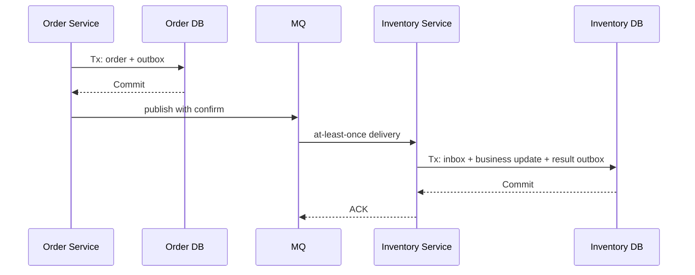
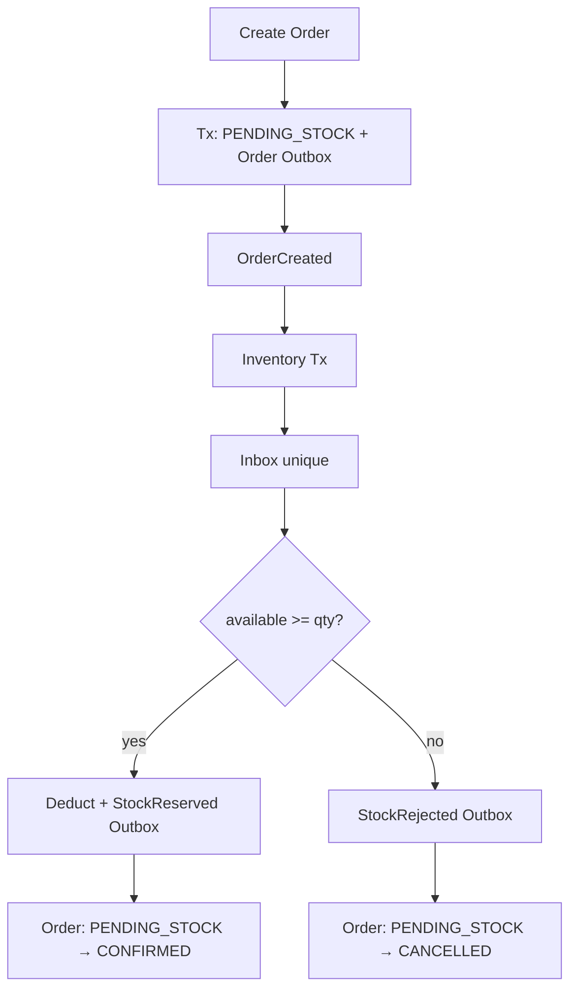

# 分布式一致性与 CAP

> 前置：[04-消息队列架构设计](./04-消息队列架构设计.md)、[05-数据库扩展与读写分离](./05-数据库扩展与读写分离.md)
> 目标：先从故障和业务不变量出发，再理解一致性模型、CAP、quorum 与分布式事务方案。
> 原则：Go 后端优先，原理保持语言和框架中立。

## 1. 定位与学习分层

分布式一致性的核心不是背 CAP，而是回答：超时后操作是否执行、部分成功时不变量是否成立、读允许多旧，以及重试和崩溃后如何收敛。

### 1.1 现在必须掌握

超时代表结果未知；先写业务 invariant；本地事务优先；at-least-once 必须配合原子幂等；Outbox 与 Inbox 分属生产者和消费者。

### 1.2 面试阶段再深化

理解线性一致、串行化、CAP/PACELC、quorum，以及 Saga、TCC、XA/2PC 的恢复语义。

### 1.3 生产阶段必须补齐

补齐对账审计、状态机版本、墓碑清理、租约与 fencing、故障注入和 RPO/RTO。

## 2. 第一原则：超时意味着结果未知

调用方在 deadline 到达时，只知道“没有及时收到响应”，不知道服务端处于哪种状态：

```text
1. 请求根本没到服务端
2. 请求到了，但尚未执行
3. 已执行并提交，响应丢失
4. 执行到一半，部分外部副作用已发生
5. 服务端仍在执行，客户端已经重试
```

因此写接口必须设计：稳定 `operation_id`、可查询状态、幂等重试、`PENDING/SUCCEEDED/FAILED` 状态机，以及长时间 PENDING 的对账任务。

Go 的 context 只控制调用方等待时间，不保证远端事务回滚。遇到 `DeadlineExceeded` 应用同一 operation ID 查询或安全重试，而不是创建第二个业务对象。同步 RPC 和 MQ 发布确认都存在未知结果窗口。

## 3. 先定义业务不变量

业务不变量是任何故障和并发下都必须成立的条件。

| 场景 | 不变量 |
|---|---|
| 转账 | 不能凭空增加或丢失资金；同一指令最多扣一次 |
| 下单 | 库存不足不能进入可支付状态 |
| 短链 | 同一租户内短码唯一；禁用后不能继续跳转 |
| 优惠券 | 同一用户同一券最多核销一次 |
| MQ 消费 | 同一消息重复投递不能重复改变业务状态 |

设计顺序：

1. 写出不变量。
2. 找到维护该不变量的数据所有者。
3. 尽量让相关写入落进一个本地事务。
4. 若必须跨服务，定义中间态、重试、补偿和对账。
5. 最后才选择 Outbox、Saga、TCC 或 XA。

“最终一致”不是允许最终结果错误，而是允许系统在明确时间窗口内存在可识别中间态，之后必须收敛到满足不变量的状态。

## 4. 一致性模型

一致性不是一条只有“强”和“弱”的直线。不同模型约束不同现象。

| 模型 | 保证 |
|---|---|
| 最终一致 | 停止更新后副本最终收敛，不自动承诺收敛时间 |
| 读己之写 | 当前用户后续读取能看到自己的写 |
| 单调读/写 | 会话不从新版本退回旧版本，写按发出顺序生效 |
| 因果一致 | 有因果关系的操作按因果顺序可见 |
| 线性一致 | 操作像在调用区间内某瞬间原子发生，并尊重实时顺序 |
| 串行化 | 多事务结果等价于某种串行执行顺序 |

会话保证可通过读 Primary、粘滞、版本/复制位点实现。线性一致与串行化是正交维度，不能用“ACID”或“强一致”一词全部代替。

单机 MySQL 也要看隔离级别和事务边界。在 Repeatable Read 的旧快照事务中，即使另一个事务已经提交，当前事务仍可能读到旧版本；不能简单说“提交后任何下一次读都必见新值”。

## 5. CAP 的准确含义

CAP 针对的是一个复制数据系统在网络分区下能否同时满足线性一致与可用。

| 字母 | 含义 |
|---|---|
| C — Consistency | 对外表现为线性一致的单副本 |
| A — Availability | 每个到达非故障节点的请求最终得到有效响应 |
| P — Partition | 节点之间的消息可能被任意延迟或丢失，形成分区 |

当分区发生时：

- 若仍让两侧都接受冲突操作，倾向保 A，可能暂时失去 C。
- 若只有能确认权威状态的一侧继续处理，倾向保 C，另一侧失去 A。

这不是“CAP 三选二”，也不是给整个产品永久贴 CP/AP 标签。真实系统常按操作、配置和故障阶段做不同选择。

### 5.1 CP 倾向示例

etcd/ZooKeeper 的多数派一侧可以继续提交；少数派不能提交。线性一致读还要使用相应的读语义，允许 stale 的本地读不自动具有线性一致性。

### 5.2 AP 倾向示例

Dynamo/Cassandra 类系统在特定低一致性级别下，可让分区两侧继续接受操作，之后依赖版本、冲突解决和修复收敛。把读写级别调为 quorum 后，可用性取舍也会变化。

### 5.3 Redis 不是干净的 CAP 教材标签

Redis 主从和 Sentinel 通常使用异步复制：

- 故障转移可能丢失已被旧 Primary 确认但尚未复制的写；
- 旧 Primary 在被隔离后不保证立即停止接受写；
- `min-replicas-to-write` 只能降低风险，不构成完整共识协议；
- Redis Cluster、Sentinel、单机和托管产品的行为也不同。

因此不要简单背“Redis 是 AP”或“Sentinel 是 CP”。应描述具体拓扑、确认语义、故障转移和允许的数据损失。

## 6. PACELC

CAP 只突出分区期间的选择。PACELC 补充：

```text
if Partition:
    choose Availability or Consistency
else:
    choose Latency or Consistency
```

无分区时，等待更多副本确认通常提高一致性或持久性，但会增加延迟并降低可用余量；异步复制延迟低，却可能读旧或在故障时丢最近写。

不要把 PACELC 分类写死到产品名上。Cassandra、MongoDB、MySQL、Kafka 等都可通过 read/write concern、复制确认、读路由和故障策略改变取舍。

面试回答应落到配置：

```text
“订单确认写等待多数副本，牺牲部分延迟；商品详情读允许副本延迟，
但用户刚修改后的读携带版本并回退 Primary。”
```

## 7. Quorum 与共识的最小知识

### 7.1 读写 quorum

假设有 N 个副本，写等待 W 个确认，读查询 R 个副本。`R + W > N` 可以让读写集合有交集，但**仅有交集并不自动得到线性一致**，还需要版本规则、冲突处理、并发写协议和故障恢复。

例如 N=3、W=2：少数派只有 1 个节点时不能确认新写，这就是用可用性换一致性/持久性的一部分。

### 7.2 Leader 与多数派

Raft 一类共识协议使用 term、leader 和多数派提交日志：

- 同一 term 只有合法 leader 发起复制；
- 日志被多数派持久化后才提交；
- minority 无法自行提交新日志；
- leader 变更后通过日志规则恢复唯一历史。

共识主要解决复制状态和成员对“已提交顺序”的一致，不等同于任意业务跨服务事务。

### 7.3 租约与时钟

租约过期依赖时间和网络。旧持有者可能暂停后恢复并继续写，所以续期只能降低并发概率，不能证明旧持有者不会再操作。需要 fencing token 让下游拒绝旧持有者。

## 8. ACID 与 BASE 不是二选一

ACID 描述事务的原子性、一致性、隔离性和持久性。BASE 常用来概括分布式系统允许中间态并最终收敛的设计风格：

- Basically Available：故障时保留核心能力或降级服务；
- Soft State：系统可能存在由异步流程推进的中间状态；
- Eventually Consistent：最终收敛到满足业务规则的结果。

常见架构是：

```text
每个服务内部：ACID 本地事务
服务之间：Outbox + 幂等 + 状态机 + 补偿，实现最终一致
```

BASE 不替代 ACID，幂等也不等于事务隔离。一个系统可以同时大量使用两者。

## 9. 方案选择顺序

优先级通常是：

1. **一个本地事务**：把必须原子的写放到同一服务、同一数据库。
2. **本地事务 + Outbox/Inbox**：跨服务传播事实并最终一致。
3. **Saga**：多步骤长流程，每步提交并提供补偿。
4. **TCC**：业务资源可显式预留，需要更强的隔离感知。
5. **XA/2PC**：参与者支持 prepare，能接受阻塞和协调成本。

| 方案 | 中间态 | 业务侵入 | 主要风险 | 适合 |
|---|---|---|---|---|
| 本地事务 | 对外可隐藏 | 低 | 单库边界 | 强相关数据 |
| Outbox/Inbox | 有 | 中 | 重复、延迟 | 事件驱动流程 |
| Saga | 有且可见 | 中高 | 补偿失败 | 长业务流程 |
| TCC | Try 预留 | 高 | 空回滚、悬挂 | 可冻结资源 |
| XA/2PC | Prepare 锁定 | 框架相关 | in-doubt 阻塞 | 参与者少、强原子需求 |

不要以“金融就一定 TCC”或“互联网就一定 AP”替代实际不变量和故障分析。

## 10. 本地事务优先

如果订单头、订单项、操作幂等记录和待发布事件都属于订单聚合，应尽量放到同一分片，用一个 `sql.Tx` 提交。Go 代码的关键顺序是：

```text
BeginTx
  → INSERT orders，operation_id 唯一
  → INSERT order_items
  → INSERT outbox
  → Commit
```

任一步失败都回滚。重复 `operation_id` 查询并返回原订单，而不是创建第二张订单。

## 11. Outbox、Inbox 与原子幂等边界

完整机制见 [04-消息队列架构设计](./04-消息队列架构设计.md)。本章关注一致性语义：



必须接受两个重复窗口：

- Broker 已确认，Producer 更新 Outbox 前崩溃 → 再次发布。
- Consumer 事务提交，ACK 前崩溃 → 再次投递。

消费者处理的正确原子边界：

```go
func applyEvent(ctx context.Context, db *sql.DB, e Event) error {
	tx, err := db.BeginTx(ctx, nil)
	if err != nil {
		return err
	}
	defer tx.Rollback()

	res, err := tx.ExecContext(ctx, `
		INSERT IGNORE INTO inbox(consumer, message_id, processed_at)
		VALUES ('inventory', ?, NOW())`, e.MessageID)
	if err != nil {
		return err
	}
	n, err := res.RowsAffected()
	if err != nil {
		return err
	}
	if n == 0 {
		return tx.Commit()
	}

	if err := changeBusinessState(ctx, tx, e); err != nil {
		return err
	}
	if err := insertResultOutbox(ctx, tx, e); err != nil {
		return err
	}
	return tx.Commit()
}
```

只有 Inbox 插入、业务更新和结果事件处于同一本地事务时，才能把“至少一次投递”转换为“恰好一次业务效果”。外部短信、支付接口还必须支持自己的幂等键或结果查询。

## 12. Saga

Saga 将长事务拆成多个已提交的本地事务，并为前面的成功步骤设计补偿。

### 12.1 两种组织方式

| 模式 | 说明 | 风险 |
|---|---|---|
| Choreography 事件协同 | 服务监听事件并发布下一事件 | 流程分散、循环依赖难发现 |
| Orchestration 集中编排 | 编排器持久化状态并发命令 | 编排器复杂、需高可用 |

### 12.2 正向与补偿

```text
正向：创建行程 → 订机票 → 订酒店 → 扣款
补偿：取消行程 ← 退机票 ← 退酒店 ← 退款
```

补偿不是数据库 rollback：退款可能有手续费，短信无法撤回，释放的库存也可能被别人占用。生产 Saga 必须持久化流程状态，为每一步和补偿提供幂等键、有界重试、人工处置与对账，并尽量把不可补偿的 pivot step 放在后面。

Saga 不自动提供隔离；其他请求可能看到中间态，因此需用 `PENDING/CANCELLING/DONE/FAILED` 等状态限制后续操作。

## 13. TCC：正确处理空回滚与悬挂

TCC 适合资源可显式预留的场景：

| 阶段 | 库存示例 |
|---|---|
| Try | `available -= qty; frozen += qty` |
| Confirm | `frozen -= qty`，确认消耗 |
| Cancel | `available += qty; frozen -= qty`，释放预留 |

每个事务分支使用唯一 `(global_tx_id, branch_id)` 和状态机。

### 13.1 三个必须处理的问题

- **幂等**：Confirm/Cancel 重复调用只生效一次。
- **空回滚**：Cancel 先到、Try 从未成功，也要记录 `CANCELLED` 墓碑。
- **悬挂**：Try 晚于 Cancel 到达时，看到墓碑后必须拒绝，不能再冻结资源。

正确顺序示意：

```text
Cancel(global_tx_id, branch_id)
  → 锁定或创建 branch row
  → 若不存在 Try：插入 CANCELLED 墓碑并返回
  → 若状态 TRY_SUCCEEDED：释放资源，条件更新为 CANCELLED
  → 若已 CANCELLED：幂等返回

Try(global_tx_id, branch_id)
  → 锁定 branch row
  → 若已 CANCELLED：拒绝执行，防悬挂
  → 若已 TRY_SUCCEEDED：幂等返回成功
  → 条件冻结资源，并写 TRY_SUCCEEDED
```

Go 落地时，`Cancel` 在一个 `sql.Tx` 中 `SELECT ... FOR UPDATE` 分支行：无记录则插入 `CANCELLED`；Try 也先锁同一唯一键，看到 `CANCELLED` 就拒绝。两个请求同时创建分支时依靠唯一约束让失败方重读状态，不能使用 `exists → update → save log` 这种非原子流程。

TCC 在 Try 后会暴露冻结中间态，它是业务协议，不应直接描述成 CAP 意义的线性强一致。

## 14. XA / 两阶段提交

经典 2PC：

```text
阶段 1：Coordinator 要求所有 Participant prepare
阶段 2：全部 Yes 则 commit；任一 No 则 rollback
```

Participant 在 prepare 成功后必须把可恢复状态持久化并保留相关资源。

关键故障窗口：Coordinator 已决定 Commit，但某 Participant 没收到决定。该 Participant 进入 **in-doubt** 状态，不能因为本地超时就自行回滚，否则可能与已提交参与者产生永久分叉。

正确恢复方式包括：

- Coordinator 从持久化日志恢复并重发决定；
- Participant 查询 Coordinator 或事务恢复服务；
- 事务管理器做 crash recovery；
- 最后才可能人工做启发式决策，并承认它可能破坏原子性。

2PC 的主要成本：

- prepare 后锁和资源占用时间较长；
- 网络或协调故障时可能阻塞；
- 所有参与者和驱动必须正确支持协议；
- 运维恢复复杂，尾延迟高。

协调者可通过持久化和高可用降低“单点”风险，但经典 2PC 的阻塞性质不会因此消失。XA 不是互联网绝对禁用，只是适用面通常比本地事务和最终一致方案窄。

## 15. 分布式锁与 Fencing Token

分布式锁只提供一段时间内的互斥意图，不提供跨服务事务原子性。

Redis `SET key value NX PX ttl` 的风险：

- 业务执行超过 TTL，第二个持有者获得锁；
- 进程暂停后恢复，旧持有者仍可能继续写；
- 异步复制故障转移可能丢失锁状态；
- 自动续期只能降低过期概率，不能证明旧持有者已停止。

更稳妥的方案是 fencing token：

```text
每次获得锁得到单调递增 token：41、42、43...
下游只接受 token > last_token 的写
旧持有者带 token=41 恢复时，被已经处理 token=42 的下游拒绝
```

需要线性一致锁和单调 token 时，可使用 etcd/ZooKeeper 一类共识系统；最终业务写仍应有数据库条件更新、版本号或唯一约束。

锁的正确组合：

```text
锁降低并发
  + fencing/版本拒绝旧持有者
  + 本地事务维护业务不变量
  + 幂等键处理重试
```

## 16. 缓存与数据库一致性

Cache Aside 常用更新顺序：

```text
更新 DB 并提交 → 删除缓存
```

它比“先删缓存再更新 DB”安全，但仍有窗口。

经典竞态：

```text
R：缓存 miss
R：从 DB 读到旧值
W：更新 DB 并提交
W：删除缓存
R：最后把旧值写回缓存
```

改进手段：

- 缓存设置合理 TTL，保证最终自愈；
- 缓存值携带版本，拒绝旧版本覆盖新版本；
- 写后关键读走 Primary 或直接使用写响应；
- DB 事务提交后通过可靠 Outbox 或 binlog CDC 删除缓存；
- 对热点 key 使用互斥重建或逻辑过期，控制并发回填；
- 支付、验价、禁用校验直接以权威 DB/服务为准。

进程内的 after-commit 回调仍可能在 DB 已提交、删除 Redis 前崩溃；Redis 删除也可能失败。若该失效事件重要，必须可重试和可观测，不能只依赖内存回调。

不要简单说“缓存是 AP、支付是 CP”。应明确：哪份数据是权威、读走哪个副本、允许陈旧多久、故障时返回什么。

## 17. Case：订单与库存跨服务

要求：不超卖、同一订单最多扣一次、库存失败不能支付、任一进程崩溃后最终可收敛。

### 17.1 正确流程



库存服务的 Inbox、条件扣减和结果 Outbox 在一个本地事务。订单服务消费结果时，也用自己的 Inbox 和条件状态更新。

关键条件更新：

```sql
UPDATE stock
SET available = available - :qty
WHERE sku_id = :sku_id AND available >= :qty;

UPDATE orders
SET status = 'CONFIRMED', version = version + 1
WHERE order_id = :id AND status = 'PENDING_STOCK';
```

库存不足是业务结果，应发布 `StockRejected`，而不是无限技术重试。数据库超时、连接失败等瞬时错误才进入有界重试。

支付入口只接受 `CONFIRMED` 订单。长时间 `PENDING_STOCK` 由对账任务比较订单 Outbox、库存 Inbox 和当前状态，重新驱动或转人工失败。

### 17.2 为什么不直接同步取消订单

库存消费者调用 `orderService.Cancel()` 后再 ACK，会产生新的双写窗口：库存结果已经落库，但取消 RPC 超时。把结果写入库存 Outbox，交给订单服务幂等消费，故障边界更清楚。

## 18. 观测、对账与验收

### 18.1 状态指标

- 业务状态数量与 oldest age；
- Outbox backlog、Inbox 重复命中、DLQ；
- Saga/TCC 停留时间与补偿失败；
- 复制 lag、缓存版本拒绝；
- 对账差异、修复成功率和人工工单年龄。

### 18.2 故障注入

- 响应丢失后用同一 operation 重试；
- Outbox confirm 后、Consumer commit 后分别杀进程；
- 让 TCC Cancel 先于 Try；
- 让 2PC Participant prepare 后失联；
- 让锁持有者暂停超过 TTL；
- 模拟缓存删除失败。

每项都应验证幂等、in-doubt、fencing 或最终收敛是否符合设计。

### 18.3 验收标准

- operation 和消息各重试 10 次仍只产生一次业务效果；
- 每个中间态都有时限、告警和恢复动作；
- 补偿失败可审计、可重试、可人工处理；
- 能说明关键数据由谁拥有、何时收敛、如何证明。

## 19. 短链服务中的一致性

短链可把一致性要求拆开：

| 数据 | 要求 | 机制 |
|---|---|---|
| short code 唯一 | 强业务不变量 | DB 唯一索引 + 创建幂等键 |
| code → target | 跳转权威状态 | DB 本地事务，缓存仅加速 |
| 禁用/过期 | 尽快停止跳转 | 版本化缓存失效 + 权威回源 |
| 点击统计 | 可最终一致 | MQ/日志流 + 幂等聚合 |
| 搜索/报表 | 可延迟 | 异步读模型 |

创建短链时先提交映射，再返回成功；不能只把“创建命令”发 MQ 后立即声称链接可用。

修改目标或禁用链接时：

1. DB 条件更新状态和版本；
2. 同事务写 `LinkChanged` Outbox；
3. 缓存消费者按版本删除或覆盖；
4. 跳转侧发现缓存版本可疑时回源权威库；
5. 对账检查长期未失效缓存和异常跳转。

点击事件重复不会导致重复计费或重复 UV，需要事件 ID、聚合窗口或业务去重规则。

完整设计见 [08-短链服务设计](./08-短链服务设计.md)。

## 20. 复习清单

- [ ] 能解释为什么超时是“未知结果”而不是“失败”。
- [ ] 能先写出业务 invariant，再选择技术方案。
- [ ] 能区分最终一致、读己之写、因果一致、线性一致和串行化。
- [ ] 能准确说明 CAP 只讨论分区下 C/A 的取舍。
- [ ] 不会简单给 Redis、MySQL 或整个业务贴 CP/AP 标签。
- [ ] 知道 `R + W > N` 有交集，但不自动等于线性一致。
- [ ] 能解释 ACID 与 BASE 可以同时存在。
- [ ] 能说明为什么本地事务优先。
- [ ] 能画出 Outbox/Inbox 的两个重复窗口和原子边界。
- [ ] 能区分 Saga 的事件协同与集中编排。
- [ ] 能正确解释 TCC 的空回滚、悬挂和 CANCEL 墓碑。
- [ ] 知道 2PC prepare 后 in-doubt 不能超时自行回滚。
- [ ] 能说明续租为什么不能替代 fencing token。
- [ ] 能画出 DB 更新后删缓存仍可能出现的旧值回填窗口。
- [ ] 能用订单库存 Case 讲清状态机、幂等、结果事件和对账。
- [ ] 能区分短链跳转状态与点击统计的一致性要求。

下一章：[07-秒杀系统简化设计](./07-秒杀系统简化设计.md)。
