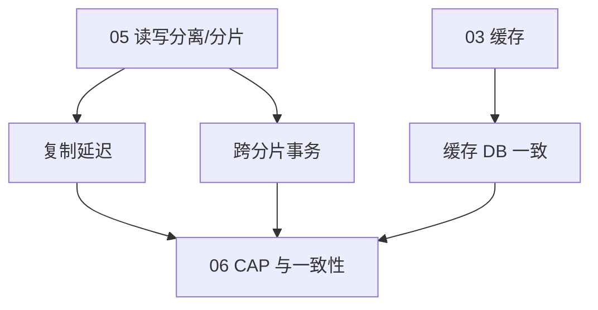
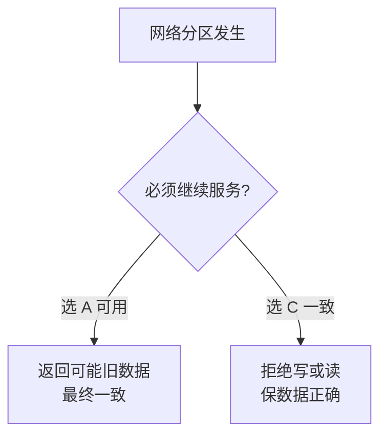
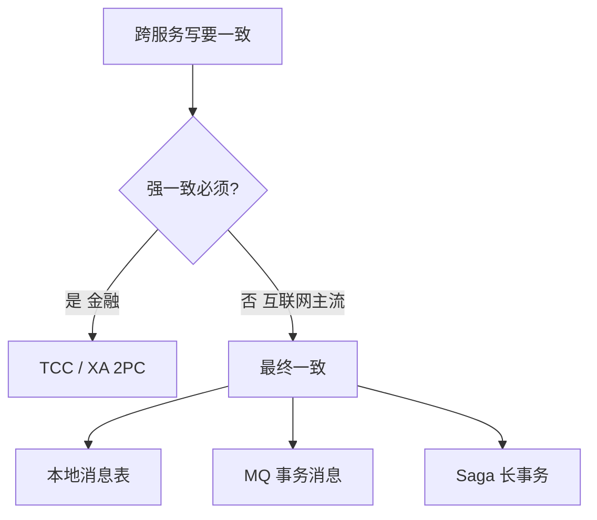
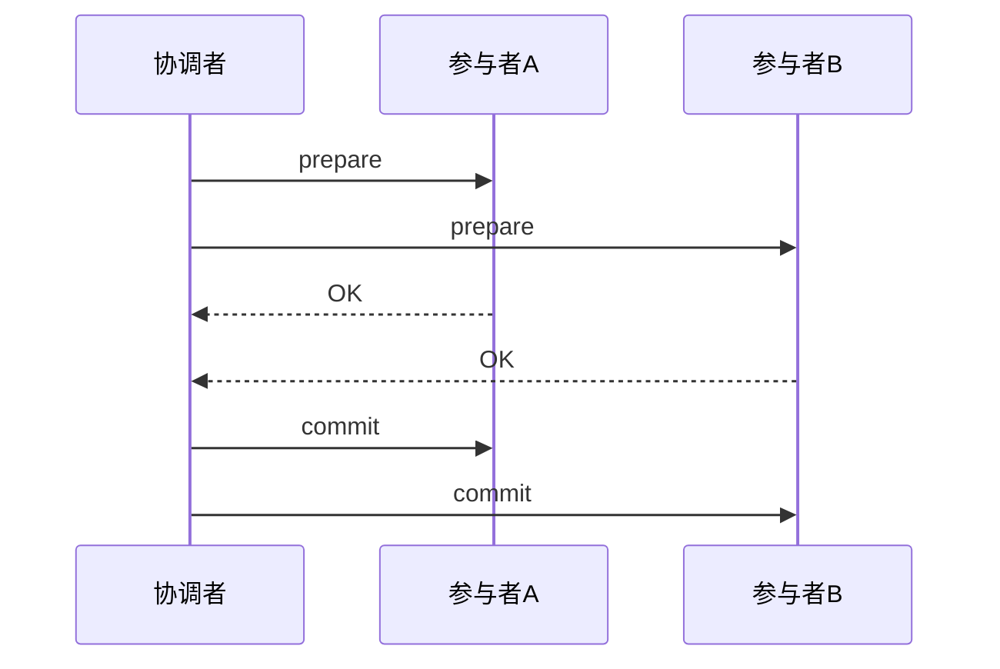
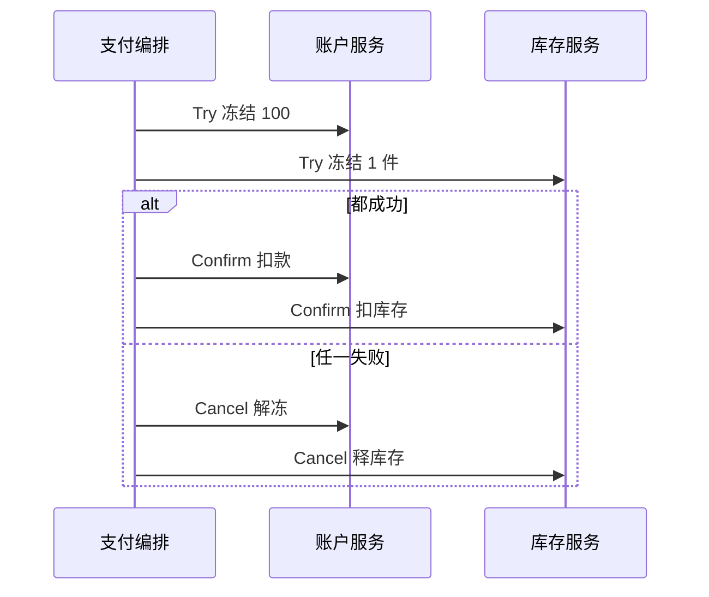
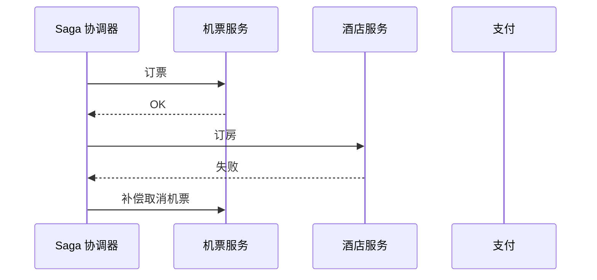
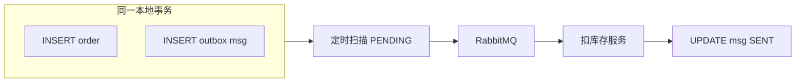
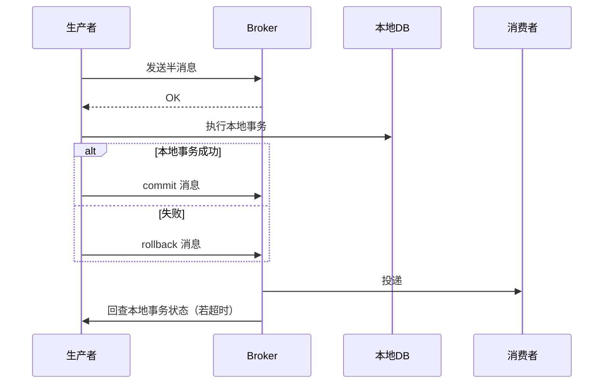
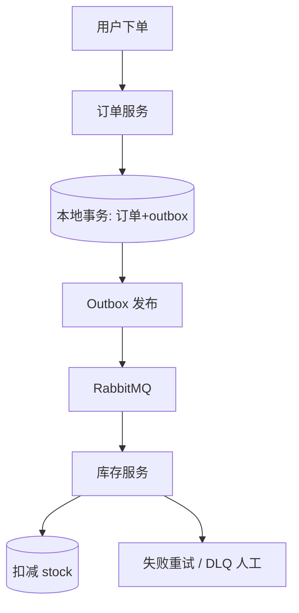
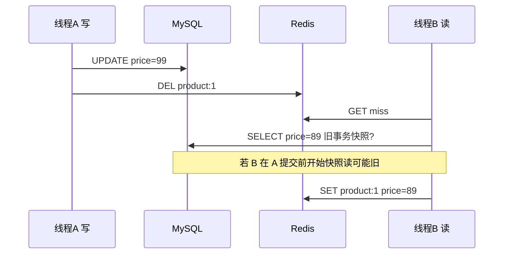

# 分布式一致性与 CAP

<!-- 修改说明: 2026-06-30 按 EXPANSION-STANDARD 扩充 §0、Case 步骤表、FAQ≥12、闭卷自测、费曼检验 -->

> **文件编码**：UTF-8  
> **定位**：在 [05 数据库扩展与读写分离](./05-数据库扩展与读写分离.md) 把数据拆到多副本、多分片之后，**「多个节点上的数据是否、何时一致」**成为系统设计核心。本章系统讲 CAP、PACELC、BASE、一致性级别与分布式事务选型。  
> **扩展阅读**：[Java/12 高并发与分布式系统基础](../Java/12-高并发与分布式系统基础.md) §16 CAP、§29 分布式事务；[Java/11 微服务](../Java/11-微服务与SpringCloud基础.md) Seata/TCC 概述。

---

## 0. 读前导读（零基础也能跟上）

### 0.1 用一句话弄懂本章

**一句话**：数据拆到多台机器后，**不可能处处像单机 MySQL 一样立刻一致**——本章教你 CAP 怎么取舍、BASE 怎么落地，以及 **2PC / TCC / Saga / 本地消息表** 该何时选。

### 0.2 你需要提前知道什么

| 你已会 | 可以直接学本章 |
|--------|----------------|
| [05 读写分离/分片](./05-数据库扩展与读写分离.md) | ✅ 本章 |
| [03 Cache Aside](./03-缓存架构设计.md) | ✅ 本章 |
| [Java/12 §16 CAP](../Java/12-高并发与分布式系统基础.md) 扫过 | ✅ 本章 |
| 完全不懂事务 ACID | 先 [Java/06 MySQL](../Java/06-MySQL基础索引与事务.md) §事务 |

### 0.3 本章知识地图（学完后应能勾选全部 ☐→☑）

- ☐ 30 秒内讲清 **CAP**，说明分区时 C/A 二选一
- ☐ 能解释 **PACELC** 与 CAP 区别
- ☐ 对比 **2PC / TCC / Saga / 本地消息表 / MQ 事务消息**（至少 4 项）
- ☐ 能口述 **跨服务库存扣减** Case（outbox + 幂等 + 补偿）
- ☐ 能分析 **缓存 DB 不一致** 的并发窗口与 3 种解法
- ☐ 明确 **分布式锁 ≠ 分布式事务**
- ☐ 闭卷自测（§23）≥ 8/10

### 0.4 建议学习时长与节奏

| 阶段 | 内容 | 建议时长 |
|------|------|----------|
| 第 1 天 | §1～§5 CAP、PACELC、BASE、一致性光谱 | 2 h |
| 第 2 天 | §6～§12 分布式事务方案对比 | 2.5 h |
| 第 3 天 | §13～§16 锁、幂等 + 两个 Case Study | 2.5 h |
| 第 4 天 | FAQ + 闭卷自测 + 费曼录音 | 1 h |

### 0.5 学完本章你能做什么（可验证的具体动作）

1. 白板画 CAP 分区取舍图，各举 ZK（CP）与 Cassandra（AP）例子
2. 为「订单服务 + 库存服务」画出本地消息表 Mermaid 时序图
3. 解释 TCC 的「空悬挂」并写出 Cancel 防悬挂伪代码
4. 说明「先更 DB 再删缓存」优于反序的并发原因
5. 回答面试官：「互联网高并发写路径为什么不用 XA？」

### 0.6 核心术语三件套（首次出现速记）

**CAP 定理（CAP Theorem）**：分区发生时，一致性与可用性不能兼得。  
**生活类比**：快递站断网——要么拒收新件保账本对齐（C），要么继续收件但可能对不上账（A）。  
**为什么重要**：所有分布式设计的理论底座。  
**本章用到的地方**：§2、§17 面试速答

**最终一致（Eventual Consistency）**：停止写入后，各副本经过一段时间收敛到相同值。  
**生活类比**：朋友圈点赞数晚几秒刷新——可接受。  
**为什么重要**：互联网 C 端默认模型。  
**本章用到的地方**：§4 BASE、§14 库存 Case

**本地消息表（Transactional Outbox）**：业务写库与写消息表同一本地事务，异步扫表发 MQ。  
**生活类比**：收银同时写小票和「待发货便签」，店员按便签发货。  
**为什么重要**：不依赖 MQ 事务特性，通用性最强。  
**本章用到的地方**：§10、§14 Case Study 1

---

## 本章与上一章的关系

05 章你学会了读写分离和分片——架构上立刻出现三类一致性问题：

1. **主从延迟**：写主读从，用户看到旧数据。
2. **跨分片写**：订单库扣库存 + 积分库加积分，无法用一个本地 `@Transactional` 兜住。
3. **缓存与 DB**：03 章 Cache Aside 下，Redis 与 MySQL 短暂不一致是常态还是 bug？

05 章回答「数据放哪」；本章回答「**允许多长时间、多大范围的不一致**」以及「**用什么协议补偿**」。  
[Java/12](../Java/12-高并发与分布式系统基础.md) 给了 CAP 词汇表和本地消息表简图——本章**加深理论 + 方案对比 + 两个完整 Case**。



---

## 1. 为什么分布式系统无法「处处强一致」

单机 MySQL 靠 **ACID + 单点时钟** 保证：事务提交后，下一次读必见新值。

分布式下：

- 网络会**分区**（机房光缆断、Pod 不可达）。
- 复制是**异步**的（性能要求）。
- 服务有**独立故障域**（订单服务活着、库存服务挂了）。

因此设计目标从「永远一致」变成「**在业务可接受的前提下，选合适的一致性模型与补偿机制**」。

---

## 2. CAP 定理

### 2.1 三个字母含义

| 字母 | 英文 | 含义 |
|------|------|------|
| **C** | Consistency | 所有节点同一时刻看到**相同**数据（线性一致性的强形式，面试常简化为此定义） |
| **A** | Availability | 每个请求都能收到**非失败**响应（不保证最新） |
| **P** | Partition tolerance | 网络分区发生时系统**继续工作**（不会整体停摆） |

### 2.2 定理内容（面试标准表述）

在存在**网络分区 P** 时，系统**不能同时**做到 C 和 A——必须在 **C 与 A 之间二选一**。



### 2.3 为什么 P 实际上「必选」

分布式系统跑在公网/多 AZ——**分区一定会发生**。所以真实取舍是：

```text
不是「CAP 三选二」，而是「分区时你要 C 还是 A」
```

### 2.4 例子 1：注册写主库，读从库（AP 倾向）

- 分区：应用连不上 Master，但能连 Replica。
- 选 **A**：读从库返回旧 profile（可用但 stale）。
- 选 **C**：读从库失败返回 503（不可用但避免脏读）。

互联网 C 端多数选 **AP + 写后读主 + 最终一致**。

### 2.5 例子 2：Redis 哨兵选主（CP 倾向）

- 分区：旧 Master 与集群多数失联。
- 选 **C**：旧 Master 拒绝写，避免**双主**。
- 若旧 Master 仍接受写 → 脑裂，数据分叉。

### 2.6 例子 3：ZooKeeper / etcd（CP）

- 选主需**多数派 quorum**。
- 分区 minority 侧**不可用**（不能写也不能选主），保 **C**。

### 2.7 例子 4：银行转账（偏 CP + 复杂协议）

- 余额不能错 → 宁可「服务繁忙」也不能双扣。
- 常用：**同步复制、分布式事务、或单库集中账户**。

### 2.8 CAP 常见误区

| 误区 | 纠正 |
|------|------|
| 「我们的系统是 CP」 | 平时无分区时 C 和 A 都能满足；CAP 谈的是**分区瞬间** |
| 「选了 AP 就不要一致」 | AP 多为**最终一致**，有补偿与读己之写策略 |
| 「CAP 只有三种系统」 | 一致性和可用性是**光谱**，不是开关 |

---

## 3. PACELC 扩展

CAP 只描述**分区时**的取舍。**PACELC** 补全**正常无分区**时的 Latency vs Consistency：

```text
if Partition:
    choose A or C   （同 CAP）
else:
    choose Latency or Consistency
```

| 系统 | P 时 | EL 时 | 解读 |
|------|------|-------|------|
| Dynamo/Cassandra | AP | 低延迟，牺牲强一致 | L 优先 |
| MongoDB 默认 | AP | 可调 write concern | 可偏 C |
| MySQL 单主同步 | CP | 同步复制时延迟↑一致↑ | 无分区时仍要权衡复制策略 |
| 纯缓存 Redis | AP | 极 L，弱 C | 业务层补偿 |

**面试加分**：「我们无分区时选 **L**（异步复制 + 缓存）；分区时选 **A**（降级读旧数据），关键路径写后读主。」

---

## 4. BASE 理论

**BA** Basically Available — 基本可用（响应时间变长、功能降级仍服务）  
**S** Soft state — 软状态（中间态允许存在）  
**E** Eventually consistent — 最终一致（时间窗口后收敛）


与 ACID 对比：

| | ACID | BASE |
|---|------|------|
| 一致性 | 立即 | 最终 |
| 隔离 | 强 | 业务层幂等 |
| 典型 | 单库事务 | 缓存、MQ、主从 |

---

## 5. 一致性级别光谱

从弱到强（需能**举例**）：

| 级别 | 说明 | 例子 |
|------|------|------|
| 读自己的写 | 用户改昵称后立即读必是新值 | 写后读主、Session 粘滞 |
| 单调读 | 不会时间倒流 | 同一 Replica |
| 因果一致 | 有因果关系的操作有序 | 评论回复链 |
| 最终一致 | 停止写入后，各副本收敛 | 主从复制、Cache Aside |
| 强一致/线性一致 | 读最新已提交写 | 单库事务、etcd quorum 读 |

```java
// 最终一致：发 MQ 异步扣库存，订单状态先 CREATED
orderMapper.insert(order);           // 本地事务提交
rabbitTemplate.convertAndSend("stock.deduct", event);  // 可能延迟几秒
// 此时查库存：Redis/DB 可能仍显示旧库存 → 业务接受 or 展示「处理中」
```

**秒杀/库存**：C 端展示可 **AP**；**扣减成功判定**必须业务层 **不超卖**（Redis Lua + DB 乐观锁），不等于全局强一致。

### 5.1 一致性级别选型决策表（面试白板）

| 业务场景 | 推荐级别 | 实现要点 | 别用什么 |
|----------|----------|----------|----------|
| 账户余额 | 强一致 | 单库事务 / TCC | 纯 Redis 扣款 |
| 秒杀扣库存 | 业务不超卖 | Lua + 乐观锁 + 幂等 | XA 跨库 |
| 商品详情缓存 | 最终一致 | Cache Aside + TTL | 强一致缓存 |
| 点赞/阅读数 | 最终一致 | Redis INCR + 异步落库 | 同步双写 |
| 配置/选主 | 线性一致 | etcd quorum | Redis 主从写 |
| 订单+库存跨服务 | 最终一致 | 本地消息表 + 补偿 | 同步 Feign 链 |

---

## 6. 分布式事务方案总览



| 方案 | 一致性 | 性能 | 开发成本 | 典型场景 |
|------|--------|------|----------|----------|
| **2PC/XA** | 强 | 差（锁到 prepare） | 低（容器支持） | 传统银行，互联网少用 |
| **TCC** | 可强 | 较好 | **高**（Try/Confirm/Cancel 三接口） | 支付、冻结金额 |
| **Saga** | 最终 | 好 | 中（正向 + 补偿） | 长流程订单、旅行 |
| **本地消息表** | 最终 | 好 | 中 | 订单 + 发 MQ |
| **MQ 事务消息** | 最终 | 好 | 中 | RocketMQ 半消息 |
| **Seata AT** | 最终 | 中 | 低 | 快速落地，有脏写风险需懂原理 |

---

## 7. 两阶段提交（2PC / XA）

### 7.1 流程



### 7.2 问题

1. **同步阻塞**：prepare 到 commit 资源锁住。
2. **协调者单点**：协调者 hang 住，参与者不知 commit 还是 rollback。
3. **性能**：跨库 RT × 2，高并发不适用。

```java
// Spring 理论上 @Transactional + JTA — 生产互联网极少用于高 QPS 路径
// @Transactional  // JTA 跨数据源 — 了解即可
```

**面试结论**：知道原理；**互联网高并发写路径不用 XA**。

---

## 8. TCC（Try-Confirm-Cancel）

### 8.1 三阶段语义

| 阶段 | 含义 | 库存例子 |
|------|------|----------|
| Try | 预留资源 | `frozen_stock += 1`，可用库存减 1 |
| Confirm | 确认提交 | `frozen_stock -= 1`，扣真实库存 |
| Cancel | 释放预留 | 回滚 frozen 与可用库存 |

### 8.2 空悬挂、幂等、防悬挂

- **空悬挂**：Cancel 比 Try 先到 → Cancel 需识别「无 Try 则忽略」。
- **幂等**：Confirm/Cancel 重复调用结果相同。
- **防悬挂**：Try 记录事务 ID，Cancel 检查 Try 是否存在。

```java
@Service
public class InventoryTccService {

    @Transactional
    public boolean tryDeduct(String txId, Long skuId, int qty) {
        if (tccLog.exists(txId, "TRY")) return true; // 幂等
        int rows = jdbc.update(
            "UPDATE stock SET available = available - ?, frozen = frozen + ? " +
            "WHERE sku_id = ? AND available >= ?",
            qty, qty, skuId, qty
        );
        if (rows == 0) return false;
        tccLog.save(txId, "TRY", skuId, qty);
        return true;
    }

    @Transactional
    public void confirm(String txId) {
        if (tccLog.exists(txId, "CONFIRM")) return;
        TccRecord r = tccLog.getTry(txId);
        jdbc.update(
            "UPDATE stock SET frozen = frozen - ? WHERE sku_id = ?",
            r.getQty(), r.getSkuId()
        );
        tccLog.save(txId, "CONFIRM", null, 0);
    }

    @Transactional
    public void cancel(String txId) {
        if (tccLog.exists(txId, "CANCEL")) return;
        Optional<TccRecord> tryRec = tccLog.findTry(txId);
        if (tryRec.isEmpty()) return; // 防悬挂
        TccRecord r = tryRec.get();
        jdbc.update(
            "UPDATE stock SET available = available + ?, frozen = frozen - ? WHERE sku_id = ?",
            r.getQty(), r.getQty(), r.getSkuId()
        );
        tccLog.save(txId, "CANCEL", null, 0);
    }
}
```

**适用**：**必须**预留、可回滚的金融资源；开发量约为普通接口 3 倍。

### 8.3 Case Study 3：支付冻结（TCC 迷你场景）

**场景**：用户支付 100 元，需同时 **冻结余额** 与 **预留库存**；15 分钟内未支付自动释放。



| 步骤 | 动作 | 失败处理 |
|------|------|----------|
| 1 | 账户 Try：`balance -= 100, frozen += 100` | 余额不足直接失败 |
| 2 | 库存 Try：`available -= 1, frozen += 1` | 失败则 Cancel 账户 |
| 3 | 支付成功 Confirm 两边 | 幂等表防重复 Confirm |
| 4 | 超时 MQ 触发 Cancel | 空悬挂检查 |

**面试结论**：金额类 **TCC**；普通电商下单 **outbox** 足够，别过度设计。

---

## 9. Saga

### 9.1 编排 vs 编排

| 模式 | 说明 |
|------|------|
| **编排 Choreography** | 各服务监听事件，链式触发（MQ） |
| **编排 Orchestration** | 中央 Saga 协调器发命令 |

### 9.2 流程示例：订酒店 + 机票

```text
正向：订机票 → 订酒店 → 扣款
补偿：退款 ← 取消酒店 ← 取消机票（逆序）
```



**与 TCC**：Saga **无 Try 预留**，靠**补偿事务**；补偿可能**语义不严格**（「取消短信」无法撤回）。

---

## 10. 本地消息表

### 10.1 核心思想

**业务写库与写消息表同一本地事务** → 定时任务扫表发 MQ → 消费者处理 → 更新消息状态。

与 [Java/12 §29](../Java/12-高并发与分布式系统基础.md) 一致，本章补细节。



### 10.2 表结构

```sql
CREATE TABLE local_message (
    id            BIGINT PRIMARY KEY,
    biz_type      VARCHAR(32) NOT NULL,
    biz_id        VARCHAR(64) NOT NULL,
    payload       JSON NOT NULL,
    status        TINYINT NOT NULL DEFAULT 0,  -- 0待发送 1已发送 2已消费
    retry_count   INT NOT NULL DEFAULT 0,
    next_retry_at DATETIME NOT NULL,
    created_at    DATETIME NOT NULL,
    UNIQUE KEY uk_biz (biz_type, biz_id)
);
```

### 10.3 Java 发件箱

```java
@Service
@RequiredArgsConstructor
public class OrderAppService {
    private final OrderMapper orderMapper;
    private final LocalMessageMapper messageMapper;

    @Transactional
    public Long createOrder(CreateOrderCmd cmd) {
        Order order = orderMapper.insert(cmd);
        LocalMessage msg = LocalMessage.pending(
            "STOCK_DEDUCT",
            order.getId().toString(),
            JsonUtil.toJson(new StockDeductEvent(order.getId(), cmd.getSkuId(), cmd.getQty()))
        );
        messageMapper.insert(msg);
        return order.getId();
    }
}

@Component
@RequiredArgsConstructor
public class OutboxPublisher {
    @Scheduled(fixedDelay = 1000)
    public void publish() {
        List<LocalMessage> batch = messageMapper.selectPending(100);
        for (LocalMessage m : batch) {
            try {
                rabbitTemplate.convertAndSend("stock.exchange", "deduct", m.getPayload());
                messageMapper.markSent(m.getId());
            } catch (Exception e) {
                messageMapper.increaseRetry(m.getId());
            }
        }
    }
}
```

### 10.4 优缺点

| 优点 | 缺点 |
|------|------|
| 不依赖 MQ 事务特性 | 扫表延迟（通常 1s 级） |
| 任何 MQ 都能用 | 需清理历史消息 |
| 消息可审计 | 消费者仍要幂等 |

---

## 11. MQ 事务消息（以 RocketMQ 为例）

### 11.1 半消息流程



RabbitMQ **无原生事务消息**（只有事务模式性能差）；常用 **本地消息表** 或 **Confirm + 幂等** 模拟。

### 11.2 与本地消息表对比

| 维度 | 本地消息表 | MQ 事务消息 |
|------|------------|-------------|
| 依赖 | 仅 DB + MQ | RocketMQ 等 |
| 延迟 | 扫表间隔 | 较低 |
| 实现 | 自建 outbox | Broker 回查 |
| 面试 | 通用答案 | 阿里系加分 |

---

## 12. 方案选型决策树

```text
是否跨公司/银行级强一致？
  └ 是 → TCC 或业务合并到单库
  └ 否 → 能否接受秒级不一致？
        └ 是 → 本地消息表 / MQ 事务消息（首选）
        └ 否 → Saga 短补偿 + 同步 RPC（仍非 2PC）
```

**Seata AT 模式**：自动代理数据源，**undo_log** 回滚——适合快速 POC；生产需评估 **全局锁、脏写** 与 RT。

---

## 13. 分布式锁回顾

[Java/07 Redis](../Java/07-Redis核心原理与缓存实战.md) 与 [Java/12](../Java/12-高并发与分布式系统基础.md) 已讲 SETNX；本章强调**与一致性的关系**。

### 13.1 Redis 分布式锁

```java
// Redisson 推荐：看门狗续期 + Lua 释放
RLock lock = redisson.getLock("lock:order:" + orderId);
try {
    if (lock.tryLock(3, 30, TimeUnit.SECONDS)) {
        processOrder(orderId);
    }
} finally {
    if (lock.isHeldByCurrentThread()) lock.unlock();
}
```

| 点 | 说明 |
|----|------|
| 作用 | **互斥**，不是分布式事务 |
| 过期 | 业务未完成锁过期 → 双执行，需续期或 fencing token |
| RedLock | 多 master 争议大，**慎用** |
| vs DB | `SELECT FOR UPDATE` 单库有效；跨库无效 |

### 13.2 锁 + 幂等 + 唯一索引（组合拳）

```text
SETNX 挡重复 → 唯一索引兜底 → 本地事务写库
```

锁**不能**替代跨服务事务；只保证同一 `orderId` 同时只有一个线程处理。

### 13.3 etcd/ZK 锁（CP）

强一致场景（选主、配置）用 **etcd lease**；库存扣减互联网仍多用 **Redis + DB 乐观锁**。

---

## 14. Case Study 1：跨服务库存扣减

### 14.1 场景

下单服务（Order）与库存服务（Inventory）分库；流程：创建订单 → 扣库存 → 发通知。

**要求**：不能超卖；可接受库存显示 1～2 秒延迟；支付前必须扣成功。

### 14.2 错误方案

| 方案 | 问题 |
|------|------|
| OpenFeign 同步扣库存，无事务 | 订单成功库存失败 → 脏单 |
| XA 跨两库 | RT 高，锁表 |
| 先扣库存再建单 |  abandoned 订单占库存 |

### 14.3 推荐：本地消息表 + 消费者幂等



**库存服务消费者**：

```java
@RabbitListener(queues = "stock.deduct.q")
public void onDeduct(StockDeductEvent event) {
    // 幂等：deduct_log 唯一 (order_id)
    if (deductLog.exists(event.getOrderId())) return;
    boolean ok = stockService.deduct(event.getSkuId(), event.getQty());
    if (!ok) {
        orderService.cancel(event.getOrderId()); // 补偿
        throw new AmqpRejectAndDontRequeueException("stock not enough");
    }
    deductLog.save(event.getOrderId());
}
```

**一致性语义**：**最终一致**；订单 `PENDING_STOCK` → `CONFIRMED`；用户看到「处理中」。

### 14.5 Case Study 1 手把手步骤表

| 步骤 | 你的设计动作 | 预期结果 | 若不对 |
|------|--------------|----------|--------|
| 1 | 订单服务 `createOrder` 本地事务写 `order` + `local_message` | 两表同事务提交 | 只写 order 无消息 → 库存永不扣 |
| 2 | Outbox 定时任务扫 `PENDING` 发 MQ | 1s 内消息到达 Broker | 扫表停 → 积压，加监控 |
| 3 | 库存消费者 `deduct_log` 幂等 `(order_id)` | 重复消息不双扣 | 无幂等 → 超扣 |
| 4 | 扣失败发 `cancelOrder` 补偿 | 订单变 CANCELLED | 脏单滞留 |
| 5 | 前端轮询或 WS 推送订单状态 | 用户见「处理中→成功」 | 用户以为失败重复下单 |

### 14.6 更强：TCC 何时上？

**秒杀尾款、冻结保证金**——Try 冻结库存，支付 Confirm，超时 Cancel。

---

## 15. Case Study 2：缓存与 DB 一致性

### 15.1 场景

商品详情：MySQL 为源，Redis Cache Aside，读 QPS 10 万。

更新商品：运营改价后，部分用户仍看到旧价 5～30 秒。

### 15.2 策略矩阵

| 策略 | 一致性 | 复杂度 | 适用 |
|------|--------|--------|------|
| 先更 DB 再删缓存 | 较好 | 低 | **默认推荐** |
| 先删缓存再更 DB | 差（并发读回填旧值） | 低 | 不推荐 |
| 延迟双删 | 中 | 中 | 旧项目 |
| 订阅 Binlog 删缓存 | 好 | 高 | 大促、Canal |
| 短 TTL | 最终 | 低 | 可接受 stale |

### 15.3 先更 DB 再删缓存（标准）

```java
@Transactional
public void updatePrice(Long productId, BigDecimal newPrice) {
    productMapper.updatePrice(productId, newPrice);
    // 事务提交后删缓存（TransactionSynchronization 或 @TransactionalEventListener AFTER_COMMIT）
}

@TransactionalEventListener(phase = TransactionPhase.AFTER_COMMIT)
public void evictCache(ProductPriceUpdatedEvent e) {
    redis.delete("product:" + e.getProductId());
}
```

**仍有的窗口**：删缓存后、下次读前，另一请求读 miss 从 DB 读旧值？——若 DB 已提交则读到新值；**极端并发**下两个读 miss 并发写缓存旧值 → **互斥锁 / 逻辑过期**（见 03 章）。

### 15.4 时序：问题并发



**解法**：

1. **读己之写**：写接口返回新 VO，前端直接用；详情页带 `version` 参数。
2. **Canal**：Binlog 驱动删缓存，延迟 < 100ms。
3. **accept stale**：价格非支付瞬间，TTL 30s + 下单时 **实时查 DB 验价**。

### 15.5 CAP 视角

- 缓存层：**AP**（Redis 主从可能丢最新）。
- 支付验价路径：**CP 倾向**（直读 Master DB 或强校验接口）。

### 15.6 Case Study 2 手把手步骤表

| 步骤 | 你的设计动作 | 预期结果 | 若不对 |
|------|--------------|----------|--------|
| 1 | `updatePrice` 在 `@Transactional` 内更 DB | 行锁提交后新价持久化 | 事务外更价 → 回滚不一致 |
| 2 | `AFTER_COMMIT` 监听器删 Redis `product:{id}` | 缓存失效 | 事务提交前删缓存 → 旧值回填 |
| 3 | 读路径 Cache Aside：miss 读 Master | 读到新价 | 读从库 → 主从延迟旧价 |
| 4 | 下单验价直查 DB 或强一致接口 | 支付金额正确 | 仅信缓存 → 资损 |
| 5 | 大促加 Canal Binlog 删缓存 | 延迟 < 100ms | 仅 TTL → 窗口更长 |

### 15.7 本地消息表 Java 逐行读（>10 行）

| 行号/代码块 | 含义 | 改错会怎样 |
|-------------|------|------------|
| `@Transactional createOrder` | 订单与 outbox 同边界 | 去掉注解 → 可能只写一半 |
| `orderMapper.insert(cmd)` | 持久化订单 | 顺序反了先写消息 → 消息指向空订单 |
| `LocalMessage.pending(...)` | 构造待发送事件 | payload 缺 skuId → 消费者无法扣 |
| `messageMapper.insert(msg)` | 同事务写 outbox | 漏写 → 永不发 MQ |
| `@Scheduled publish` | 定时扫表 | fixedDelay 过大 → 秒级延迟 |
| `selectPending(100)` | 批量拉取 | 单条拉 → 吞吐低 |
| `convertAndSend` | 投递 MQ | 无 Confirm → 可能丢消息 |
| `markSent` | 更新状态防重发 | 先发后标 → 重复投递 |
| `increaseRetry` | 失败退避 | 无上限 → 死循环 |

---

## 16. 幂等与去重（一致性的盟友）

| 机制 | 层级 |
|------|------|
| 唯一索引 `(biz_type, biz_id)` | DB 最终兜底 |
| Redis SETNX | 快速挡 |
| 状态机 `PENDING→DONE` | 业务层 |
| 消费者 dedup 表 | MQ 至少一次 |

**至少一次投递 + 幂等消费 = 恰好一次效果**（工程语义）。

---

## 17. 面试对比速答

### Q：TCC 和 Saga？

| | TCC | Saga |
|---|-----|------|
| 预留 | Try 阶段预留 | 无，直接做 |
| 回滚 | Cancel 释放预留 | 补偿接口 |
| 隔离 | 较好 | 差（脏读中间态） |
| 适用 | 短、资源可冻结 | 长流程 |

### Q：本地消息表 vs MQ 事务消息？

都能最终一致；消息表 **MQ 无关**；RocketMQ 事务消息 **省扫表**，需 Broker 支持。

### Q：分布式锁能保一致吗？

**不能**；只保互斥。一致靠事务边界、幂等、补偿。

---

## 18. 分级练习

### 基础

1. CAP 中 P 为什么必选？分区时 C 和 A 如何二选一？各举一系统。
2. BASE 三个字母分别指什么？与 ACID 关系？
3. 强一致 vs 最终一致各举一个业务场景。

### 进阶

4. 画出本地消息表从下单到扣库存的 Mermaid 时序图。
5. 说明 TCC 的「空悬挂」是什么，如何预防。
6. Cache Aside 更新价格，为什么推荐「先更 DB 再删缓存」？

### 挑战

7. 订单服务、积分服务、库存服务三写：用 Saga 设计正向与补偿步骤。
8. 若 Redis 主从异步复制，锁在旧主上已释放，新主未同步——会发生什么？如何缓解？

### 参考答案

#### 基础 1～3

1. 分布式必遇网络隔离；ZK 分区 minority **不可用=CP**；Cassandra **仍服务可能旧值=AP**。  
2. 见 §4；BASE 是 ACID 在分布式的工程 relax。  
3. 强一致：账户余额；最终：朋友圈点赞数、商品详情缓存。

#### 进阶 4～6

4. 见 §10.1 flowchart / §14.3。  
5. Cancel 先于 Try 到达；Cancel 查无 Try 记录则**直接返回成功**不执行回滚。  
6. 先删缓存则读请求可能把**旧 DB 值**写回缓存；先更 DB 则 miss 时读到新值（仍要注意事务提交时机用 AFTER_COMMIT 删缓存）。

#### 挑战 7～8

7. 正向：创建订单 → 扣库存 → 加积分；补偿：删积分 → 回库存 → 取消订单（逆序）；每步幂等 + 状态表。  
8. **锁失效双扣**；缓解：Redisson 看门狗、fencing token（DB 更新带 monotonic token）、**DB 乐观锁/唯一约束兜底**。

---

## 19. 学完标准

- [ ] 30 秒内讲清 CAP，并说明 **P 必选、分区时在 C/A 间取舍**
- [ ] 能解释 PACELC 与 CAP 的区别
- [ ] 能描述 BASE，并举一个最终一致的业务闭环
- [ ] 对比 **2PC / TCC / Saga / 本地消息表 / MQ 事务消息**（至少 4 项）
- [ ] 能完整口述 **跨服务库存扣减** Case（outbox + 幂等 + 补偿）
- [ ] 能分析 **缓存 DB 不一致** 的并发窗口与 3 种解法
- [ ] 明确 **分布式锁 ≠ 分布式事务**，说出 Redisson 与唯一索引组合
- [ ] 知道 Seata AT 定位，不盲目用于核心金融

---

## 20. 常见问题 FAQ

### Q1：互联网是不是都 AP？

**多数 C 端 AP + 最终一致**；支付、库存确认等**关键路径**用同步校验、TCC 或单库集中。

### Q2：最终一致会不会被用户投诉？

看产品：**读己之写**、进度条、「处理中」状态；**支付结果**必须可靠（同步 + 对账）。

### Q3：RabbitMQ 怎么做事务消息？

无 RocketMQ 式半消息；用 **本地消息表** 或 **Publisher Confirm + 消费者幂等**。

### Q4：Saga 补偿失败怎么办？

重试 + DLQ + **人工对账**；Saga 必须设计**可重入补偿**。

### Q5：和 05 章主从延迟关系？

主从 lag 是 **最终一致**的一种；写后读主是 **读己之写** 策略，不是全局强一致。

### Q6：Seata AT 和本地消息表怎么选？

**AT**：开发快，自动代理数据源，需懂 undo_log 与全局锁；**消息表**：MQ 无关、可审计，多 1s 扫表延迟。金融核心写路径优先 **TCC 或单库**；互联网订单+库存优先 **outbox**。

### Q7：Saga 补偿和 TCC Cancel 有何不同？

TCC Cancel 释放 **Try 预留的资源**；Saga 补偿是 **业务逆向操作**（退款、删积分），语义可能不完美（短信无法撤回），且中间态可被其他事务读到。

### Q8：etcd 和 Redis 在一致性上差在哪？

**etcd/ZK**：quorum 读写，**CP**，分区 minority 不可用；**Redis 主从**：默认 **AP**，异步复制可能丢最新写。配置/选主用 etcd；缓存/库存扣减用 Redis + DB 兜底。

### Q9：读己之写有哪些实现？

写后读 **Master**、Session **粘滞**到同一副本、客户端 **携带 version** 强制读新、写接口 **直接返回新 VO** 不给读旧的机会。

### Q10：2PC 协调者挂了怎么办？

参与者处于 **prepare 后未知状态**——需 **超时回滚** 或 **人工介入**；这是 2PC 致命缺陷之一，也是互联网不用 XA 的原因。

### Q11：如何向产品解释「最终一致」？

用 **进度条**、**处理中** 状态、**读己之写**；支付结果必须 **同步可靠 + 对账**；展示类数据（点赞、库存展示）可延迟几秒。

### Q12：DDIA 要读吗？

**06、05 章理论来源**；《Designing Data-Intensive Applications》Ch.7 一致性、Ch.9 分区——有时间强烈推荐。

---

## 21. 知识点对照 Java 章节

| 主题 | 系统设计 06 | Java |
|------|-------------|------|
| CAP/BASE | 全文 | 12 §16 |
| 分布式事务 | §6～12 | 12 §29, 11 Seata |
| 分布式锁 | §13 | 07 §33, 12 §7 |
| 缓存一致 | §15 | 07 §35, 03 章 |
| 幂等 | §16 | 08 MQ, 14 场景 |

---

## 22. 我的笔记区

```text
我们项目一致性模型：__________
跨服务用的方案：__________
缓存更新策略：__________
有没有对账/补偿任务：__________
```

---

## 23. 闭卷自测

完成后再看 §23.1 参考答案。

1. **概念** CAP 三个字母分别指什么？为什么 P 实际上必选？
2. **概念** BASE 三个字母分别指什么？与 ACID 核心区别？
3. **概念** 强一致、最终一致、读己之写各举一个业务场景。
4. **概念** PACELC 相对 CAP 多描述了哪种权衡？
5. **概念** 本地消息表如何保证「订单与发消息」不丢一半？
6. **概念** 分布式锁能否替代分布式事务？为什么？
7. **动手** 画出 TCC Try/Confirm/Cancel 三阶段库存字段变化（available/frozen）。
8. **动手** 写 Cache Aside 更新价格：事务提交后删缓存的 Spring 钩子名。
9. **综合** 订单、积分、库存三服务三写：用 Saga 列正向与补偿步骤（逆序）。
10. **综合** Redis 主从异步 + 分布式锁：锁过期双扣如何三层兜底？

### 23.1 自测参考答案

1. C 一致、A 可用、P 分区容忍；分布式必遇网络分区，故实际在 C/A 间取舍。  
2. BA 基本可用、S 软状态、E 最终一致；ACID 立即一致，BASE 允许中间态。  
3. 强一致：账户余额；最终一致：点赞数；读己之写：改昵称后立即读。  
4. 无分区时在 **延迟 L** 与 **一致 C** 间取舍。  
5. 同一 `@Transactional` 内 insert order + insert outbox；扫表发 MQ。  
6. 不能；锁只互斥，不保证跨服务原子提交。  
7. Try: available↓ frozen↑；Confirm: frozen↓；Cancel: available↑ frozen↓。  
8. `@TransactionalEventListener(phase = AFTER_COMMIT)` 或 `TransactionSynchronization`。  
9. 正向：建单→扣库存→加积分；补偿：删积分→回库存→取消订单。  
10. Redisson 看门狗续期、fencing token、DB 乐观锁/唯一索引兜底。

---

## 24. 费曼检验

请在不看资料的情况下，用 **3 分钟**向朋友解释：**「为什么秒杀不能全靠 Redis，还要 MySQL 和 MQ？」**

**对照提纲（能说到即过关）**：

1. **CAP 视角**：Redis 偏 AP，主从可能丢；库存 **不能超卖** 要 DB 乐观锁兜底。  
2. **性能视角**：5 万 QPS 不能直打 MySQL；Redis Lua 挡 99%，MQ 削峰异步落库。  
3. **一致视角**：Redis 预扣与 DB 是 **最终一致**；靠幂等、唯一索引、对账 Job 收敛。

---

## 25. DDIA 延伸阅读

**06、05 章理论来源**；《Designing Data-Intensive Applications》Ch.7 一致性、Ch.9 分区——有时间强烈推荐。

---

## 下一章预告

06 章是**理论与方案选型**——下一章把 01～06 的方法论和组件**拧成一股绳**，做第一个完整 Case Study。

**[07-秒杀系统简化设计](./07-秒杀系统简化设计.md)** 从需求澄清、容量估算到网关/Redis/MQ/DB 全链路，讲防超卖与幂等，并对比 [Java/14 秒杀模板](../Java/14-高频场景设计与面试专题.md) 与 [Java/07 Redis](../Java/07-Redis核心原理与缓存实战.md)、[Java/08 MQ](../Java/08-RabbitMQ与消息队列实战.md)、[Java/12](../Java/12-高并发与分布式系统基础.md) 的实战细节。

---

*配合 [05 数据库扩展](./05-数据库扩展与读写分离.md)、[03 缓存架构](./03-缓存架构设计.md)、[04 MQ 架构](./04-消息队列架构设计.md) 形成数据层完整视图。*

*本章已按 EXPANSION-STANDARD 扩充（§0+Case 步骤表+Outbox 逐行读+FAQ+闭卷自测+费曼）。*

**EXPANSION-STANDARD 自检**：☑ §0 ☑ Case 步骤表 §14.5/§15.6 ☑ Outbox 逐行读 §15.7 ☑ FAQ≥12 ☑ 闭卷 10 题 §23 ☑ 费曼 §24
