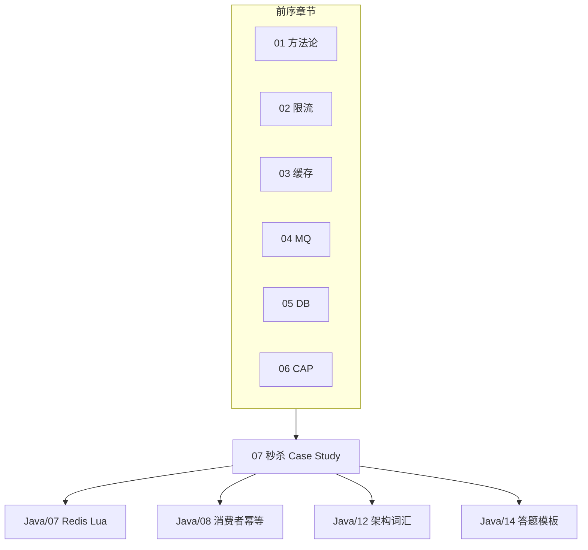
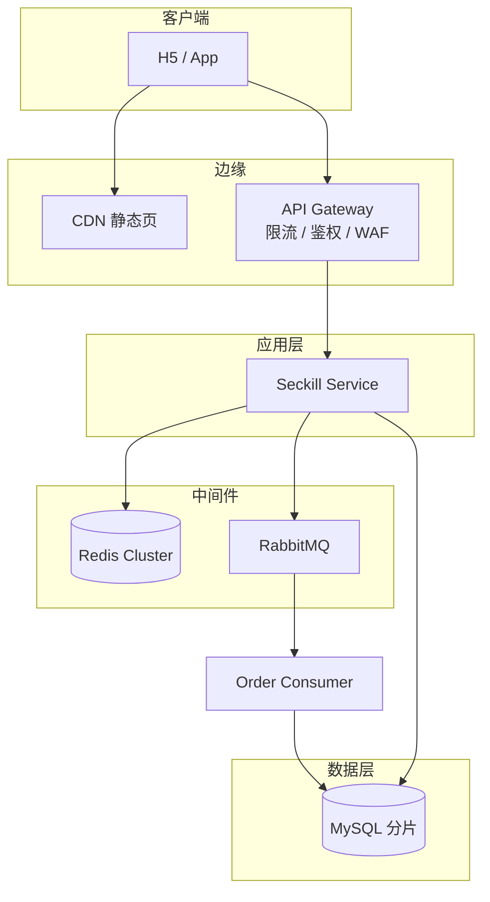
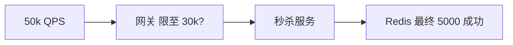
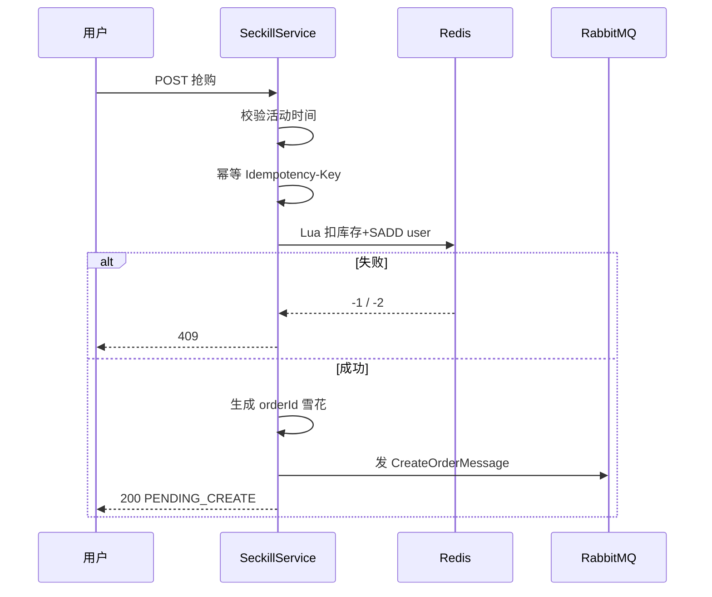
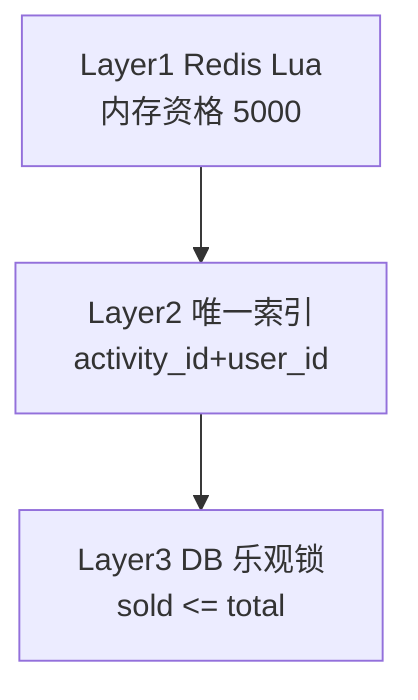
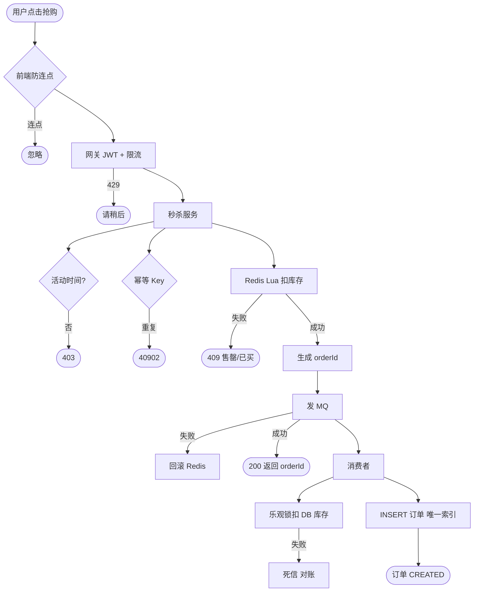

# 秒杀系统简化设计

<!-- 修改说明: 2026-06-30 按 EXPANSION-STANDARD 扩充 §0、Case 步骤表、Lua 逐行读、FAQ≥12、闭卷自测、费曼检验 -->

> **文件编码**：UTF-8  
> **定位**：综合运用 [01 方法论](./01-系统设计方法论与面试框架.md)～[06 CAP](./06-分布式一致性与CAP.md)，完成第一个**完整 Case Study**。比 [Java/14 秒杀模板](../Java/14-高频场景设计与面试专题.md) 更细：含估算、分层架构、Mermaid 全链路、防超卖与幂等实现要点。  
> **关联章节**：[Java/07 Redis](../Java/07-Redis核心原理与缓存实战.md) §34 秒杀、[Java/08 RabbitMQ](../Java/08-RabbitMQ与消息队列实战.md) 异步削峰、[Java/12 高并发](../Java/12-高并发与分布式系统基础.md) §22 秒杀拆解。

---

## 0. 读前导读（零基础也能跟上）

### 0.1 用一句话弄懂本章

**一句话**：秒杀是 **01～06 章的期末综合题**——瞬时 5 万 QPS、库存只有 5000，靠 **CDN 限流 → Redis Lua 资格 → MQ 削峰 → DB 乐观锁** 四层把写压进数据库能扛的范围。

### 0.2 你需要提前知道什么

| 你已会 | 可以直接学本章 |
|--------|----------------|
| [01 方法论](./01-系统设计方法论与面试框架.md) 4+1 步 | ✅ 本章 |
| [02 限流](./02-限流熔断与降级.md)、[03 缓存](./03-缓存架构设计.md) | ✅ 本章 |
| [06 CAP](./06-分布式一致性与CAP.md) 最终一致 | ✅ 本章 |
| [Java/07 Redis Lua](../Java/07-Redis核心原理与缓存实战.md) §34 | ✅ 本章 |
| 完全没听过 MQ | 先 [04 MQ 架构](./04-消息队列架构设计.md) |

### 0.3 本章知识地图（学完后应能勾选全部 ☐→☑）

- ☐ **5 分钟**讲清需求、估算、架构分层
- ☐ 默画 **Mermaid 架构图 + 抢购 flowchart**
- ☐ 写得出 **Lua 三判断**（库存、限购、扣减）
- ☐ 说清 **MQ 削峰**位置与 **DB 乐观锁**兜底原因
- ☐ 设计 **三层幂等** 与 **MQ 失败补偿**
- ☐ 闭卷自测（§24）≥ 8/10

### 0.4 建议学习时长与节奏

| 阶段 | 内容 | 建议时长 |
|------|------|----------|
| 第 1 天 | §1～§4 需求、估算、API、架构 | 2 h |
| 第 2 天 | §5～§7 前端、网关、Redis Lua | 3 h |
| 第 3 天 | §8～§11 MQ、DB、幂等、全流程图 | 2.5 h |
| 第 4 天 | 15 分钟模拟 + 闭卷自测 + 费曼 | 1.5 h |

### 0.5 学完本章你能做什么（可验证的具体动作）

1. 白板从 DAU 推到抢购 QPS 与「为何不能直打 MySQL」
2. 手写 Lua：`库存判断 + SISMEMBER 限购 + DECRBY`
3. 口述 MQ 发送失败时 Redis 回滚 Lua 补偿流程
4. 画出三层防超卖：Redis → 唯一索引 → 乐观锁
5. 对比 [Java/14 §30.2](../Java/14-高频场景设计与面试专题.md) 说出本章多出的 5 个维度

### 0.6 核心术语三件套

**预扣库存（Redis Pre-deduct）**：在内存中原子判定资格，挡掉 99% 无效请求。  
**生活类比**：演唱会门口保安先看票根，没票不用进馆排队。  
**为什么重要**：MySQL 扛不住 5 万写 QPS。  
**本章用到的地方**：§7 Lua

**削峰填谷（MQ Peak Shaving）**：同步路径只发消息，消费者按 DB 能力慢慢落库。  
**生活类比**：餐厅先拿号，按号入座，不在门口挤爆厨房。  
**为什么重要**：5000 成功单不必同步写库。  
**本章用到的地方**：§8

**乐观锁（Optimistic Lock）**：`UPDATE ... WHERE sold + 1 <= total`，冲突则失败。  
**生活类比**：改签机票时看「余票是否仍 ≥1」，不是先锁整架飞机。  
**为什么重要**：Redis 与 DB 漂移时最终不超卖。  
**本章用到的地方**：§9.2

---

## 本章与上一章的关系

01～02 讲怎么拆题、怎么限流；03 讲缓存扛读；04 讲 MQ 削峰；05 讲 DB 扩展；06 讲一致性与补偿。

**秒杀**是这些组件的「期末综合题」：

| 章节能力 | 在秒杀中的体现 |
|----------|----------------|
| 01 估算 | 峰值 QPS、库存量级、带宽 |
| 02 限流 | 网关令牌桶、用户维度限流 |
| 03 缓存 | 活动页静态化、库存热点 |
| 04 MQ | 异步创建订单、削峰填谷 |
| 05 分片 | 订单按 user_id 落库 |
| 06 一致 | Redis 预扣 + DB 乐观锁 + 幂等 |

[Java/12 §22](../Java/12-高并发与分布式系统基础.md) 给了三层防护一句话；[Java/14 §30.2](../Java/14-高频场景设计与面试专题.md) 给了 ASCII 框图——**本章展开为可面试 30 分钟、可落地实现的简化设计**。



---

## 1. 需求澄清（面试第一步）

### 1.1 功能需求（MVP）

| 功能 | 说明 | 优先级 |
|------|------|--------|
| 秒杀活动页 | 展示商品、库存、倒计时 | P0 |
| 秒杀下单 | 活动开始后可抢购 | P0 |
| 限购 | 每用户每活动 1 件（可配置） | P0 |
| 订单查询 | 抢购结果、订单状态 | P1 |
| 支付 | 可简化为「下单成功=占位，15 分钟内支付」 | P1 |
| 运营配置 | 创建活动、库存、时间 | P2（面试可口述） |

### 1.2 非功能需求

| 维度 | 目标 | 面试可协商假设 |
|------|------|----------------|
| 峰值 QPS | 扛 5 万～10 万/秒 | 活动持续 10 分钟 |
| 库存 | 1000～10000 件 | 远小于 QPS |
| 超卖 | **0 容忍** | |
| 重复下单 | 每用户成功 ≤1 | |
| RT | 抢购接口 P99 < 200ms | 异步落单可 1s 内可见 |
| 可用性 | 活动期 99.9% | 降级静态页 |

### 1.3 明确不做（Scope 控制）

- 复杂推荐、购物车、跨 SKU 组合
- 全球多活（除非面试官追问）
- 完整支付对账（可指向「支付服务另题」）

### 1.4 澄清问题清单（向面试官提问）

```text
1. DAU 与同时在线？活动持续多久？
2. 库存量级？是否每用户限购 1？
3. 下单后是否必须同步返回订单号？
4. 能否接受「排队中」异步结果？
5. 一致性：能否接受列表页库存略滞后？
```

---

## 2. 容量估算

### 2.1 假设（可白板重写）

```text
DAU：500 万
活动参与率：20% → 100 万人在线
峰值系数：10% 同时点 → 10 万 QPS（保守按 5 万 QPS 设计）
SKU 库存：5000 件
活动时长：600 秒
```

### 2.2 QPS

```text
抢购 API QPS ≈ 50,000/s（设计目标）
实际成功订单 ≤ 5000（库存上限）
99% 请求应在 Redis 层被拒绝（库存/资格）
到达 MySQL 的写 QPS 目标 < 500/s（MQ 削峰后更低）
```

### 2.3 存储

| 数据 | 估算 |
|------|------|
| 订单 | 5000 条/活动 × 500B ≈ 2.5MB（可忽略） |
| 秒杀日志 | 失败请求可采样，成功必存 |
| Redis | 库存 key + 用户 Set + 活动信息 < 10MB |

### 2.4 带宽

```text
请求：50k × 1KB ≈ 50 MB/s ≈ 400 Mbps（入口）
响应：大量 409/403 短 JSON，约 100 Mbps 级
静态页走 CDN，不占 API 带宽
```

### 2.5 结论驱动架构

```text
50k QPS 不能直打 MySQL
→ 网关限流 + Redis 内存判定 + MQ 异步写库
5000 库存 → 热点集中在少量 key，Redis 单 key 可扛（集群分片备用）
```

---

## 3. API 设计

### 3.1 REST 接口

| 方法 | 路径 | 说明 |
|------|------|------|
| GET | `/api/v1/seckill/activities/{id}` | 活动详情（可 CDN） |
| POST | `/api/v1/seckill/activities/{id}/orders` | 抢购 |
| GET | `/api/v1/seckill/orders/{orderId}` | 查单 |
| GET | `/api/v1/users/me/seckill-orders` | 我的秒杀订单 |

### 3.2 抢购请求/响应

```json
// POST body
{
  "skuId": 10086,
  "idempotentKey": "uuid-from-client"
}

// 200 成功（异步落单）
{
  "code": 0,
  "data": {
    "orderId": "1983726450000123456",
    "status": "PENDING_CREATE"
  }
}

// 409 库存不足 / 已抢过
{
  "code": 40901,
  "message": "已售罄或您已参与"
}
```

### 3.3 错误码设计

| code | 含义 | 层 |
|------|------|-----|
| 429 | 限流 | 网关 |
| 403 | 活动未开始/已结束 | 服务 |
| 40901 | 库存/资格失败 | Redis |
| 40902 | 重复提交 | 幂等 |
| 503 | 降级 | 网关/服务 |

---

## 4. 高层架构



### 4.1 与 Java/14 三层防护对照

| Java/14 层 | 本章对应 | 扩展点 |
|------------|----------|--------|
| 前端防抖 | §5 前端 | 验证码、静态页 |
| 网关 + Redis | §6～7 | Sentinel 参数、Lua 原子 |
| MQ + DB | §8～9 | 幂等表、乐观锁、死信 |

---

## 5. 前端层

### 5.1 职责

- 活动页 **静态化** 或 SSR 缓存，CDN 边缘分发
- 倒计时由 **服务端时间** 校准，防改本地时钟
- 按钮：**活动开始前 disabled**；点击后 **loading 防连点**
- 可选：**图形验证码 / 答题**（流量削峰 + 防脚本）

### 5.2 静态页策略

```text
/seckill/{activityId}.html → CDN
  - 商品图、文案、开始时间戳
  - 库存展示用「剩余库存接口」轮询或 WS（可选）
抢购 POST 必须走动态 API（鉴权）
```

### 5.3 前端伪代码

```javascript
let submitting = false;
async function onSeckillClick() {
  if (submitting) return;
  submitting = true;
  try {
    const key = crypto.randomUUID();
    const res = await fetch(`/api/v1/seckill/activities/${actId}/orders`, {
      method: 'POST',
      headers: { Authorization: `Bearer ${token}`, 'Idempotency-Key': key },
      body: JSON.stringify({ skuId, idempotentKey: key })
    });
    // 处理 200 / 409 / 429
  } finally {
    submitting = false;
  }
}
```

---

## 6. 网关层

### 6.1 职责

| 能力 | 说明 |
|------|------|
| 鉴权 | JWT 校验，未登录 401 |
| 全局限流 | 令牌桶 5 万 QPS |
| 用户限流 | 每 userId 1 QPS |
| IP 限流 | 防脚本 |
| 黑名单 | 恶意 IP |
| 路由 | `/seckill/**` → 秒杀服务集群 |

### 6.2 Sentinel 网关限流（概念）

```yaml
# 路由 seckill-route  QPS 50000
# 参数限流 userId  1 QPS
```

```java
// 网关 Filter：提取 userId 作为热点参数
// 详见 Java/12 §28 令牌桶 + Sentinel 控制台
```

### 6.3 网关不参与扣库存

**原因**：网关无状态、不宜执行业务 Lua；只做 **流量整形 + 鉴权**。



是否「网关直接挡到 5000」——**不行**，不知道谁成功；只能粗限流。

---

## 7. 秒杀服务 + Redis 层（核心）

### 7.1 Redis 数据结构

| Key | 类型 | 说明 |
|-----|------|------|
| `seckill:stock:{actId}` | String/int | 剩余库存 |
| `seckill:bought:{actId}` | Set | 已成功 userId |
| `seckill:activity:{actId}` | Hash | 开始/结束时间、skuId |
| `seckill:lock:{userId}:{actId}` | String | 幂等锁，TTL 60s |

### 7.2 活动预热

```java
@Service
@RequiredArgsConstructor
public class SeckillWarmupService {
    private final StringRedisTemplate redis;

    public void warmup(SeckillActivity act) {
        String stockKey = "seckill:stock:" + act.getId();
        redis.opsForValue().set(stockKey, String.valueOf(act.getStock()));
        Map<String, String> meta = Map.of(
            "skuId", String.valueOf(act.getSkuId()),
            "startAt", String.valueOf(act.getStartTime().toEpochMilli()),
            "endAt", String.valueOf(act.getEndTime().toEpochMilli())
        );
        redis.opsForHash().putAll("seckill:activity:" + act.getId(), meta);
    }
}
```

### 7.3 Lua 脚本：原子扣库存 + 限购

见 [Java/07 §34](../Java/07-Redis核心原理与缓存实战.md)——**必须 Lua**，避免 `GET` + `DECR` 竞态。

```lua
-- KEYS[1]=stock  KEYS[2]=boughtSet  ARGV[1]=userId  ARGV[2]=qty(1)
local stock = tonumber(redis.call('GET', KEYS[1]))
if stock == nil or stock < tonumber(ARGV[2]) then
    return -1  -- 库存不足
end
if redis.call('SISMEMBER', KEYS[2], ARGV[1]) == 1 then
    return -2  -- 已购买
end
redis.call('DECRBY', KEYS[1], ARGV[2])
redis.call('SADD', KEYS[2], ARGV[1])
return stock - tonumber(ARGV[2])  -- 剩余库存
```

```java
@Service
@RequiredArgsConstructor
public class SeckillRedisService {
    private final StringRedisTemplate redis;
    private static final DefaultRedisScript<Long> SECKILL_SCRIPT = new DefaultRedisScript<>(
        LUA, Long.class
    );

    public SeckillTryResult trySeckill(long actId, long userId) {
        String stockKey = "seckill:stock:" + actId;
        String boughtKey = "seckill:bought:" + actId;
        Long ret = redis.execute(SECKILL_SCRIPT,
            List.of(stockKey, boughtKey),
            String.valueOf(userId), "1");
        if (ret == null || ret == -1) return SeckillTryResult.SOLD_OUT;
        if (ret == -2) return SeckillTryResult.ALREADY_BOUGHT;
        return SeckillTryResult.ok(ret);
    }
}
```

### 7.4 服务主流程



```java
@Service
@RequiredArgsConstructor
public class SeckillAppService {
    private final SeckillRedisService redisService;
    private final RabbitTemplate rabbit;
    private final IdempotentService idempotent;

    public CreateSeckillOrderResult seckill(long actId, long userId, String idemKey) {
        if (!activityTimeValid(actId)) throw new BizException(403, "活动未开始");
        idempotent.checkAndLock("seckill:idem:" + idemKey, 60);

        SeckillTryResult tr = redisService.trySeckill(actId, userId);
        if (!tr.isOk()) throw new BizException(40901, tr.getMessage());

        long orderId = orderIdGenerator.nextId();
        SeckillOrderMessage msg = new SeckillOrderMessage(orderId, actId, userId, skuId(actId));
        rabbit.convertAndSend("seckill.order.exchange", "create", msg);
        return CreateSeckillOrderResult.pending(orderId);
    }
}
```

### 7.5 Redis 挂了怎么办（降级）

| 策略 | 说明 |
|------|------|
| 熔断 | Redis 超时 → 返回 503「活动火爆」 |
| 不推荐直打 DB | 5 万 QPS 打穿 MySQL |
| 预备 | 多 AZ Redis Cluster + 本地短缓存仅读 |

与 [Java/14 §7](../Java/14-高频场景设计与面试专题.md)「Redis 挂了」一致：**不能只说挂了就挂了**。

### 7.6 压测 Case Study：活动前演练清单

| 阶段 | 动作 | 通过标准 |
|------|------|----------|
| T-7 天 | 单接口压测 Redis Lua | P99 < 5ms，无错误 |
| T-3 天 | 全链路压测（含 MQ 消费） | 超卖数 = 0 |
| T-1 天 | 预热 + 网关限流阈值校准 | 429 比例可接受 |
| T-0 | 监控大盘 + 对账 Job 待命 | 告警通道畅通 |
| T+1 | 对账 Redis bought vs DB | 差异 < 0.01% |

**常见压测发现**：MQ 消费慢于生产 → 调 prefetch/消费者数；DB 连接池耗尽 → 限消费者并发。

---

## 8. 消息队列层

### 8.1 为什么需要 MQ

- Redis 已成功 = **资格**已得；**订单落库**慢且需事务
- MQ **削峰**：5000 消息慢慢消费，DB 压力可控
- 失败 **重试** + DLQ

### 8.2 交换机与队列

```text
Exchange: seckill.order.exchange (topic)
Routing: create
Queue: seckill.order.create.q
DLQ: seckill.order.create.dlq
```

### 8.3 消息体

```java
@Data
@AllArgsConstructor
public class SeckillOrderMessage implements Serializable {
    private long orderId;
    private long activityId;
    private long userId;
    private long skuId;
    private long createdAt;
}
```

### 8.4 生产者可靠性

- **Publisher Confirm**（见 [Java/08](../Java/08-RabbitMQ与消息队列实战.md)）
- Redis 已扣库存，**MQ 发送失败**必须 **补偿回滚 Redis** 或 **本地消息表**（06 章）

```java
public void sendWithCompensate(SeckillOrderMessage msg, long actId, long userId) {
    try {
        rabbit.convertAndSend("seckill.order.exchange", "create", msg);
    } catch (Exception e) {
        redisService.rollbackSeckill(actId, userId); // 另写 Lua: SREM + INCR
        throw e;
    }
}
```

---

## 9. 数据库层与防超卖

### 9.1 表设计（简化）

```sql
CREATE TABLE seckill_order (
    id           BIGINT PRIMARY KEY,
    activity_id  BIGINT NOT NULL,
    user_id      BIGINT NOT NULL,
    sku_id       BIGINT NOT NULL,
    status       VARCHAR(20) NOT NULL,  -- PENDING/PAID/CANCELLED
    created_at   DATETIME NOT NULL,
    UNIQUE KEY uk_act_user (activity_id, user_id),
    KEY idx_user (user_id, created_at)
);

CREATE TABLE seckill_stock (
    activity_id  BIGINT PRIMARY KEY,
    sku_id       BIGINT NOT NULL,
    total_stock  INT NOT NULL,
    sold_stock   INT NOT NULL DEFAULT 0,
    version      INT NOT NULL DEFAULT 0
);
```

分片：按 `user_id` 路由 `seckill_order`（见 [05 章](./05-数据库扩展与读写分离.md)）。

### 9.2 消费者：乐观锁扣 DB 库存

```java
@Component
@RequiredArgsConstructor
public class SeckillOrderConsumer {

    @RabbitListener(queues = "seckill.order.create.q")
    public void onMessage(SeckillOrderMessage msg) {
        if (orderMapper.exists(msg.getActivityId(), msg.getUserId())) return; // 幂等

        boolean stockOk = stockMapper.deductOptimistic(
            msg.getActivityId(), 1, msg.getVersionHint()
        );
        if (!stockOk) {
            // Redis 与 DB 不一致 —  rare，需补偿取消 Redis 资格或人工
            log.error("DB stock deduct fail, msg={}", msg);
            throw new AmqpRejectAndDontRequeueException("stock mismatch");
        }
        orderMapper.insertPending(msg);
    }
}
```

```sql
UPDATE seckill_stock
SET sold_stock = sold_stock + 1, version = version + 1
WHERE activity_id = ? AND sold_stock + 1 <= total_stock
```

### 9.3 三层防超卖总结



| 层 | 防什么 |
|----|--------|
| Redis | 99.99% 流量挡在内存 |
| 唯一索引 | 重复消费、重复 MQ |
| 乐观锁 | Redis 与 DB 漂移、最终不超卖 |

### 9.4 Case Study：完整抢购手把手步骤表

| 步骤 | 层 | 你的动作 | 预期结果 | 若不对 |
|------|-----|----------|----------|--------|
| 1 | 前端 | 防连点 + UUID 幂等 Key | 双击不重复 POST | 连点 → 重复资格 |
| 2 | 网关 | JWT + 全局/用户限流 | 429 挡脚本 | 无限流 → 打穿下游 |
| 3 | 服务 | 校验活动时间窗口 | 403 未开始/已结束 | 时钟漂移 → 提前抢 |
| 4 | Redis | Lua 扣 stock + SADD bought | -1 售罄 / -2 已买 | GET+DECR → 超卖 |
| 5 | 服务 | 生成雪花 orderId | 全局唯一 | 自增 ID → 分库冲突 |
| 6 | MQ | Publisher Confirm 发消息 | 消息入队 | 发失败未回滚 → 占库存无单 |
| 7 | 消费者 | 唯一索引 + 乐观锁扣 DB | 订单 CREATED | 无乐观锁 → 超卖 |
| 8 | 对账 | 活动结束 Redis vs DB | sold 一致 | 漂移累积 → 客诉 |

### 9.5 Lua 脚本逐行读

| 行号/语句 | 含义 | 改错会怎样 |
|-----------|------|------------|
| `GET KEYS[1]` | 读剩余库存 | 与 DECR 分两条命令 → 并发超卖 |
| `stock < ARGV[2]` | 库存不足判断 | 漏判断 → 负数库存 |
| `SISMEMBER KEYS[2]` | 是否已抢购 | 漏限购 → 一人多单 |
| `DECRBY KEYS[1]` | 原子减库存 | 先 SADD 后 DECR → 资格与库存不一致 |
| `SADD KEYS[2]` | 记录 userId | 漏 SADD → 重复抢购 |
| `return stock - qty` | 返回剩余量 | 返回 0 与 -1 混淆 → 前端误判 |

---

## 10. 幂等设计

### 10.1 三层幂等

| 层级 | 机制 |
|------|------|
| 前端 | UUID `idempotentKey` + 防连点 |
| 接口 | Redis `SETNX seckill:idem:{key}` |
| 数据 | `UNIQUE(activity_id, user_id)` |

### 10.2 Idempotency-Key 服务

```java
@Service
public class IdempotentService {
    @Autowired
    private StringRedisTemplate redis;

    public void checkAndLock(String key, long ttlSec) {
        Boolean ok = redis.opsForValue().setIfAbsent(key, "1", Duration.ofSeconds(ttlSec));
        if (Boolean.FALSE.equals(ok)) {
            throw new BizException(40902, "请勿重复提交");
        }
    }
}
```

与 [Java/14 §30.3](../Java/14-高频场景设计与面试专题.md) 一致：**SETNX + 唯一索引双保险**。

---

## 11. 完整抢购流程图



---

## 12. 与 Java/14 秒杀章节对比

| 维度 | Java/14 §30.2 | 本章 07 |
|------|---------------|---------|
| 篇幅 | 3 分钟模板 | 30 分钟完整设计 |
| 估算 | 无 | §2 QPS/带宽/存储 |
| API | 无 | §3 REST + 错误码 |
| 前端 | 按钮置灰 | §5 CDN + 验证码 |
| 网关 | Sentinel 一句 | §6 多维限流 |
| Redis | DECR + Set | §7 **Lua 原子** + 预热 |
| MQ 失败 | 未提 | §8 补偿回滚 |
| DB | 乐观锁一句 | §9 表结构 + SQL |
| 分片 | 无 | 05 章 user_id |
| 一致 | 无 | 06 章 最终一致 |
| 图 | ASCII 框 | 多 Mermaid |

**学习路径**：先 [Java/12 §22](../Java/12-高并发与分布式系统基础.md) 建立词汇 → [Java/14 §30.2](../Java/14-高频场景设计与面试专题.md) 背模板 → **本章做 Owner 级设计**。

---

## 13. 部署与扩容要点

### 13.1 服务实例

```text
Seckill Service：无状态，K8s HPA 按 CPU/QPS 扩容
Order Consumer：并发度 ≈ DB 承受力，prefetch 限制
Redis Cluster：3 主 3 从，库存 key 可 hash tag {actId}
MySQL：活动订单分片 + 库存表单库（行锁热点）
```

### 13.2 压测指标

| 指标 | 目标 |
|------|------|
| 抢购 API P99 | < 200ms |
| Redis Lua RT | < 5ms |
| MQ 堆积 | 活动后 5 分钟内清空 |
| 超卖数 | 0 |
| 重复成功订单 | 0 |

---

## 14. 监控与对账

| 监控 | 告警 |
|------|------|
| Redis 库存 vs DB sold_stock | 不一致 |
| MQ 堆积深度 | > 10000 |
| 消费者失败率 | > 0.1% |
| 499/503 比例 | 突增 |

**对账 Job**（活动结束）：

```text
Redis SADD bought 数量 == DB count(status!=CANCELLED)
DB sold_stock == Redis 初始 - 当前 stock
```

---

## 15. 扩展话题（面试追问）

### 15.1 静态库存显示不准？

接受 **AP**；按钮以 POST 结果为准；可选 WS 推送剩余量。

### 15.2 黄牛 multiple 账号？

设备指纹、实名、风控评分、验证码——**业务风控**超出本章但可提。

### 15.3 多 SKU 多库存？

每 SKU 独立 stock key；Lua 多 key 或 Hash 字段。

### 15.4 和「普通下单」区别？

| | 普通下单 | 秒杀 |
|---|----------|------|
| QPS | 百～千 | 万～十万 |
| 读路径 | 查 DB 库存 | Redis 预判 |
| 写路径 | 同步事务 | MQ 异步 |
| 限流 | 可选 | **必须** |

---

## 16. Java 代码索引（跨章）

| 主题 | 本章 | Java |
|------|------|------|
| Lua 原子扣库存 | §7.3 | [07 §34](../Java/07-Redis核心原理与缓存实战.md) |
| Publisher Confirm | §8.4 | [08](../Java/08-RabbitMQ与消息队列实战.md) |
| 乐观锁 SQL | §9.2 | [06](../Java/06-MySQL基础索引与事务.md) |
| 令牌桶限流 | §6 | [12 §28](../Java/12-高并发与分布式系统基础.md) |
| 分布式 ID | §7.4 | [12 §27](../Java/12-高并发与分布式系统基础.md) |
| 三层防护口述 | §4.1 | [14 §30.2](../Java/14-高频场景设计与面试专题.md) |

---

## 17. 15 分钟 / 30 分钟面试脚本

### 15 分钟版

```text
1. 需求+估算 2min（5000 库存，5万 QPS）
2. 架构图 3min（CDN+网关+Redis+MQ+DB）
3. 核心路径 5min（Lua+MQ+乐观锁+幂等）
4. 超卖与 Redis 挂 3min
5. 监控对账 2min
```

### 30 分钟版

加：表结构、错误码、MQ 失败补偿、分片、与 CAP 关系。

---

## 18. 分级练习

### 基础

1. 口述秒杀三层防护分别在哪一层、防什么。
2. 为什么 Redis 扣库存要用 Lua 而不是 GET + DECR？
3. 列举 2 种幂等手段。

### 进阶

4. 画出 §11 完整 flowchart（不看文档）。
5. MQ 发送失败但 Redis 已扣库存，如何处理？
6. 估算：10 万 QPS、每请求 1KB，入口带宽约多少？

### 挑战

7. 设计「Redis Cluster 单 key 热点」的拆分方案（库存分段）。
8. 写消费者伪代码：处理「DB 扣失败但 Redis 已成功」的 Saga 补偿。

### 参考答案

#### 基础 1～3

1. 网关限流；Redis Lua 资格；MQ+DB 乐观锁+唯一索引。  
2. GET 与 DECR 之间并发可超卖；Lua **原子**。  
3. Idempotency-Key SETNX；唯一索引 `(activity_id,user_id)`。

#### 进阶 4～6

4. 见 §11。  
5. **同步回滚 Lua**（SREM bought + INCR stock）或记录 **补偿任务**；禁止静默丢单。  
6. 10万 × 1KB = 100MB/s ≈ **800 Mbps**（加响应约 1Gbps 级）。

#### 挑战 7～8

7. **库存分段**：`stock:act:0`～`stock:act:9` 各 500，Lua 内 loop 扣第一个非 0 段；或 Redis Cluster hash tag `{act}:stock` 单 slot。  
8. 消费者 DB 失败 → 发 **CancelSeckillMessage** → 执行 Redis rollback Lua + 订单标 CANCELLED + 告警。

---

## 19. 学完标准

- [ ] **5 分钟**讲清需求、估算结论、架构分层
- [ ] 默画 **Mermaid 架构图 + 抢购 flowchart**
- [ ] 写得出 **Lua 三判断**（库存、限购、扣减）
- [ ] 说清 **MQ 削峰**位置与 **DB 乐观锁**兜底原因
- [ ] 设计 **三层幂等** 与 **MQ 失败补偿**
- [ ] 对比 [Java/14](../Java/14-高频场景设计与面试专题.md) 说出本章多出的 5 个维度
- [ ] 知道 Redis 降级策略，不说「直打 MySQL」
- [ ] 完成挑战练习 7 或 8 之一

---

## 20. 常见问题 FAQ

### Q1：能否全程同步写 MySQL？

**不能**（本题 QPS 下）；仅 **极低并发** 或 **库存=QPS 同量级** 可简化。

### Q2：Redis 预扣与 DB 不一致怎么办？

**对账 Job + DLQ**；乐观锁失败进死信；活动结束人工核对 Redis bought 与 DB。

### Q3：用户刷接口怎么办？

网关 **userId QPS** + 验证码 + 黑名单；**不要**只靠前端。

### Q4：Seata 要不要上？

秒杀主流 **不用 XA/Seata AT**；**Redis + MQ + 本地事务 + 幂等** 足够（06 章）。

### Q5：和 02 章限流关系？

02 讲算法与 Sentinel；本章 **网关是第一道坝**，Redis 是 **第二道资格坝**。

### Q6：支付超时释放库存？

延迟 MQ（[Java/14 §30.4](../Java/14-高频场景设计与面试专题.md)）→ 取消订单 → **INCR Redis + 回 DB sold**（另题可扩展）。

### Q7：库存显示和实际不一致用户会投诉吗？

列表页库存可 **AP 滞后**；按钮结果以 **POST 响应**为准；支付前再 **同步验库存**。

### Q8：为什么要雪花 ID 而不是 DB 自增？

分库分表下自增 **易冲突**；雪花 **趋势递增** 利于索引；orderId 在 Redis 成功后即可生成返回。

### Q9：消费者 prefetch 设多少合适？

按 DB 写 TPS 倒推：DB 承受 500 TPS → 消费者并发 × prefetch ≈ 500；过大 → 堆积与连接耗尽。

### Q10：活动预热什么时候做？

**开始前 5～30 分钟** 把 stock/activity meta 写入 Redis；避免活动开始瞬间打 DB 读配置。

### Q11：验证码有必要吗？

**可选但推荐**：削掉脚本流量；真人验证码有成本；网关限流是底线，验证码是增效。

### Q12：和 07 Java/14 模板怎么配合？

**14**：3 分钟背三层防护口述；**本章**：30 分钟 Owner 级设计含估算、表结构、MQ 补偿；考前先 14 后 07 深化。

---

## 21. 知识点 checklist

```text
□ 需求澄清 5 问
□ QPS / 带宽估算
□ CDN 静态 + 动态 API
□ 网关：JWT + 全局/用户限流
□ Redis：预热、Lua、Cluster
□ MQ：Exchange、Confirm、DLQ
□ DB：唯一索引、乐观锁、分片
□ 幂等：Key + SETNX + 唯一约束
□ 监控对账
□ Java/07、08、12、14 交叉引用
```

---

## 22. 我的笔记区

```text
我画的秒杀架构图日期：__________
Lua 脚本是否手写练过：__________
15 分钟模拟面试录音：__________
薄弱点（Redis/MQ/DB）：__________
```

---

## 23. 闭卷自测

完成后再看 §23.1 参考答案。

1. **概念** 秒杀三层防护分别在哪一层、防什么？
2. **概念** 为什么 Redis 扣库存必须用 Lua 而不是 GET + DECR？
3. **概念** MQ 在秒杀链路中的作用是什么？
4. **概念** DB 乐观锁 SQL 核心 WHERE 条件是什么？
5. **概念** 幂等的三层分别是什么？
6. **概念** Redis 挂了为什么不能直打 MySQL？
7. **动手** 估算：10 万 QPS、每请求 1KB，入口带宽约多少？
8. **动手** Lua 返回 -1、-2 分别表示什么？
9. **综合** MQ 发送失败但 Redis 已扣库存，如何处理？
10. **综合** 设计库存分段方案应对 Redis 单 key 热点（挑战 7 要点）。

### 23.1 自测参考答案

1. 网关限流；Redis Lua 资格；MQ+DB 乐观锁+唯一索引。  
2. GET 与 DECR 非原子，并发可超卖；Lua 单线程原子执行。  
3. 异步落库削峰，把写 QPS 压到 DB 可承受范围。  
4. `sold_stock + 1 <= total_stock`（或 `available >= qty`）。  
5. 前端 UUID；接口 SETNX；DB `UNIQUE(activity_id, user_id)`。  
6. 5 万 QPS 打穿 MySQL；应熔断返回 503。  
7. 100MB/s ≈ 800 Mbps（加响应约 1Gbps）。  
8. -1 库存不足；-2 已购买过。  
9. 同步执行 rollback Lua（SREM+INCR）或补偿任务；禁止静默丢单。  
10. `stock:act:0`～`stock:act:9` 分段扣；或 hash tag `{actId}` 单 slot。

---

## 24. 费曼检验

请在不看资料的情况下，用 **3 分钟**向朋友解释：**「秒杀为什么需要网关、Redis、MQ、MySQL 四层，少一层会怎样？」**

**对照提纲（能说到即过关）**：

1. **网关**：挡 5 万 QPS 里的恶意与重复；没有 → 下游瞬间被打满。  
2. **Redis**：内存原子判定 5000 资格；没有 → MySQL 行锁地狱。  
3. **MQ**：削峰异步写库；没有 → 同步写扛不住。  
4. **MySQL**：唯一索引+乐观锁 **最终不超卖**；没有 → Redis 丢数据就超卖。

---

## 下一章预告

07 章是**写多读少、瞬时峰值**的极端 Case——下一章 **08-短链服务设计** 转向 **读极大、写相对少、全局唯一 key**，涉及 Base62、302/301、亿级存储与一致性哈希分片，并衔接 [数据结构哈希表](../数据结构/03-哈希表/README.md)。

---

*本章是系统设计路线第一个完整 Case；后续 [10-面试专题与知识点总表](./10-面试专题与知识点总表.md) 将把秒杀与短链、Feed 并列索引。*

*本章已按 EXPANSION-STANDARD 扩充（§0+Case 步骤表+Lua 逐行读+FAQ+闭卷自测+费曼）。*

**EXPANSION-STANDARD 自检**：☑ §0 ☑ Case 步骤表 §9.4 ☑ Lua 逐行读 §9.5 ☑ FAQ≥12 ☑ 闭卷 10 题 §23 ☑ 费曼 §24
