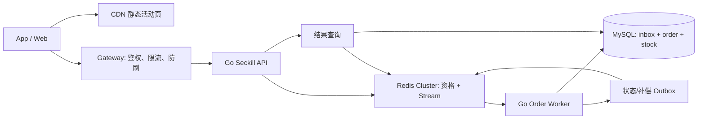
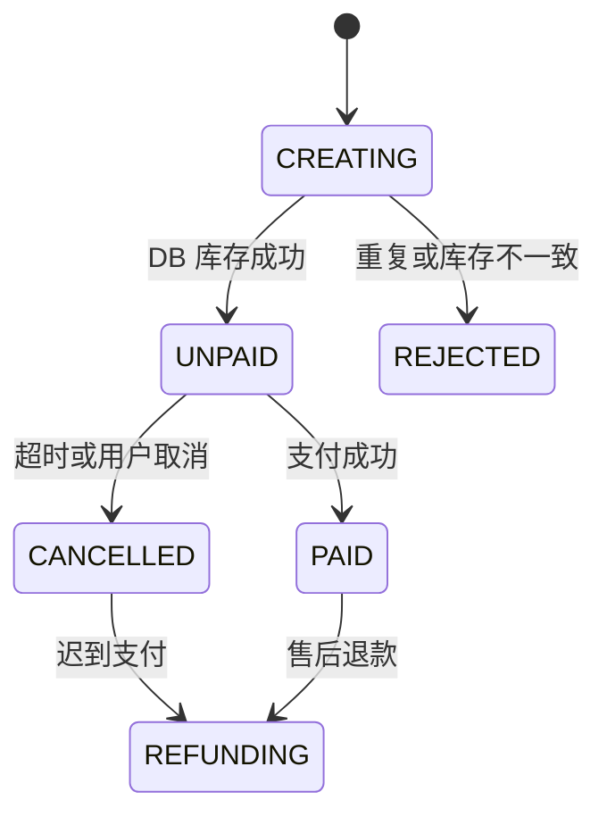

# 秒杀系统设计：从资格预扣到订单一致性

> **定位**：后期进阶 Case。先学完限流、Redis、消息队列、MySQL 事务和幂等，再用本章练习“高并发入口 + 异步可靠链路 + 最终业务不变量”。
>
> **Go 后端主线**：本章不是当前短链项目的开发任务。短链 V2 做完后，再用它训练 Redis Lua、Stream、事务消费者、状态机、故障演练和项目讲解能力。

---

## 1. 先定需求与不变量

### 1.1 MVP 功能

| 优先级 | 功能 | 说明 |
|---|---|---|
| P0 | 活动详情 | 商品、开始/结束时间、展示库存 |
| P0 | 抢购 | 每用户每活动最多成功一单 |
| P0 | 结果查询 | 返回排队中、待支付、已支付、已取消或失败 |
| P1 | 支付 | 下单后 15 分钟内支付 |
| P1 | 超时关单 | 未支付订单释放库存 |
| P2 | 运营配置 | 创建、预热、启停活动 |

不讨论购物车、跨 SKU 优惠、完整支付对账和全球多活。

### 1.2 非功能目标

| 维度 | 示例目标 |
|---|---|
| 峰值入口 | 约 7.5 万请求/秒，活动前需实测 |
| 抢购接口 | P99 < 200ms，成功资格返回 `202 Accepted` |
| 订单可见 | 99% 在 2 秒内由“排队中”收敛到最终状态 |
| 超卖 | 0 |
| 重复成功 | 同一 `activity_id + user_id` 最多一单 |
| 可用性 | Redis 或事件链路异常时快速失败，不直打 MySQL |
| 恢复性 | 可重放事件、可重建结果、可执行对账 |

### 1.3 四条业务不变量

1. `DB sold_stock <= total_stock` 永远成立。
2. 同一活动和用户最多一个有效订单。
3. 只有 `UNPAID` 或 `PAID` 订单占用 DB 库存。
4. 取消只释放一次；支付与取消竞态只能有一个状态迁移成功。

Redis 是高并发资格层，MySQL 是订单与最终库存的权威数据源。

---

## 2. 容量估算：先写清时间窗口

示例假设：

- 报名用户：100 万；
- 活动前 2 秒内点击：10 万次；
- 客户端重试与脚本流量放大：1.5 倍；
- SKU 库存：5000；
- 活动持续：10 分钟。

### 2.1 QPS

```text
原始峰值 = 100000 / 2s = 50000 请求/秒
入口设计值 = 50000 × 1.5 = 75000 请求/秒
最终成功资格 <= 5000
DB 新订单总量 <= 5000，不等于入口 QPS
```

网关阈值不能照抄 7.5 万。应根据压测得到的 API、Redis 单节点和网络安全容量设置，并保留余量。

### 2.2 带宽

假设请求 0.8KB、响应 0.2KB：

```text
入口约 75000 × 0.8KB = 60MB/s ≈ 480Mbps
出口约 75000 × 0.2KB = 15MB/s ≈ 120Mbps
考虑 TLS、连接和协议开销，入口链路按 1Gbps 级准备
```

活动页图片与静态资源必须走 CDN，不能混入抢购 API 带宽。

### 2.3 存储与事件

5000 个订单即使每条 1KB，也只有约 5MB。真正的难点不是订单容量，而是：

- 2 秒内的入口突发；
- Redis 单活动热点；
- 事件是否可靠进入后台；
- 消费者能否在 DB 能力范围内收敛；
- 支付、取消和补偿能否保持不变量。

---

## 3. API 与返回语义

| Method | Path | 说明 |
|---|---|---|
| GET | `/api/v1/seckill/activities/:id` | 活动元信息 |
| POST | `/api/v1/seckill/activities/:id/reservations` | 抢购 |
| GET | `/api/v1/seckill/requests/:requestId` | 查询异步处理结果 |
| GET | `/api/v1/seckill/orders/:orderId` | 查询订单 |
| POST | `/api/v1/payments/callback` | 支付回调，内部鉴权 |

```http
POST /api/v1/seckill/activities/1001/reservations
Authorization: Bearer <token>
Idempotency-Key: 018f...

{"sku_id":2001}
→ 202 {"request_id":"01J...","order_id":"01J...","status":"QUEUED"}
```

关键语义：

- 同一用户重放同一个幂等键，返回第一次的 `request_id/order_id`，不是简单报 409。
- 同一个幂等键若请求体不同，返回 `409 IDEMPOTENCY_CONFLICT`。
- 售罄或已经参与返回 `409`；过载返回 `429`；依赖不可用返回 `503`。
- `202` 只代表资格事件已被接受，不代表订单已经落库。

---

## 4. 总体架构



核心链路：

1. 网关按全局、用户、IP 和设备做流量整形。
2. Go API 生成 `event_id/order_id`。
3. Lua 在 Redis 同一 hash slot 内完成活动校验、重复校验、写可靠事件、扣减资格库存。
4. Worker 从 Stream 消费，在一个 MySQL 事务中处理 inbox、订单和 DB 库存。
5. DB 提交后再 ACK Stream。
6. 支付、取消和 Redis 补偿都走带状态条件的幂等流程。

---

## 5. Redis Cluster：正确使用 hash tag

### 5.1 Key 设计

同一活动参与 Lua 的 key 必须共享**字面量** hash tag：

```text
seckill:{1001}:meta
seckill:{1001}:stock
seckill:{1001}:reservations
seckill:{1001}:events
seckill:{1001}:results
```

`seckill:stock:1001` 和 `seckill:bought:1001` 通常不在同一 slot，多 key Lua 会报 `CROSSSLOT`。

### 5.2 Redis 数据语义

| Key | 类型 | 作用 |
|---|---|---|
| `meta` | Hash | 版本、状态、开始/结束时间 |
| `stock` | String/int | 尚未发放的资格数 |
| `reservations` | Hash | `user_id -> event_id`，用于限购和条件补偿 |
| `events` | Stream | 已接受资格事件 |
| `results` | Hash 或短 TTL String | 排队结果缓存 |

### 5.3 原子资格脚本

脚本先完成全部只读校验，再 `XADD`，最后修改已验证类型的库存和 reservation。Redis 脚本运行时错误不会自动回滚，因此活动预热必须保证 key 类型正确，实例应使用明确的内存与持久化策略。

```lua
-- KEYS[1] meta
-- KEYS[2] stock
-- KEYS[3] reservations
-- KEYS[4] events
-- ARGV[1] user_id
-- ARGV[2] event_id
-- ARGV[3] order_id
-- ARGV[4] activity_id
-- ARGV[5] sku_id

local state = redis.call("HGET", KEYS[1], "state")
if state ~= "ACTIVE" then
    return {-3, ""}
end

local now = redis.call("TIME")
local now_ms = tonumber(now[1]) * 1000 + math.floor(tonumber(now[2]) / 1000)
local start_ms = tonumber(redis.call("HGET", KEYS[1], "start_ms"))
local end_ms = tonumber(redis.call("HGET", KEYS[1], "end_ms"))
if not start_ms or not end_ms or now_ms < start_ms or now_ms >= end_ms then
    return {-3, ""}
end

local existing = redis.call("HGET", KEYS[3], ARGV[1])
if existing then
    return {-2, existing}
end

local stock = tonumber(redis.call("GET", KEYS[2]))
if not stock or stock <= 0 then
    return {-1, ""}
end

-- 放在库存变更前；后续命令的 key 类型由预热阶段保证。
redis.call("XADD", KEYS[4], "*",
    "event_id", ARGV[2],
    "order_id", ARGV[3],
    "activity_id", ARGV[4],
    "sku_id", ARGV[5],
    "user_id", ARGV[1],
    "occurred_at_ms", tostring(now_ms))

redis.call("DECR", KEYS[2])
redis.call("HSET", KEYS[3], ARGV[1], ARGV[2])
return {1, ARGV[2]}
```

Lua 返回：

- `1`：已接受；
- `-1`：售罄；
- `-2`：用户已有 reservation，返回原 event；
- `-3`：活动未处于有效时间窗口。

### 5.4 Go 侧 key 生成

```go
func activityKeys(activityID int64) []string {
	tag := fmt.Sprintf("{%d}", activityID)
	return []string{
		"seckill:" + tag + ":meta",
		"seckill:" + tag + ":stock",
		"seckill:" + tag + ":reservations",
		"seckill:" + tag + ":events",
	}
}
```

不要把大括号只写在文档占位符里；它必须出现在真实 Redis key 中。

---

## 6. 可靠事件与“发送结果未知”

### 6.1 为什么不采用“扣 Redis 后普通发 MQ”

下面的流程不可靠：

```text
Lua 扣库存成功
→ rabbit.Publish()
→ 超时
→ 不知道消息已入队还是未入队
→ 直接回滚 Redis
```

如果消息其实已经入队，回滚会释放一个仍将生成订单的资格。Publisher Confirm 能发现 nack，但网络中断时仍可能得到“结果未知”。

本设计把资格与事件放进同一 Redis slot，由 Lua 一次完成，避免 Redis→MQ 双写窗口。

### 6.2 Stream 的边界

Redis Stream 不是绝对不丢：

- AOF `everysec` 在主机级故障时可能丢最近约 1 秒；
- 异步复制在主从切换时可能丢已确认写；
- `MAXLEN` 配置过小会裁掉未消费消息；
- 缓存 Redis 使用淘汰策略时，不应与可靠 Stream 混用。

因此应：

- 使用持久卷、AOF、至少一个副本和 `noeviction`；
- 监控 consumer lag、pending 和最老事件年龄；
- 活动后用 Redis reservation 与 DB 订单对账；
- 若业务要求“已返回 ACCEPTED 的事件绝不丢”，需要更强的持久化接受日志，并明确增加的延迟与成本。

---

## 7. MySQL：inbox、order、stock 单事务

### 7.1 核心表

```sql
CREATE TABLE seckill_stock (
  activity_id BIGINT UNSIGNED PRIMARY KEY,
  total_stock INT UNSIGNED NOT NULL,
  sold_stock INT UNSIGNED NOT NULL DEFAULT 0,
  version BIGINT UNSIGNED NOT NULL DEFAULT 1,
  CHECK (sold_stock <= total_stock)
);

CREATE TABLE seckill_order (
  id CHAR(26) CHARACTER SET ascii COLLATE ascii_bin PRIMARY KEY,
  activity_id BIGINT UNSIGNED NOT NULL, user_id BIGINT UNSIGNED NOT NULL,
  sku_id BIGINT UNSIGNED NOT NULL, status VARCHAR(20) NOT NULL,
  expires_at DATETIME(3), paid_at DATETIME(3), created_at DATETIME(3) NOT NULL,
  UNIQUE KEY uk_activity_user (activity_id,user_id),
  KEY idx_user_created (user_id,created_at,id)
);

CREATE TABLE seckill_inbox (
  event_id CHAR(26) CHARACTER SET ascii COLLATE ascii_bin PRIMARY KEY,
  order_id CHAR(26) NOT NULL, outcome VARCHAR(24) NOT NULL,
  processed_at DATETIME(3) NOT NULL,
  UNIQUE KEY uk_inbox_order (order_id)
);
```

生产环境还应有支付幂等表和用于 Redis 状态同步的 outbox 表。

### 7.2 消费事务算法

每个事件执行一个短事务：

```text
BEGIN
1. INSERT seckill_inbox(event_id, outcome='PROCESSING')
   - event_id 已存在：读取既有 outcome，COMMIT，随后 ACK
2. INSERT seckill_order(status='CREATING')
   - activity_id + user_id 冲突：
     inbox.outcome='REJECTED_DUPLICATE'
     INSERT compensation_outbox(event_id, user_id, reason)
     COMMIT
3. UPDATE seckill_stock
   SET sold_stock=sold_stock+1, version=version+1
   WHERE activity_id=? AND sold_stock < total_stock
   - 影响 0 行：
     order.status='REJECTED'
     inbox.outcome='REJECTED_STOCK'
     INSERT compensation_outbox(event_id, user_id, reason)
     COMMIT
4. order.status='UNPAID'，expires_at=now+15min
5. inbox.outcome='APPLIED'
COMMIT
6. 只有 COMMIT 成功后 XACK
```

事务超时或结果未知时，使用同一个 `event_id` 重试。inbox 主键保证不会重复扣 DB 库存。

Go 落地时，`Worker.Apply` 只调用一个 `WithTx`：依次执行 inbox 判重、订单插入、条件扣库存和 outcome 更新。`WithTx` 必须传播 commit 错误；调用方仅在事务成功后 `XACK`，结果未知时复用原 `event_id` 重试。

---

## 8. 条件补偿：禁止无脑 `SREM + INCR`

DB 最终拒绝 reservation，或未支付订单成功取消后，需要释放 Redis 资格。补偿脚本必须核对 event：

```lua
-- KEYS[1] stock, KEYS[2] reservations
-- ARGV[1] user_id, ARGV[2] event_id
local current = redis.call("HGET", KEYS[2], ARGV[1])
if current ~= ARGV[2] then
    return 0
end
redis.call("HDEL", KEYS[2], ARGV[1])
redis.call("INCR", KEYS[1])
return 1
```

重复补偿返回 0，不会二次加库存。DB 事务提交一条 outbox 事件，补偿 worker 重试执行该 Lua；不能在 DB 事务中同步等待 Redis。

---

## 9. 订单状态机与支付取消竞态



支付回调：

```sql
UPDATE seckill_order
SET status='PAID', paid_at=NOW(3)
WHERE id=? AND status='UNPAID';
```

超时取消与 DB 释放必须同一事务：

```sql
UPDATE seckill_order
SET status='CANCELLED'
WHERE id=? AND status='UNPAID';

UPDATE seckill_stock
SET sold_stock=sold_stock-1, version=version+1
WHERE activity_id=? AND sold_stock>0;
```

只有第一条影响 1 行时才执行第二条并写 Redis 补偿 outbox。

竞态规则：

- 支付先成功：取消条件更新影响 0 行，不释放库存。
- 取消先成功：迟到支付不能把订单改回 PAID，应进入退款流程。
- 支付平台回调以 `payment_id` 唯一键幂等。
- 关单扫描和延迟消息都可能重复，状态条件是最终保护。

---

## 10. 活动预热必须幂等

禁止在活动进行中直接执行 `SET stock total`。推荐状态：

```text
DRAFT → PREPARED → ACTIVE → CLOSED
```

预热规则：

1. MySQL 保存活动版本、总库存和时间窗口。
2. Lua 仅在 Redis key 不存在或仍为同版本 `PREPARED` 时初始化。
3. `ACTIVE` 后禁止覆盖 stock、reservations 和 stream。
4. 激活使用 expected version 做 CAS。
5. 活动结束并完成对账后再设置统一保留 TTL。
6. Redis 数据丢失时先关闭入口并对账重建，不能边抢边重置。

上线前应验证所有 key 类型，避免 Lua 在部分写入后遇到 `WRONGTYPE`。

---

## 11. 热点与扩容边界

同一活动的原子库存天然集中在一个 hash slot。先做这些事情：

- CDN 静态化活动页；
- 网关按实测容量限流并快速拒绝；
- Lua 保持短小，不在脚本中写日志或循环大量 key；
- 活动按 hash tag 分散到不同 Redis 主节点；
- API 无状态扩容，worker 并发受 DB 连接池约束。

只有单 Redis 主节点实测不足时才考虑库存分桶。跨槽后无法用一个 Lua 保证全局原子，需要设计：

- 独立 bucket 库存；
- 用户到 bucket 的稳定路由；
- 空 bucket 的 token 迁移；
- 全局售罄判断；
- 重复用户跨 bucket 的防护；
- 对账与回收。

“把十个 key 写进同一个 `{actId}` slot”仍是同一节点，不是水平拆热点。

---

## 12. 故障矩阵

| 故障 | 用户结果 | 系统动作 |
|---|---|---|
| Redis 超时 | 503/429，不直打 DB | 熔断、保护连接池、告警 |
| Stream lag 上升 | 已接受请求保持 QUEUED | 降低入口、扩 worker、检查 DB |
| Worker 崩溃 | 事件留在 PEL | `XAUTOCLAIM` 后重试 |
| DB commit 失败 | 不 ACK | 同 event 重试 |
| DB commit 结果未知 | 不 ACK | inbox 判重后安全重试 |
| 补偿 Redis 失败 | DB 状态已正确 | outbox 重试、告警 |
| Redis 主从切换丢事件 | 可能长期 QUEUED | 对账 reservation、人工/任务修复 |
| 支付回调重复 | 返回已有结果 | payment_id + 状态条件幂等 |

毒消息有限重试后进入 DLQ。DLQ 必须有查看、修复、重放和告警流程，不能只“存进去”。

---

## 13. 可观测性、压测与对账

### 13.1 指标

```text
seckill_requests_total{result}
seckill_request_duration_seconds
seckill_lua_duration_seconds{result}
seckill_stream_lag / seckill_oldest_event_age_seconds
seckill_db_tx_duration_seconds{result}
seckill_compensation_pending / seckill_dlq_messages
```

Prometheus label 不要放 user_id、order_id 或 activity_id 全量高基数字段；这些进入带采样的结构化日志。

日志用 `request_id/event_id/order_id` 串起 API、Stream、DB 与补偿，并记录结果码、耗时、consumer 和重试次数。

### 13.3 对账不变量

活动进行中允许存在“已接受但 DB 未收敛”的短暂差异，要用 lag 描述；活动结束并清空事件后要求：

```text
DB sold_stock
= count(order.status in UNPAID, PAID)

total_stock - Redis stock
= HLEN(reservations)
= count(DB 有效占用订单)
```

差异不能写成“允许 <0.01%”后不处理。超卖必须为 0；其他差异必须有原因、修复动作和完成时限。

### 13.4 压测场景

| 场景 | 验证 |
|---|---|
| 售罄突发 | P99、429/409 比例、Lua RT |
| 同用户重复 | 只返回同一 reservation |
| Worker 停止 2 分钟 | lag 告警、恢复追平 |
| DB commit 后 ACK 前崩溃 | 不重复扣库存 |
| Redis 切主 | 已接受事件损失边界 |
| 支付与取消并发 | 只出现一个终态 |
| 补偿重复执行 | Redis 库存只加一次 |

报告必须保存机器、版本、配置、数据集、脚本、原始输出、P95/P99、错误率、CPU、内存和依赖指标。

## 14. 与短链项目的能力迁移

| 短链项目能力 | 秒杀中的升级 |
|---|---|
| Idempotency-Key | 抢购重放返回同一 request/order |
| Redis Lua 限流 | Lua 资格预扣与条件补偿 |
| Redis Streams 统计 | Redis Streams 可靠资格事件 |
| MySQL 幂等消费 | inbox + order + stock 单事务 |
| cache outbox | 取消后的 Redis 补偿 outbox |
| 故障演练 | Redis 切主、worker lag、支付竞态 |

建议顺序：先把短链 V2 做到可解释、可测试，再学习本章；不要同时开第二个正式项目。

## 15. 面试与练习

15 分钟顺序：需求与不变量 → 75k/5000 数量级 → Lua + Stream → DB 单事务 → 支付取消 → 故障对账。

闭卷回答：

1. Publisher Confirm 为什么仍可能“结果未知”？
2. 哪种 key 命名能避免 `CROSSSLOT`？
3. 重复事件为何不会二次扣 DB 库存？
4. 支付与取消竞态由哪条状态条件决定？
5. 同 hash tag 的十个库存 key为何不能拆散热点？

能画链路、写条件补偿、讲清三个故障边界并用指标判断收敛，即达到本章要求。

---

- 上一章：[06-分布式一致性与 CAP](./06-分布式一致性与CAP.md)
- 下一章：[08-短链服务设计](./08-短链服务设计.md)
