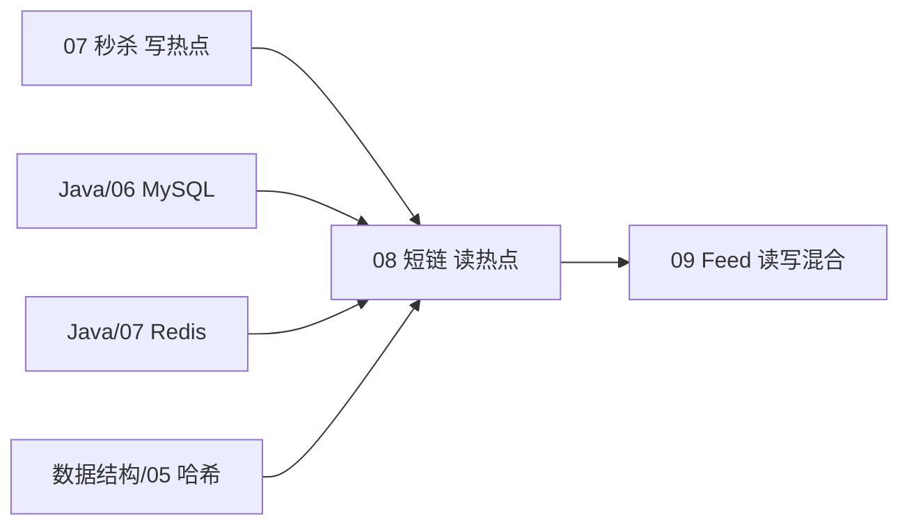
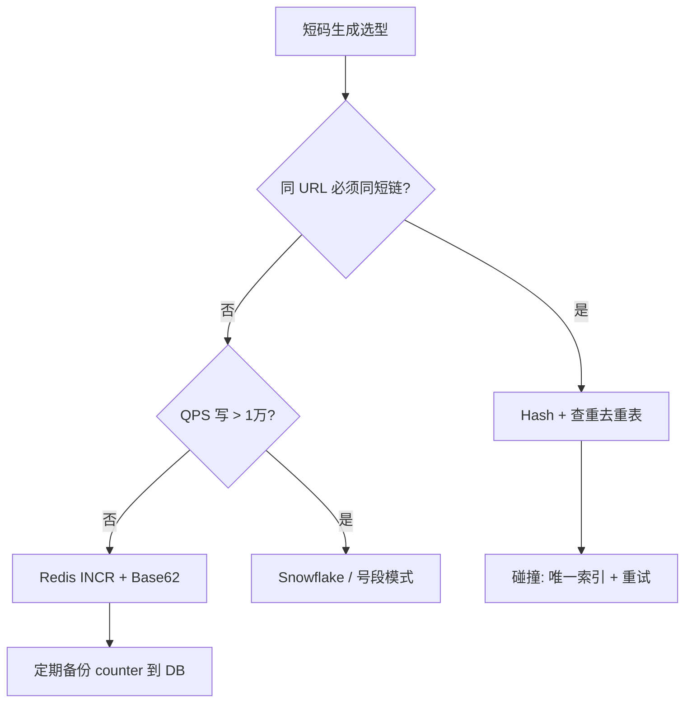
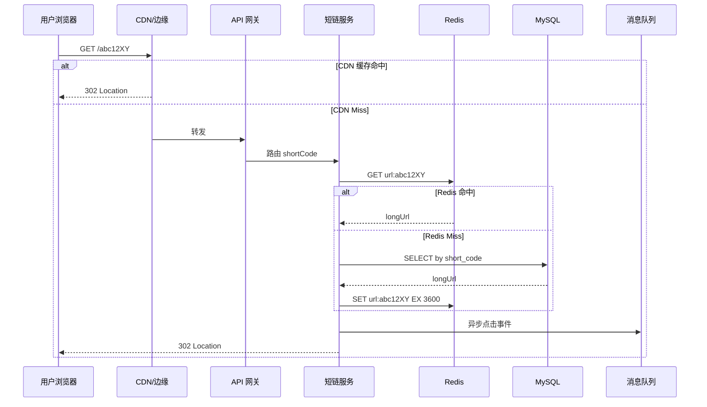
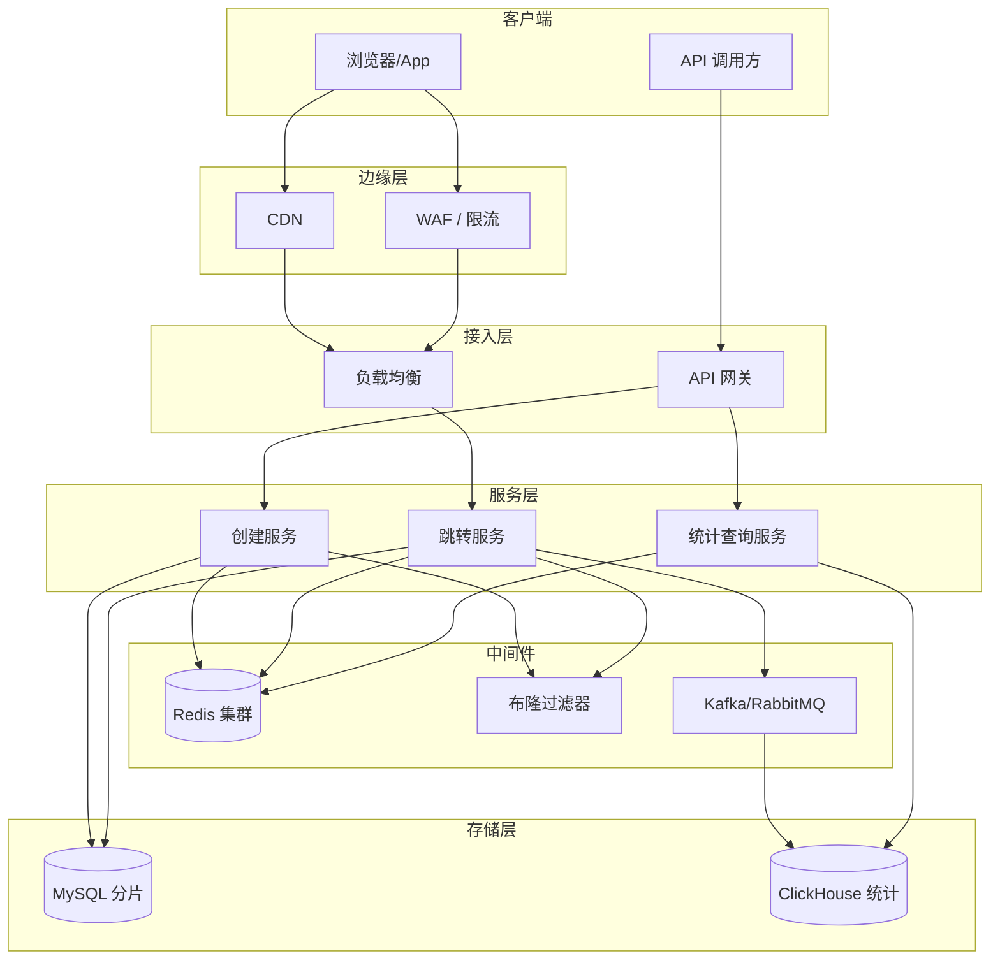
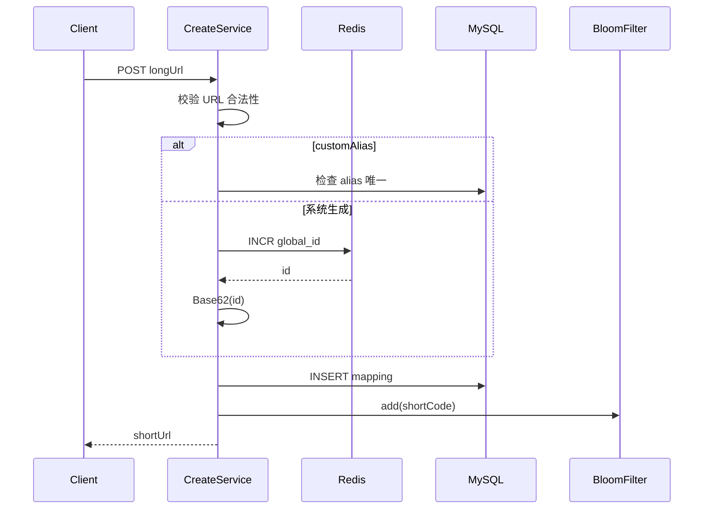
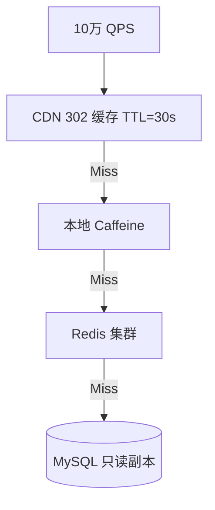

# 短链服务设计

<!-- 修改说明: 2026-06-30 按 EXPANSION-STANDARD 扩充 §0、Case 步骤表、Base62 逐行读、FAQ≥12、闭卷自测、费曼检验 -->

> **文件编码**：UTF-8。  
> **定位**：经典系统设计 Case Study——在 [07 秒杀](./07-秒杀系统简化设计.md) 的高并发读写经验之上，学习**读多写少、O(1) 跳转、统计异步化**的架构模式。  
> **前置**：[01 方法论](./01-系统设计方法论与面试框架.md)、[03 缓存](./03-缓存架构设计.md)、[Java/06 MySQL](../Java/06-MySQL基础索引与事务.md)、[Java/07 Redis](../Java/07-Redis核心原理与缓存实战.md)、[数据结构/05 哈希表](../数据结构/05-哈希表.md)。  
> **Go 路线代码实现**：[Go/10 短链项目上](../Go/10-短链服务项目实战上.md) + [Go/11 短链项目下](../Go/11-短链服务项目实战下.md) —— **先读本章懂设计，再跟 Go 章写代码**。

---

## 0. 读前导读（零基础也能跟上）

### 0.1 用一句话弄懂本章

**一句话**：短链是 **读多写少的 O(1) 映射**——长 URL 变短码，跳转靠 **302 + Redis 缓存 + 布隆防穿透**，点击统计走 **MQ 异步**。

### 0.2 你需要提前知道什么

| 你已会 | 可以直接学本章 |
|--------|----------------|
| [01 方法论](./01-系统设计方法论与面试框架.md) 估算 | ✅ 本章 |
| [03 缓存](./03-缓存架构设计.md) Cache Aside | ✅ 本章 |
| [07 秒杀](./07-秒杀系统简化设计.md) 高并发读 | ✅ 本章 |
| [数据结构/05 哈希表](../数据结构/05-哈希表.md) | ✅ 本章 |
| 不懂 HTTP 重定向 | 先 [计网 04 HTTP](../../前端学习/计算机网络/04-HTTP协议深入.md) |

### 0.3 本章知识地图（学完后应能勾选全部 ☐→☑）

- ☐ 5 分钟完成 **QPS + 存储** 数量级估算
- ☐ 3 分钟讲清 **Hash vs Counter vs Snowflake** 选型
- ☐ 说明 **301 vs 302** 对统计与 CDN 的影响
- ☐ 画「跳转 + 异步统计」架构与时序图
- ☐ 设计 **布隆过滤器** 防穿透流程
- ☐ 闭卷自测（§24）≥ 8/10

### 0.4 建议学习时长与节奏

| 阶段 | 内容 | 建议时长 |
|------|------|----------|
| 第 1 天 | §1～§4 需求、估算、API | 2 h |
| 第 2 天 | §5～§8 短码、Base62、跳转、统计 | 2.5 h |
| 第 3 天 | §9～§13 布隆、Schema、缓存、CDN、Case | 2.5 h |
| 第 4 天 | 15 分钟模拟 + 闭卷 + 费曼 | 1.5 h |

### 0.5 学完本章你能做什么（可验证的具体动作）

1. 手算 7 位 Base62 空间与 5 年 1000 万/日存储 TB 级结论
2. 白板画跳转路径：CDN → Redis → DB → 302
3. 口述创建短链：INCR → Base62 → INSERT → Bloom.add
4. 解释为何商业短链选 302 而非 301
5. 设计 `short_code` 哈希分片 1024 路由规则

### 0.6 核心术语三件套

**Base62 编码（Base62 Encoding）**：用 0-9a-zA-Z 62 个字符表示大整数，URL 友好。  
**生活类比**：把门牌号 125 写成短暗号 `21`（62 进制）。  
**为什么重要**：短码要在浏览器地址栏直接可用。  
**本章用到的地方**：§6

**布隆过滤器（Bloom Filter）**：判断 key **一定不存在** 或 **可能存在**。  
**生活类比**：保安手里的「黑名单速查本」——没有名字一定不让进，有名字还要再查身份证。  
**为什么重要**：恶意短码打穿 DB。  
**本章用到的地方**：§9

**302 临时重定向（302 Found）**：每次跳转经过短链服务，利于统计。  
**生活类比**：每次问路都经过总台登记，而不是记住地址以后再也不问。  
**为什么重要**：301 会被浏览器/CDN 缓存，PV 漏计。  
**本章用到的地方**：§7

---

## 本章与上一章的关系

| 上一章（[07 秒杀系统简化设计](./07-秒杀系统简化设计.md)） | 本章（08） | 下一章（[09 Feed 流](./09-Feed流与时间线设计.md)） |
|----------------------------------------------------------|------------|---------------------------------------------------|
| 写热点、库存扣减、MQ 削峰 | **读热点**、短码映射、跳转 | 推拉混合、时间线、大 V 扇出 |
| 强一致库存、防超卖 | **最终一致统计**、允许统计延迟 | 读扩散 vs 写扩散 |
| Redis 预减 + DB 事务 | Redis 缓存映射 + DB 持久化 | ZSet 时间线 + 分页 |
| 限流保护写路径 | 布隆过滤器防穿透、CDN 扛读 | 热点 Feed 缓存 |

[07 秒杀](./07-秒杀系统简化设计.md) 教你「写路径如何不被打垮」；短链服务教你「**读路径如何做到毫秒级跳转**」——两者都是高并发，但瓶颈完全不同。秒杀怕**写冲突**，短链怕**读放大**和**存储膨胀**。



| 模块 | 链接 |
|------|------|
| 索引与分表 | [Java/06 MySQL](../Java/06-MySQL基础索引与事务.md) |
| 缓存、布隆、计数器 | [Java/07 Redis](../Java/07-Redis核心原理与缓存实战.md) |
| 哈希函数与冲突 | [数据结构/05 哈希表](../数据结构/05-哈希表.md) |
| 限流防刷 | [02 限流熔断](./02-限流熔断与降级.md) |
| 面试 3 分钟模板 | [Java/14 场景面试](../Java/14-高频场景设计与面试专题.md) |

---

## 1. 这一章解决什么问题

短链服务（URL Shortener）是系统设计面试的**高频经典题**，代表一类「**键值映射 + 极高读 QPS + 可异步统计**」的系统。

典型产品：Bitly、TinyURL、微博 t.cn、微信短链。

你要能讲清：

1. 如何把长 URL 变成短码（Hash / 自增 / Snowflake）
2. 如何用 Base62 编码、如何保证唯一、如何防碰撞
3. 跳转用 301 还是 302，对统计和 SEO 的影响
4. 点击统计如何设计（同步 vs 异步、精确 vs 近似）
5. 如何用 Redis 缓存 + 布隆过滤器 + CDN 扛读
6. 亿级 URL 如何分片存储

---

## 2. 需求澄清（面试第一步）

### 2.1 功能需求（Functional Requirements）

| 优先级 | 功能 | 说明 |
|--------|------|------|
| P0 | 缩短 URL | 输入长链，返回短链（含自定义域名，如 `https://s.example/abc12X`） |
| P0 | 跳转 | 访问短链，重定向到原始长链 |
| P1 | 点击统计 | PV、UV（按短码、按时间聚合） |
| P1 | 过期 / 删除 | 可选 TTL 或手动失效 |
| P2 | 自定义短码 | 用户指定 alias（需唯一性校验） |
| P2 | 管理后台 | 查看自己创建的短链列表 |

### 2.2 非功能需求（Non-Functional Requirements）

| 维度 | 典型假设（需与面试官确认） |
|------|---------------------------|
| 可用性 | 99.9%（跳转核心路径） |
| 延迟 | 跳转 P99 < 100ms（不含目标站） |
| 一致性 | 映射**强一致**（创建后立即可跳转）；统计可**最终一致** |
| 规模 | 见下节容量估算 |
| 安全 | 防恶意 URL、防刷量、HTTPS |

### 2.3 面试澄清问题清单

```text
□ 日创建短链多少？日跳转（读）多少？
□ 短码长度固定还是可变？是否支持自定义 alias？
□ 是否需要登录？是否多租户？
□ 统计要实时还是 T+1 可接受？
□ 短链是否会过期？默认 TTL？
□ 是否需要 API 限流？单用户 QPS？
```

---

## 3. 容量估算（Capacity Estimation）

### 3.1 假设场景（面试可调整）

| 指标 | 假设值 | 推导 |
|------|--------|------|
| DAU | 1 亿 | 面试官给定或估算 |
| 每用户日均创建短链 | 0.1 条 | 10% 用户会创建 |
| **日创建量** | **1000 万** | 1亿 × 0.1 |
| 每短链日均被点击 | 10 次 | 社交传播 |
| **日跳转量（读）** | **1 亿** | 1000万 × 10 |
| 读写比 | **约 10:1** | 读多写少，但写也不小 |

### 3.2 QPS 估算

```text
写 QPS（创建）= 1000万 / 86400 ≈ 116 QPS（平均）
              峰值按 3～5 倍 ≈ 350～580 QPS

读 QPS（跳转）= 1亿 / 86400 ≈ 1160 QPS（平均）
              峰值按 3～5 倍 ≈ 3500～5800 QPS
              热点短链（爆款）可能单链上万 QPS
```

### 3.3 存储估算

单条映射记录（粗估）：

```text
short_code:     7 字节（Base62，7 位约 3.5×10^12 空间）
long_url:       平均 200 字节（HTTPS URL）
user_id:        8 字节
created_at:     8 字节
expire_at:      8 字节
status:         1 字节
索引开销:       ~50%
────────────────────────
单条约 400～500 字节
```

5 年累计（假设日增 1000 万，不删）：

```text
总条数 = 1000万 × 365 × 5 ≈ 182.5 亿条
存储   = 182.5亿 × 500B ≈ 91 TB（仅映射表，不含统计）
```

**结论**：必须分片；单机 MySQL 不可承受；冷热分离 + 归档。

### 3.4 带宽估算

跳转响应体很小（302 + Location 头，约 500 字节）：

```text
读带宽 = 5800 QPS × 500B ≈ 2.9 MB/s（峰值，不含 CDN 回源）
```

创建 API 请求/响应各约 1KB，写带宽可忽略。

### 3.5 缓存容量

假设 20% 短链承担 80% 点击（二八定律）：

```text
热点短链数 ≈ 日活短链 × 20%
Redis 单条 value（long_url + meta）≈ 300B
若缓存 7 天热链 2000 万条 → 2000万 × 300B ≈ 6 GB（可接受）
```

---

## 4. API 设计

### 4.1 RESTful 接口

| 方法 | 路径 | 说明 |
|------|------|------|
| POST | `/api/v1/urls` | 创建短链 |
| GET | `/api/v1/urls/{shortCode}` | 查询短链元信息（管理用） |
| DELETE | `/api/v1/urls/{shortCode}` | 删除/失效 |
| GET | `/{shortCode}` | **公开跳转**（可独立域名） |
| GET | `/api/v1/urls/{shortCode}/stats` | 查询统计 |

### 4.2 创建短链

**请求**：

```json
POST /api/v1/urls
{
  "longUrl": "https://example.com/path/to/very/long/article?id=12345",
  "customAlias": "my-link",
  "expireInSeconds": 86400
}
```

**响应**：

```json
{
  "shortUrl": "https://s.example/my-link",
  "shortCode": "my-link",
  "longUrl": "https://example.com/path/to/very/long/article?id=12345",
  "createdAt": "2026-06-30T10:00:00Z",
  "expireAt": "2026-07-01T10:00:00Z"
}
```

### 4.3 跳转接口

```http
GET /abc12XY HTTP/1.1
Host: s.example

HTTP/1.1 302 Found
Location: https://example.com/original/long/url
Cache-Control: public, max-age=300
```

---

## 5. 短码生成方案对比

### 5.1 三种主流方案

| 方案 | 原理 | 优点 | 缺点 | 适用 |
|------|------|------|------|------|
| **Hash（哈希）** | MD5/SHA256 长 URL → 取前 7 位 Base62 | 无中心 ID、可预计算 | **碰撞**需处理；相同 URL 可能重复短链 | 不要求同 URL 同短链 |
| **Counter（自增）** | DB/Redis 全局自增 ID → Base62 | 无碰撞、顺序可控 | **单点**瓶颈；需分布式 ID | 工业界最常用 |
| **Snowflake** | 时间戳 + 机器 ID + 序列号 → Base62 | 分布式、趋势递增 | 实现复杂；时钟回拨 | 大规模分布式 |

### 5.2 Hash 方案详解

```text
输入: longUrl = "https://example.com/..."
步骤:
  1. hash = MD5(longUrl + salt)   // salt 防彩虹表
  2. 取 hash 前 64 bit → 整数 N
  3. shortCode = Base62Encode(N)[0:7]
  4. 查 DB 是否已存在该 shortCode
     - 不存在 → 插入
     - 存在且 longUrl 相同 → 返回已有
     - 存在且 longUrl 不同 → 碰撞！追加 salt 重算或 Counter 兜底
```

**碰撞概率**（生日悖论）：

7 位 Base62 空间 ≈ 3.5×10^12。插入 n 条时碰撞概率约 `n² / (2 × 空间)`。  
n = 10 亿时，碰撞概率仍极低，但**必须**有 DB 唯一索引兜底。

与 [数据结构/05 哈希表](../数据结构/05-哈希表.md) 的联系：哈希函数均匀性、冲突处理（链地址法 ↔ 重哈希 salt）。

### 5.3 Counter（自增 ID）方案详解

```text
步骤:
  1. id = Redis INCR url_id_counter   // 或 DB sequence
  2. shortCode = Base62Encode(id)
  3. INSERT mapping(short_code, long_url, ...)
```

**分布式 Counter**：

| 方式 | 说明 |
|------|------|
| DB 自增主键 | 简单，DB 成为瓶颈 |
| Redis INCR | 快，需持久化 + 故障恢复 |
| 号段模式 | 批量取 ID 段（如 1～1000）到本地，减少 Redis 压力 |
| Snowflake | 见下节 |

### 5.4 Snowflake 方案

64 bit 典型布局：

```text
| 1 bit 符号 | 41 bit 时间戳(ms) | 10 bit 机器ID | 12 bit 序列 |
```

- 每毫秒每机器 4096 个 ID
- 单机 QPS 理论 400 万+
- 编码后 Base62 约 11 字符；可截断 + 映射表（不推荐截断，易碰撞）

**面试结论**：中小规模用 **Redis INCR + Base62** 足够；超大规模用 **Snowflake** 或号段。

### 5.5 方案选型决策树



---

## 6. Base62 编码

### 6.1 为什么用 Base62

| 编码 | 字符集 | 7 位空间 | URL 友好 |
|------|--------|----------|----------|
| Base16 | 0-9A-F | 16^7 | 否（大小写不敏感 DNS 问题） |
| Base64 | +/= | 需 URL 编码 | 否 |
| **Base62** | 0-9a-zA-Z | 62^7 ≈ 3.5×10^12 | **是** |

短链只在 path 中出现，Base62 **无特殊字符**，可直接拼进 URL。

### 6.2 编码算法（伪代码）

```python
BASE62 = "0123456789abcdefghijklmnopqrstuvwxyzABCDEFGHIJKLMNOPQRSTUVWXYZ"

def encode(num: int) -> str:
    if num == 0:
        return "0"
    s = []
    while num > 0:
        s.append(BASE62[num % 62])
        num //= 62
    return "".join(reversed(s))

def decode(s: str) -> int:
    num = 0
    for c in s:
        num = num * 62 + BASE62.index(c)
    return num
```

### 6.3 短码长度规划

| 长度 | 空间 | 说明 |
|------|------|------|
| 6 位 | 62^6 ≈ 568 亿 | 早期够用 |
| 7 位 | 62^7 ≈ 3.5 万亿 | **推荐默认** |
| 8 位 | 更大 | 预留增长 |

**可变长度策略**：ID 小时 6 位，超过阈值自动 7 位——Bitly 类似做法。

---

## 7. 跳转：301 vs 302

### 7.1 HTTP 重定向对比

| 状态码 | 语义 | 浏览器/CDN 缓存 | 统计 |
|--------|------|-----------------|------|
| **301** | 永久重定向 | **会缓存** Location | 后续访问可能**不经过**短链服务，**统计丢失** |
| **302** | 临时重定向 | 默认不长期缓存 | **每次**经过短链服务，**统计准确** |
| **307** | 临时，保持方法 | 同 302 | 同 302 |

### 7.2 选型建议

| 场景 | 推荐 |
|------|------|
| 需要精确 PV/UV | **302**（或 302 + 短 Cache-Control） |
| 纯跳转、不统计、省带宽 | 301 |
| 折中 | 302 + `Cache-Control: max-age=60` 减轻回源 |

**面试标准答案**：商业短链（Bitly、微博）普遍 **302**，因为统计是核心功能；若面试官强调 SEO 传递 PageRank，可提 301 但说明统计需 JS 埋点补偿。

### 7.3 跳转核心路径时序



---

## 8. 点击统计与分析

### 8.1 统计维度

| 维度 | 说明 |
|------|------|
| PV | 总点击次数 |
| UV | 独立访客（cookie / IP + UA 指纹） |
| 时间 | 按小时/天聚合 |
| 地理 | IP → GeoIP |
| Referer | 来源页面 |
| 设备 | UA 解析 |

### 8.2 同步 vs 异步

| 方式 | 优点 | 缺点 |
|------|------|------|
| 同步写 DB | 实时精确 | 拖慢跳转 RT |
| **异步 MQ** | 跳转快 | 秒级延迟 |
| Redis INCR + 定时落库 | 简单高效 | 丢失风险需 AOF |

**推荐架构**：

```text
跳转成功 → 发 Kafka/RabbitMQ 点击事件 → 消费者聚合 → 写入 ClickHouse / ES / 汇总表
同时 → Redis HyperLogLog 近似 UV + INCR PV（实时大屏）
```

与 [04 消息队列架构](./04-消息队列架构设计.md)、[Java/08 RabbitMQ](../Java/08-RabbitMQ与消息队列实战.md) 衔接。

### 8.3 数据模型（统计）

**明细表（可选，量大时用日志 + OLAP）**：

```sql
CREATE TABLE click_event (
    id          BIGINT PRIMARY KEY,
    short_code  VARCHAR(16) NOT NULL,
    click_time  DATETIME NOT NULL,
    ip          VARCHAR(45),
    user_agent  VARCHAR(512),
    referer     VARCHAR(1024),
    country     VARCHAR(8)
) PARTITION BY RANGE (TO_DAYS(click_time));
```

**聚合表（查询用）**：

```sql
CREATE TABLE url_stats_daily (
    short_code   VARCHAR(16),
    stat_date    DATE,
    pv           BIGINT DEFAULT 0,
    uv           BIGINT DEFAULT 0,
    PRIMARY KEY (short_code, stat_date)
);
```

### 8.4 防刷与采样

- 单 IP 限流：[02 限流](./02-限流熔断与降级.md) 令牌桶
- 爬虫 UA 过滤
- 超高 QPS 短链：统计**采样**（如 1/10 采样再放大）

---

## 9. 布隆过滤器（Bloom Filter）

### 9.1 解决什么问题

**缓存穿透**：恶意请求不存在的 `shortCode`，Redis Miss → 打穿 DB。

布隆过滤器：判断「**一定不存在**」或「**可能存在**」。

```text
创建短链时 → BloomFilter.add(shortCode)
跳转时     → if !BloomFilter.mightContain(shortCode) → 直接 404，不打 DB
```

### 9.2 参数估算

```text
预期元素 n = 10 亿
误判率 p = 0.01 (1%)
位数组大小 m ≈ -n * ln(p) / (ln2)^2 ≈ 9.6 bit × n ≈ 1.2 GB
哈希函数 k ≈ 7
```

Redis 4.0+ 可用 **RedisBloom** 模块；或 Guava `BloomFilter` 放本地内存（多实例需重建或 Redis 集中）。

### 9.3 局限

- 有误判（不存在判成存在 → 仍查一次 DB，可接受）
- **不支持删除**（删除短链需 Counting Bloom Filter 或定期重建）
- 与 [03 缓存穿透](./03-缓存架构设计.md) 对策一致

---

## 10. 数据库 Schema 设计

### 10.1 核心映射表

```sql
CREATE TABLE url_mapping (
    id           BIGINT UNSIGNED PRIMARY KEY AUTO_INCREMENT,
    short_code   VARCHAR(16) NOT NULL,
    long_url     VARCHAR(2048) NOT NULL,
    long_url_hash CHAR(32) NOT NULL COMMENT 'MD5 用于去重索引',
    user_id      BIGINT UNSIGNED,
    status       TINYINT DEFAULT 1 COMMENT '1有效 0删除',
    expire_at    DATETIME NULL,
    created_at   DATETIME NOT NULL DEFAULT CURRENT_TIMESTAMP,
    updated_at   DATETIME NOT NULL DEFAULT CURRENT_TIMESTAMP ON UPDATE CURRENT_TIMESTAMP,
    UNIQUE KEY uk_short_code (short_code),
    KEY idx_user_id (user_id),
    KEY idx_long_url_hash (long_url_hash),
    KEY idx_created_at (created_at)
) ENGINE=InnoDB DEFAULT CHARSET=utf8mb4;
```

### 10.2 索引设计要点

| 索引 | 用途 |
|------|------|
| `uk_short_code` | 跳转主路径 O(log n) 查找 |
| `idx_long_url_hash` | 同 URL 去重（可选产品需求） |
| `idx_user_id` | 用户短链列表 |

详见 [Java/06 索引](../Java/06-MySQL基础索引与事务.md)。

### 10.3 分片策略

**按 short_code 哈希分片**（跳转均匀）：

```text
shard_id = hash(short_code) % 1024
```

或 **按 id 范围分片**（自增 ID 方案天然友好）。

跨分片：管理查询（按 user_id 列表）走**索引表**或 ES，不走跳转热路径。

与 [05 数据库扩展](./05-数据库扩展与读写分离.md) 衔接。

---

## 11. 缓存设计

### 11.1 Cache Aside（跳转读路径）

```text
1. GET redis url:{shortCode}
2. Miss → SELECT DB → SET redis EX TTL
3. 返回 longUrl
```

**TTL 建议**：3600s + random(0, 300) 防雪崩（见 [03 缓存](./03-缓存架构设计.md)）。

### 11.2 写路径（创建短链）

```text
1. 生成 shortCode
2. INSERT DB（事务）
3. 删除/不写缓存（首次跳转再加载）
4. BloomFilter.add(shortCode)
```

### 11.3 热点短链

爆款短链 QPS 上万：

- **本地缓存**（Caffeine）+ Redis 二级
- **singleflight** 防击穿：同一 shortCode 只有一个线程回源 DB

与 [07 秒杀热点](./07-秒杀系统简化设计.md) 的本地缓存思路相同。

### 11.4 Redis 数据结构选用

| 用途 | 结构 | 命令 |
|------|------|------|
| 映射缓存 | String | GET/SET |
| 全局 ID | String | INCR |
| PV 计数 | String | INCR |
| UV 近似 | HyperLogLog | PFADD/PFCOUNT |
| 布隆 | RedisBloom / Bitmap | BF.ADD / BF.EXISTS |

详见 [Java/07 Redis](../Java/07-Redis核心原理与缓存实战.md)。

---

## 12. CDN 与边缘加速

### 12.1 CDN 放什么

| 内容 | 是否 CDN 缓存 |
|------|---------------|
| 302 跳转响应 | **可**（短 TTL） |
| 创建 API | 否 |
| 统计 API | 否 |

### 12.2 架构

```text
用户 → CDN PoP（边缘）
         ├─ 命中 → 直接 302（需动态配置 Cache Key = shortCode）
         └─ Miss → 源站短链集群
```

**注意**：302 缓存时间过短（60s）平衡统计与性能；或用 **边缘 Worker** 回源前异步上报统计。

### 12.3 多地域

- 映射表**全球一致**（主写 + 多活读副本）
- Redis 可用 Global Database（Redis Enterprise）或地域缓存 + 回源

---

## 13. 完整架构 Case Study

### 13.1 系统架构图



### 13.2 创建短链流程



### 13.3 高可用与降级

| 故障 | 降级策略 |
|------|----------|
| Redis 挂 | 直查 DB + 限流 |
| DB 慢 | 熔断 + 返回 503 |
| MQ 积压 | 丢弃采样统计，保证跳转 |
| 统计服务挂 | 跳转不受影响 |

### 13.4 安全

- URL 黑名单（钓鱼、恶意）
- HTTPS 强制
- 创建接口鉴权 + 限流
- 自定义 alias 敏感词过滤

### 13.5 Case Study 手把手步骤表（创建 + 跳转）

| 步骤 | 路径 | 你的动作 | 预期结果 | 若不对 |
|------|------|----------|----------|--------|
| 1 | 创建 | 校验 URL 合法、长度、黑名单 | 400 非法 URL | 钓鱼链未拦 → 封域名 |
| 2 | 创建 | Redis INCR `global_id` | 单调递增 ID | DB 自增 → 分片瓶颈 |
| 3 | 创建 | Base62(id) 得 shortCode | 7 位短码 | 截断 Snowflake → 碰撞 |
| 4 | 创建 | INSERT `url_mapping` 唯一索引 | 201 返回 shortUrl | 无唯一索引 → 碰撞双映射 |
| 5 | 创建 | BloomFilter.add(shortCode) | 后续跳转可挡穿透 | 漏 add → 恶意码打 DB |
| 6 | 跳转 | Bloom mightContain | false 直接 404 | 漏布隆 → 穿透 |
| 7 | 跳转 | Redis GET `url:{code}` | hit 返回 longUrl | 无缓存 → DB 压力大 |
| 8 | 跳转 | Miss 查 DB + SET EX | 回填缓存 | 无 TTL 随机 → 雪崩 |
| 9 | 跳转 | 发 MQ 点击事件 + 302 Location | 用户到达目标站 | 同步写统计 → RT 变慢 |

### 13.6 Base62 encode 逐行读

| 行号/语句 | 含义 | 改错会怎样 |
|-----------|------|------------|
| `if num == 0: return "0"` | 零的特殊情况 | 漏处理 → 空串 |
| `num % 62` | 取最低位字符 | 用 64 → 非 URL 安全 |
| `num // 62` | 进位到下一位 | 浮点除 → 精度错 |
| `reversed(s)` | 高位在前 | 顺序反 → 解码失败 |
| `BASE62.index(c)` decode | 字符转数值 | 大小写混用未统一 → 错链 |

---

## 14. 与 TinyURL / Bitly 的对照

| 维度 | TinyURL（经典） | Bitly（商业） |
|------|-----------------|---------------|
| 短码 | 自增 ID + Base62 | 自定义 + 算法 |
| 统计 | 后期加入 | 核心卖点 |
| 302/301 | 302 为主 | 302 + 分析 SDK |
| 规模 | 分库分表 | 全球多活 |

### 14.1 Case Study：爆款短链 10 万 QPS 热点

**场景**：明星微博单链，峰值 **10 万跳转/秒**，普通架构 Redis 单 key 成为瓶颈。



| 层级 | 策略 | 说明 |
|------|------|------|
| CDN | 缓存 302 响应 | 减轻 90%+ 回源；统计用边缘上报 |
| 本地缓存 | Caffeine 1 万条 | 单实例命中极高 |
| Redis | 只存 longUrl | singleflight 防击穿 |
| DB | 读副本 | 主库仅创建写 |

**统计折中**：CDN 命中期 **采样上报**；全量以 MQ 聚合为准。

---

## 15. 15 分钟模拟面试答题提纲

```text
1. 需求（2 min）：创建、跳转、统计；读写比；统计可延迟
2. 估算（2 min）：日增 1000万、读 1亿、读 QPS 峰值 ~5000
3. API（1 min）：POST 创建、GET 跳转
4. 短码（3 min）：Redis INCR + Base62；唯一索引；碰撞处理
5. 跳转（2 min）：302；Redis Cache Aside；布隆防穿透
6. 统计（2 min）：MQ 异步；Redis INCR + HLL；ClickHouse 聚合
7. 扩展（3 min）：分片、CDN、热点本地缓存
8. 取舍（1 min）：302 牺牲 CDN 换统计；统计最终一致
```

---

## 16. 常见面试追问

### Q1：Hash 和 Counter 怎么选？

**答**：要分布式高写用 Counter/Snowflake；要同 URL 复用短链用 Hash+去重。工业界 Counter 更简单可控。

### Q2：短码用完了怎么办？

**答**：加长到 8 位；或清理过期数据；62^7 空间极大，实际先担心 DB 容量而非编码空间。

### Q3：如何保证 custom alias 不被抢注？

**答**：DB 唯一索引 + 创建时 `INSERT` 失败返回 409；高并发抢注用 Redis SETNX 预占。

### Q4：删除短链后跳转怎么办？

**答**：软删除 status=0；Redis 删 key；布隆无法删 → 依赖 DB 查 status 或 Counting Bloom。

### Q5：如何识别 UV？

**答**：Set cookie `visitor_id`；或 IP+UA 哈希（不准确）；精确 UV 用 HyperLogLog 或明细去重（贵）。

### Q6：长 URL 超长怎么办？

DB `VARCHAR(2048)` 或 TEXT；校验最大长度；极长链可只存 hash 索引 + 对象存储原文（面试提一句即可）。

### Q7：短链服务如何做高可用？

无状态 **Redirect 服务** 多副本；Redis Cluster；MySQL 主从 + 分片；**跳转路径** 与 **创建 API** 可拆服务独立扩容。

### Q8：自定义 alias 并发抢注？

`INSERT` 唯一索引冲突返回 409；高并发可用 Redis `SETNX alias:{name}` **预占** 60s 再写 DB。

### Q9：点击统计丢失能接受吗？

**最终一致**；MQ 积压时可 **采样**；跳转核心路径 **绝不阻塞**；对账用 Redis INCR 与 OLAP 聚合比对。

### Q10：CDN 缓存 302 会不会仍漏统计？

**会**——TTL 需短（30～60s）；或边缘 Worker 回源前上报；纯 301 漏更多。

### Q11：与 07 秒杀的架构差异？

秒杀 **写热点**+强一致库存；短链 **读热点**+映射强一致、统计弱一致；短链无 Lua 扣减，有布隆+Cache Aside。

### Q12：分片后按 user_id 查列表怎么办？

跳转热路径按 `short_code` 分片；**用户列表** 走二级索引表、ES 或 `user_id` 独立分片——**避免跨分片跳转**。

---

## 17. 分级练习

### 17.1 基础档

1. 口述 Base62 编码过程：ID=125 → 短码 `21`（125 = 2×62 + 1；验证 decode(`21`) = 2×62+1 = 125）
2. 画跳转时序图：浏览器 → Redis → DB
3. 说明 301 和 302 对统计的影响

### 17.2 进阶档

1. 设计 `url_mapping` 表 + 索引，解释为何 `short_code` 用唯一索引
2. 估算 7 位 Base62 空间；日增 500 万，几年需扩位？
3. 写 Bloom Filter 防穿透的伪代码流程

### 17.3 挑战档

1. 设计 1024 分片的 `short_code` 哈希路由规则
2. 热点短链 10 万 QPS，设计三级缓存（本地 + Redis + CDN）
3. 45 分钟完整模拟：含自定义 alias、过期、统计 API

### 17.4 练习参考答案（节选）

**Base62(0)=`0`，Base62(61)=`Z`，Base62(62)=`10`**

**302 vs 301**：需要统计选 302；301 浏览器缓存导致 PV 漏计。

---

## 18. 学完标准

完成本章后，你应能：

| 标准 | 自检 |
|------|------|
| ⬜ 知道 | 说出短链核心 API、读写比、Base62 作用 |
| 🔶 会用 | 画架构图；写 INCR+Base62 流程；设计 mapping 表 |
| ✅ 会讲 | 15 分钟讲完整 Case；对比 Hash/Counter/Snowflake；讲清 302 与布隆 |

**量化目标**：

- [ ] 5 分钟内完成容量估算（QPS + 存储数量级）
- [ ] 3 分钟内讲清短码生成与碰撞处理
- [ ] 能白板画出「跳转 + 异步统计」架构
- [ ] 至少 3 个追问能答（301/302、穿透、分片）

---

## 19. 与系统设计其他章节的关系

| 章节 | 在短链中的体现 |
|------|----------------|
| [01 方法论](./01-系统设计方法论与面试框架.md) | 4+1 步完整走一遍 |
| [02 限流](./02-限流熔断与降级.md) | 创建防刷、统计防刷 |
| [03 缓存](./03-缓存架构设计.md) | Cache Aside、穿透、击穿、雪崩 |
| [05 DB 扩展](./05-数据库扩展与读写分离.md) | 分片、读写分离 |
| [06 CAP](./06-分布式一致性与CAP.md) | 映射强一致 vs 统计最终一致 |
| [07 秒杀](./07-秒杀系统简化设计.md) | 热点、限流、MQ 异步 |

---

## 20. 我的笔记区

```text
短码方案选择：
301/302 选择：
统计方案：
分片 key：
薄弱点：
模拟面试日期：
```

---

## 23. 闭卷自测

完成后再看 §23.1 参考答案。

1. **概念** 短链读写比典型是多少？瓶颈在哪？
2. **概念** Hash 与 Counter 生成短码各有什么优缺点？
3. **概念** 为什么跳转推荐 302 而不是 301？
4. **概念** 布隆过滤器能判断「一定不存在」吗？误判会怎样？
5. **概念** 点击统计为什么用 MQ 异步？
6. **概念** Cache Aside 写路径为何「先 DB 后缓存」而不是写缓存？
7. **动手** ID=125，Base62 编码结果是什么？（见 §17.4）
8. **动手** 写跳转 Redis key 命名与 TTL 策略（含雪崩对策）。
9. **综合** 单条短链 1 万 QPS 热点，设计三级缓存。
10. **综合** 5 年日增 1000 万，估算映射表存储并说明为何要分片。

### 23.1 自测参考答案

1. 读:写 ≈ 10:1；瓶颈在 **跳转读 QPS** 与 **存储膨胀**。  
2. Hash 无中心 ID 但有碰撞；Counter 无碰撞但需分布式 ID。  
3. 302 每次经短链服务，**统计完整**；301 浏览器缓存漏 PV。  
4. 能判断一定不存在；误判为存在 → 多查一次 DB，可接受。  
5. 同步写 DB 拖慢跳转 P99；异步聚合可扩展。  
6. 创建后不一定立刻访问；首次跳转再加载；避免无效缓存。  
7. `21`（2×62+1=125）。  
8. `url:{shortCode}`，TTL 3600+random(0,300)。  
9. CDN 302 短 TTL + 本地 Caffeine + Redis；singleflight 回源。  
10. 约 91TB 级；单机 MySQL 不可承受，必须分片+归档。

---

## 24. 费曼检验

请在不看资料的情况下，用 **3 分钟**向朋友解释：**「短链跳转为什么快？从点链接到打开目标页经过什么？」**

**对照提纲（能说到即过关）**：

1. **CDN** 边缘可能直接 302，减轻回源。  
2. **布隆** 挡掉不存在的码，避免打 DB。  
3. **Redis** O(1) 取 longUrl，miss 才查 DB 回填。  
4. **302** 响应体极小（Location 头），统计走 MQ **旁路**不堵跳转。

---

## 25. 延伸阅读

- [Java/07 Redis](../Java/07-Redis核心原理与缓存实战.md) — 缓存、INCR、HyperLogLog
- [Java/06 MySQL](../Java/06-MySQL基础索引与事务.md) — 唯一索引、分表
- [数据结构/05 哈希表](../数据结构/05-哈希表.md) — 哈希与冲突
- [Java/14 场景面试](../Java/14-高频场景设计与面试专题.md) — 3 分钟表达
- DDIA 第 3 章 — 存储与检索（LSM、B-tree 对比）

---

上一章：[07-秒杀系统简化设计](./07-秒杀系统简化设计.md)  
下一章：[09-Feed流与时间线设计](./09-Feed流与时间线设计.md)

*本章已按 EXPANSION-STANDARD 扩充（§0+Case 步骤表+Base62 逐行读+FAQ+闭卷自测+费曼）。*

**EXPANSION-STANDARD 自检**：☑ §0 ☑ Case 步骤表 §13.5 ☑ Base62 逐行读 §13.6 ☑ FAQ≥12 ☑ 闭卷 10 题 §23 ☑ 费曼 §24
