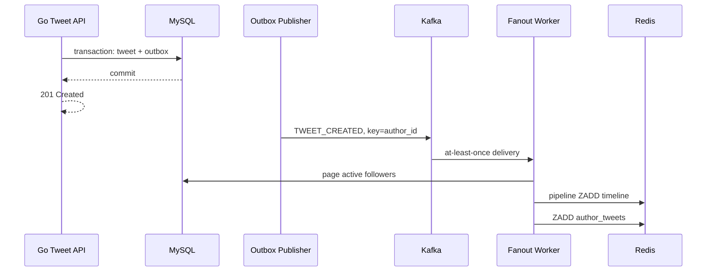

# Feed 流与时间线设计

> **定位**：后期系统设计 Case，用来训练写扩散、读扩散、异步派生数据、复合游标和大规模关系图。
>
> **学习顺序**：当前正式项目仍是 Go 短链。完成短链 V2 后，再用本章理解 outbox、Redis 可重建数据、cursor 和 consumer lag；不建议现在另开 Feed 项目。

---

## 1. 需求、范围与不变量

### 1.1 MVP 功能

| 优先级 | 功能 | 说明 |
|---|---|---|
| P0 | 发帖 | 文本与媒体元数据，媒体文件走对象存储/CDN |
| P0 | 关注流 | 查看已关注作者的帖子 |
| P0 | 关注/取关 | 单向关系 |
| P0 | 删除帖子 | 删除后不能继续对外展示 |
| P1 | 用户主页 | 按时间查看某作者帖子 |
| P1 | 屏蔽 | 双方内容立即不可见 |
| P1 | 点赞/转发 | 计数可最终一致 |
| P2 | 推荐流 | 召回、排序和关注流分开设计 |

### 1.2 非功能目标

| 维度 | 示例目标 |
|---|---|
| DAU | 2 亿 |
| Feed 峰值 | 约 14 万请求/秒 |
| 发帖峰值 | 约 3500 请求/秒 |
| 可见性 | 普通作者新帖 99% 在 5 秒内进入粉丝 Feed |
| 读延迟 | 缓存命中时 P99 < 200ms |
| 一致性 | 帖子源数据强持久；timeline 最终一致 |
| 恢复性 | Redis timeline 丢失后可由关系和帖子源重建 |

### 1.3 关键不变量

1. MySQL 中的帖子和关系是权威数据，Redis timeline 是可重建派生数据。
2. 发帖成功后，必须存在可重试的分发事件；不能只靠“DB 提交后顺手发 MQ”。
3. 删除、取关、屏蔽的读路径必须按权威状态过滤，异步清理只负责降成本。
4. Cursor 必须有稳定全序，不能把超过 `2^53` 的 Snowflake ID直接放进 Redis `float64` score。

---

## 2. 容量估算：区分 API QPS 与内部放大

示例假设：

- DAU：2 亿；
- 每人日均发帖：0.5；
- 每人日均刷新 Feed：20 次；
- 平均关注：200；
- 首页每次返回 20 条。

### 2.1 API QPS

```text
日发帖 = 2亿 × 0.5 = 1亿
平均发帖 QPS = 1亿 / 86400 ≈ 1157
峰值按 3 倍 ≈ 3500

日 Feed 请求 = 2亿 × 20 = 40亿
平均 Feed QPS = 40亿 / 86400 ≈ 46300
峰值按 3 倍 ≈ 14万
```

### 2.2 纯 Push 的写放大

```text
日 timeline 引用写入
= 1亿帖子 × 200粉丝
= 200亿条/天

平均约 23万次写入/秒
峰值按 3 倍约 69万次写入/秒
```

这不是一句“绝对做不到”就结束。还要考虑：

- 活跃粉丝比例；
- 大 V 是否跳过 Push；
- Redis pipeline 和批量；
- 复制流量；
- 每条引用的内存开销；
- 可见性 SLO 和 consumer lag。

### 2.3 Pull 的读放大

最朴素 Pull 在 14 万 Feed QPS 下，每次查询 200 个关注作者：

```text
内部作者流读取 ≈ 14万 × 200 = 2800万次/秒
```

因此纯 Pull 也不可直接照搬。工业实现通常是混合模型、批量多路归并与缓存。

### 2.4 Redis 内存

若 2 亿用户都保留最近 1000 条 timeline 引用，按每条 ZSet 成员平均约 60B 粗估：

```text
2亿 × 1000 × 60B ≈ 12TB
```

这是未计副本、allocator 碎片和 key 元数据的粗估。实际应根据真实编码压测，且只为活跃用户保留 timeline，冷用户按需重建。

### 2.5 出口带宽

若 20 条 Feed JSON 平均 20KB：

```text
14万 × 20KB ≈ 2.8GB/s ≈ 22.4Gbps
```

图片和视频必须走对象存储 + CDN；Feed API 只返回元数据和媒体 URL。

---

## 3. 正式 API 设计

| Method | Path | 说明 |
|---|---|---|
| POST | `/api/v1/tweets` | 发帖 |
| DELETE | `/api/v1/tweets/:id` | 删除自己的帖子 |
| GET | `/api/v1/users/:id/tweets` | 用户主页 |
| PUT | `/api/v1/users/:id/follow` | 关注 |
| DELETE | `/api/v1/users/:id/follow` | 取关 |
| PUT | `/api/v1/users/:id/block` | 屏蔽 |
| DELETE | `/api/v1/users/:id/block` | 解除屏蔽 |
| GET | `/api/v1/feed` | 首页关注流 |

```http
POST /api/v1/tweets
Idempotency-Key: 018f...
{"text":"hello","media_ids":["01J..."],"visibility":"followers"}

GET /api/v1/feed?limit=20&cursor=<opaque>
→ {"items":[],"next_cursor":"...","has_more":true,"as_of":"..."}
```

API 规则：

- `1 <= limit <= 100`；
- cursor 是不透明字符串，客户端只能原样回传；
- 不存在、已删除、无权查看统一按产品规则返回 404；
- 发帖幂等键重放返回原 tweet；
- Feed 可以最终一致，但删除和屏蔽必须由读时权威过滤保证。

---

## 4. 权威数据模型

### 4.1 简化 MySQL Schema

```sql
CREATE TABLE tweets (
  id BIGINT UNSIGNED PRIMARY KEY, author_id BIGINT UNSIGNED NOT NULL,
  text_content VARCHAR(2000) NOT NULL, visibility TINYINT NOT NULL,
  status TINYINT NOT NULL, created_at DATETIME(3) NOT NULL, deleted_at DATETIME(3),
  KEY idx_author_created (author_id,deleted_at,created_at,id)
);
CREATE TABLE follows (
  follower_id BIGINT UNSIGNED NOT NULL, followee_id BIGINT UNSIGNED NOT NULL,
  created_at DATETIME(3) NOT NULL, PRIMARY KEY (follower_id,followee_id),
  KEY idx_followee_follower (followee_id,follower_id)
);
CREATE TABLE blocks (
  blocker_id BIGINT UNSIGNED NOT NULL, blocked_id BIGINT UNSIGNED NOT NULL,
  PRIMARY KEY (blocker_id,blocked_id), KEY idx_blocked (blocked_id,blocker_id)
);
CREATE TABLE feed_outbox (
  id BIGINT UNSIGNED AUTO_INCREMENT PRIMARY KEY,
  event_id CHAR(26) CHARACTER SET ascii COLLATE ascii_bin NOT NULL,
  aggregate_id BIGINT UNSIGNED NOT NULL, event_type VARCHAR(32) NOT NULL,
  payload JSON NOT NULL, next_retry_at DATETIME(3) NOT NULL,
  claimed_until DATETIME(3), published_at DATETIME(3),
  UNIQUE KEY uk_event (event_id),
  KEY idx_pending (published_at,next_retry_at,claimed_until,id)
);
```

### 4.2 大规模关系分片

单表双索引适合学习项目，不代表 400 亿关系边可以放一台 MySQL。

规模增大后通常维护两份邻接视图：

- `following_by_user`：按 follower 分片，服务“我关注谁”；
- `followers_by_user`：按 followee 分片，服务 fan-out；
- 关系事件异步复制到另一视图，读路径明确延迟边界；
- 屏蔽关系因安全语义更严格，需要更短缓存和失败时保守拒绝。

帖子可按 author 分片，tweet ID 需能路由或通过映射服务定位。不要只写“按 user_id 分片”而忽略反向粉丝查询。

---

## 5. Push、Pull 与混合模型

| 模型 | 发帖路径 | 读路径 | 优点 | 代价 |
|---|---|---|---|---|
| Push | 写入粉丝 inbox | 直接读 inbox | 读快 | 写放大 |
| Pull | 只写作者帖子流 | 读时合并关注作者 | 写轻 | 读放大 |
| 混合 | 普通作者 Push，大 V Pull | inbox + 大 V 流归并 | 平衡 | 实现复杂 |

### 5.1 阈值必须由预算推出

不能把“1 万粉”当固定真理。一个作者是否 Push，可由下式判断：

```text
预计 fan-out 成本
= 粉丝数
× 活跃粉丝比例
× 单次写入成本
× 作者发帖频率
```

还要满足：

- 当前 fan-out 集群剩余写预算；
- 目标可见性延迟；
- 作者是否在突发热点名单；
- Redis 内存与复制带宽；
- 是否允许只 Push 给近期活跃粉丝。

阈值应可配置、可观测，并允许按作者动态调整。

### 5.2 推荐策略

- 普通作者：异步 Push 到活跃粉丝 timeline。
- 大 V：不做全量 Push，只维护作者帖子流。
- 冷用户：不长期保存 inbox，首次访问时 Pull 最近窗口。
- 热点公共内容：进入独立热点召回，不塞入所有用户 timeline。
- 推荐流：与关注流分开召回，再统一排序。

---

## 6. 发帖链路：DB 与 outbox 同事务

### 6.1 错误做法

```text
INSERT tweet
COMMIT
publish Kafka
```

如果进程在 COMMIT 后、publish 前崩溃，帖子永久没有 fan-out 事件。Kafka 的“至少一次”只能保证进入 Kafka 之后，不会修复这个窗口。

### 6.2 正确事务

```text
BEGIN
1. INSERT tweets
2. INSERT feed_outbox(event_id, type='TWEET_CREATED')
COMMIT
```

Outbox publisher：

1. 短事务用 `FOR UPDATE SKIP LOCKED` 领取到期事件并写租约；
2. 事务提交后再发布 Kafka，不能持有 DB 行锁等待网络；
3. Kafka key 使用 author_id，保持同作者事件顺序；
4. 发布成功后标记 `published_at`；
5. 若发布成功但标记前崩溃，事件会重复发布，消费者必须幂等。

Go 的 `TweetService.Create` 只调用一个 `WithTx`，在同一回调中 `InsertTweet` 与 `InsertOutbox`。`WithTx` 必须传播 commit 错误；客户端超时重试时，Idempotency-Key 返回原 tweet。

---

## 7. Fan-out Worker 与幂等



工程规则：

- timeline member 只存 tweet ID，`ZADD` 对同一 member 天然幂等；
- follower 分页必须使用稳定 cursor，不使用深 OFFSET；
- 大任务拆成有 `task_id + page_cursor` 的 chunk，便于重试和观测；
- worker 处理成功后再提交 Kafka offset；
- poison event 有限重试后进 DLQ，并保留原 event_id；
- Redis 写失败不删除源事件，重试或进入修复队列；
- `author_tweets` 也是派生数据，可由 tweets 表重建。

发帖 API 成功不等于所有粉丝已经可见；响应和产品提示应接受秒级传播延迟。

---

## 8. Redis Timeline 与正确 Cursor

### 8.1 Key 与值

```text
timeline:{user_id}      ZSet，Push 候选
author_tweets:{user_id} ZSet，作者帖子流
tweet:{tweet_id}        String/Hash，正文缓存
user:{user_id}          String/Hash，作者缓存
```

timeline 只保留最近 N 条，例如 1000。N 由用户刷新频率、离线时长和内存预算决定。

### 8.2 不要把完整 Snowflake 当 score

Redis ZSet score 是 double，只能精确表示到 `2^53`。完整 64 位 Snowflake 通常超过此范围。

推荐：

- score：`created_at.UnixMilli()`，当前数量级远小于 `2^53`；
- member：固定宽度 20 位十进制 tweet ID；
- cursor：`(last_score, last_member, as_of)`。

固定宽度使同 score 下的字典序与数值序一致。

```go
type FeedCursor struct {
	Score  int64  `json:"s"`
	Member string `json:"m"`
	AsOfMS int64  `json:"a"`
}
```

### 8.3 同毫秒边界

`ZREVRANGEBYSCORE` 没有“再传一个 last_id”参数。下一页应：

1. 以 `last_score` 为 inclusive max 读取一批；
2. 对 `score == last_score` 的成员，跳过 `member >= last_member`；
3. 接收更小 member 或更小 score；
4. 若同毫秒数据太多导致不足一页，继续扩大批次；
5. 用最后一条的 score/member 生成 next_cursor。

伪代码：

```go
func afterCursor(item Item, c FeedCursor) bool {
	if item.Score < c.Score {
		return true
	}
	if item.Score > c.Score {
		return false
	}
	return item.Member < c.Member
}
```

首次请求固定 `as_of`，后续页不接收比该快照更新的候选，避免翻页期间新帖插入造成漂移。

### 8.4 混合归并

读取 Feed 时：

1. 读取 Push timeline 的候选；
2. 读取当前关注的大 V 列表；
3. 批量读取各大 V 的 `author_tweets`；
4. 用大小为“来源数”的堆做多路归并；
5. Hydrate 正文和作者；
6. 按删除、关系、屏蔽和可见性做最终过滤；
7. 候选不足时继续向后取。

合并 k 路、返回 n 条，典型复杂度约为初始化 `O(k)` 加 `O(n log k)`，不是 `O(k log n)`。

---

## 9. 关注、取关、删除与屏蔽语义

### 9.1 关注

- MySQL 唯一键保证重复关注幂等；
- 可异步把作者最近 20～50 条回填到新粉丝 timeline；
- 回填只是体验优化，读路径仍可临时 Pull；
- 关系事件也应使用 outbox，避免双邻接视图永久不一致。

### 9.2 取关

取关成功后，旧 timeline 里可能仍有该作者 tweet ID。正确做法：

1. Feed Hydrate 前按权威关注关系过滤，立即不可见；
2. 后台异步清理旧成员，减少以后过滤成本；
3. 不要求同步扫描并删除作者所有历史 tweet，否则接口延迟不可控。

### 9.3 删除帖子

```text
transaction:
  tweets.status = DELETED
  tweets.deleted_at = now
  insert outbox TWEET_DELETED
```

读路径 Hydrate 时发现已删除立即过滤；消费者再从作者流和常见 timeline 异步 ZREM。不能只删 Redis，因为遗漏的 timeline 会继续展示。

### 9.4 屏蔽

屏蔽属于更严格的安全/隐私语义：

- DB 事务写 block，并删除相关 follow 关系；
- 读路径对双方都做权威过滤；
- 缓存失败时应保守拒绝展示，而不是 fail-open；
- 异步清理双方 timeline；
- 解除屏蔽不自动恢复关注，除非产品明确规定。

### 9.5 可见性变更

从公开改为仅粉丝或仅自己可见，与删除类似：权威字段先提交，读时过滤立即生效，outbox 负责清理派生 timeline。

---

## 10. Redis 丢失与重建

Redis timeline 不是唯一数据源。重建流程：

1. 标记用户 timeline 为 rebuilding，避免并发重复重建；
2. 查询权威 following 列表；
3. 批量读取各作者最近时间窗口内的帖子；
4. 多路归并取最近 N 条；
5. pipeline 写入新临时 key；
6. 原子 RENAME 或版本化切换；
7. 记录耗时、候选数和失败原因。

冷用户可以只在首次打开时重建最近 7 天或第一屏；后台再补齐。Redis 故障期间允许退化为有限 Pull，但必须限流，避免把 14 万 QPS 乘以 200 打向数据库。

---

## 11. 缓存策略

优先缓存稳定、可复用对象：

- tweet 正文；
- 用户资料；
- 关系批次；
- 作者最近帖子；
- 首页第一屏可做极短 TTL。

不建议默认缓存每个用户、每个 cursor 的完整响应，组合基数过高且失效困难。

缓存规则：

- 不存在或删除的 tweet 使用短负缓存；
- 热 tweet 回源使用 singleflight；
- TTL 加抖动；
- 删除、屏蔽等安全语义不能只依赖慢 TTL；
- Redis 故障时设置短超时和有界降级，防止请求堆积。

---

## 12. 故障矩阵

| 故障 | 行为 | 恢复 |
|---|---|---|
| Outbox publisher 停止 | 发帖仍落 DB，Feed 延迟增加 | backlog 告警，恢复发布 |
| Kafka 重复消息 | ZADD 重复不产生重复成员 | event/task 幂等 |
| Fan-out 中途崩溃 | 部分粉丝已可见 | chunk 重试、ZADD 幂等 |
| Redis timeline 丢失 | 源帖子不丢 | 按用户重建 |
| Redis 全部不可用 | 发帖可继续落 DB；Feed 限量 Pull/503 | 熔断、恢复预热 |
| MySQL 不可用 | 不能发帖/改关系 | 缓存 Feed 可有限只读 |
| 删除事件积压 | Hydrate 仍过滤删除状态 | 异步 ZREM 追平 |
| 屏蔽缓存不可用 | 保守不展示 | 查 DB 或失败关闭 |
| Ranking 服务超时 | 返回时间序结果 | 降级指标与告警 |

---

## 13. 可观测性与 SLO

### 13.1 指标

```text
feed_request_duration_seconds
feed_items_filtered_total{reason}
feed_outbox_pending / feed_outbox_oldest_age_seconds
feed_fanout_latency_seconds / feed_kafka_consumer_lag
feed_timeline_rebuild_total{result}
feed_redis_errors_total
```

不要把 user_id、tweet_id 直接作为 Prometheus label。

关键告警：outbox 最老事件超时、fan-out P99 超过可见性 SLO、Kafka lag 持续上升、Redis eviction、Hydrate 过滤率或重建失败率突增。

至少演练 outbox 停止后追平、消息重复、worker 半途崩溃、删帖事件延迟、timeline 重建、Redis 故障降级和同毫秒 cursor。

---

## 14. 与短链项目的能力迁移

| 短链项目 | Feed 进阶 |
|---|---|
| Cache Aside，MySQL 为权威 | timeline 是可重建派生数据 |
| cache outbox | tweet/follow/delete outbox |
| Redis Streams/worker 幂等 | Kafka fan-out 与 chunk 幂等 |
| 列表复合 cursor | Feed score/member/as_of cursor |
| 禁用/删除 tombstone | 删除/屏蔽读时权威过滤 |
| Redis 故障回源 | Redis timeline 丢失后重建 |
| consumer lag 指标 | fan-out 可见性 SLO |

短链先帮你练“一个 code 的读热点”；Feed 再练“每个用户一条时间线”的高基数派生数据。

---

## 15. 面试与练习

15 分钟顺序：范围与容量 → Push/Pull 放大 → 动态阈值 → outbox/fan-out → cursor → 关系与故障。

闭卷回答：

1. DB 已提交但 MQ 未发送如何修复？
2. 为什么完整 Snowflake 不能直接作为 ZSet score？
3. 同毫秒 100 条帖子如何验证不重不漏？
4. 取关与删帖如何立即生效又避免同步扫全量 timeline？
5. 大 V 阈值怎样由写预算和 SLO 推出？

能解释 outbox、复合 cursor、派生数据重建和三种关系变更语义，即达到本章要求。

---

- 上一章：[08-短链服务设计](./08-短链服务设计.md)
- 总复习：[10-面试专题与知识点总表](./10-面试专题与知识点总表.md)
