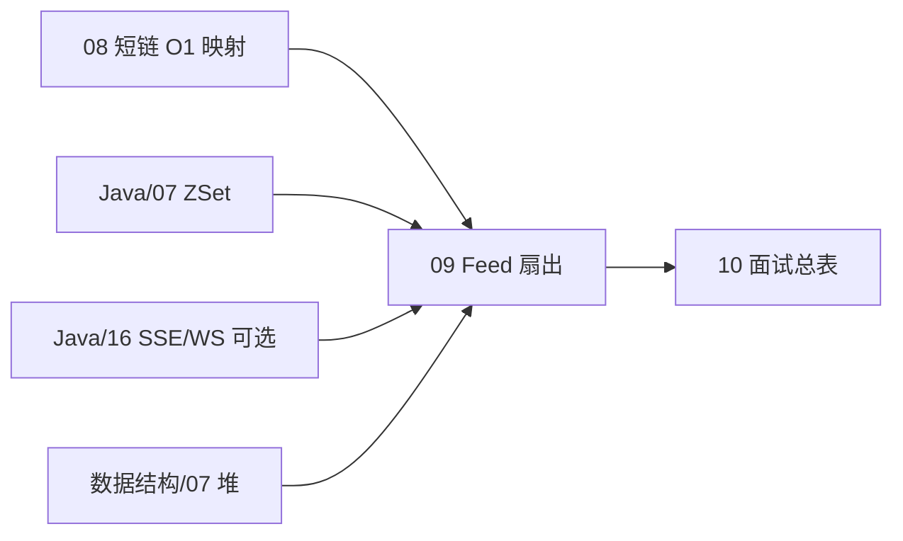
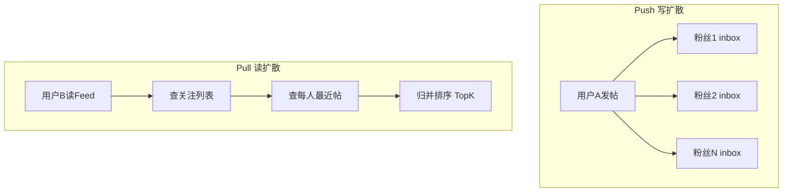
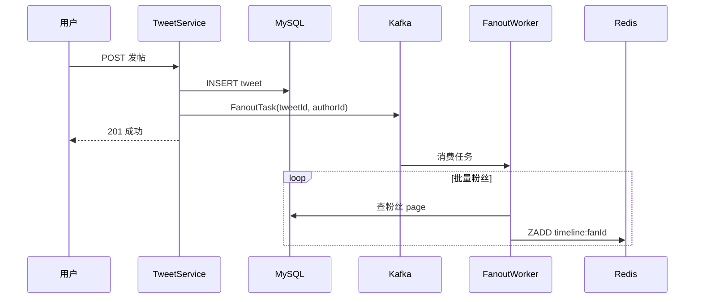
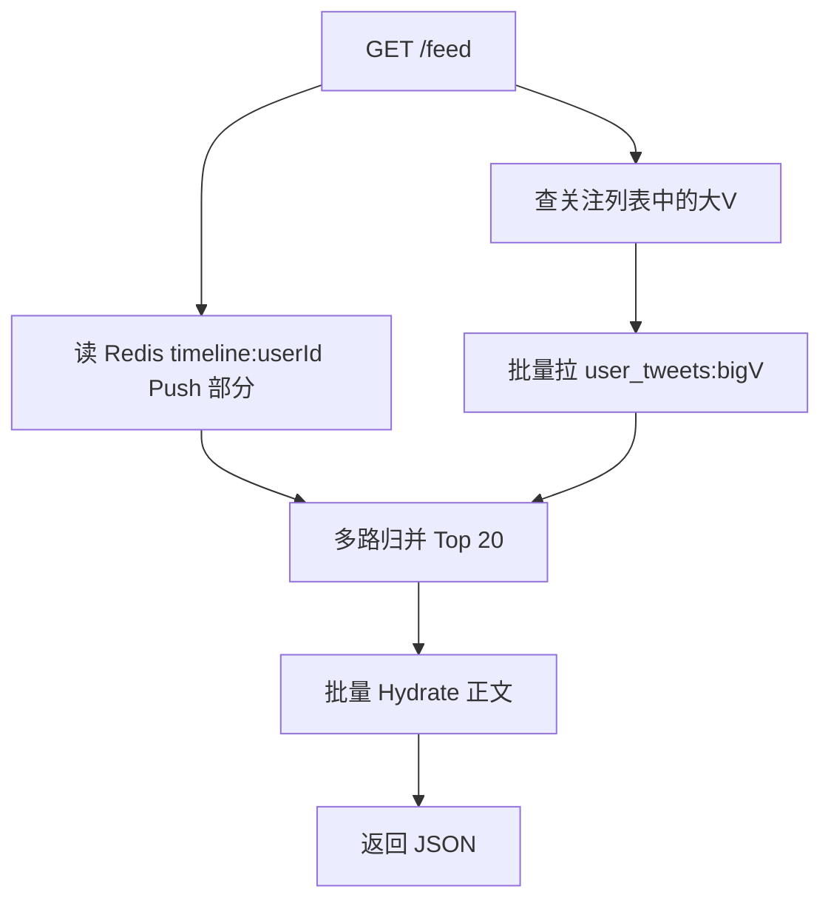
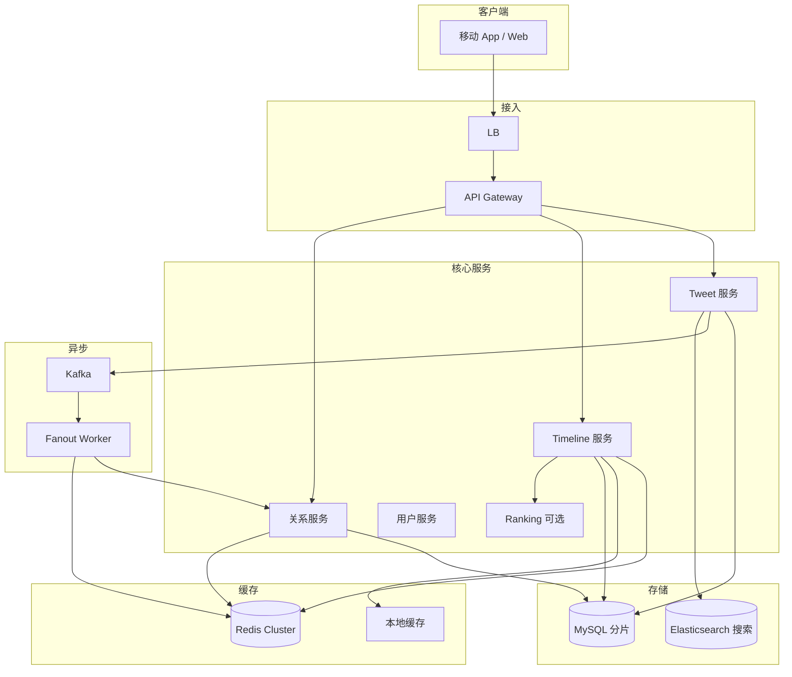
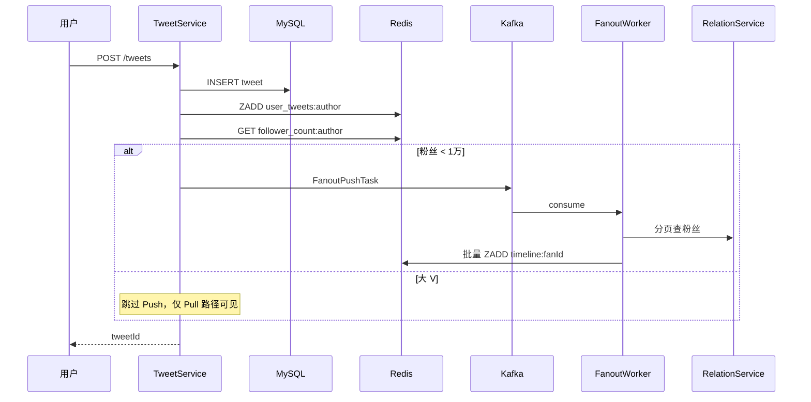
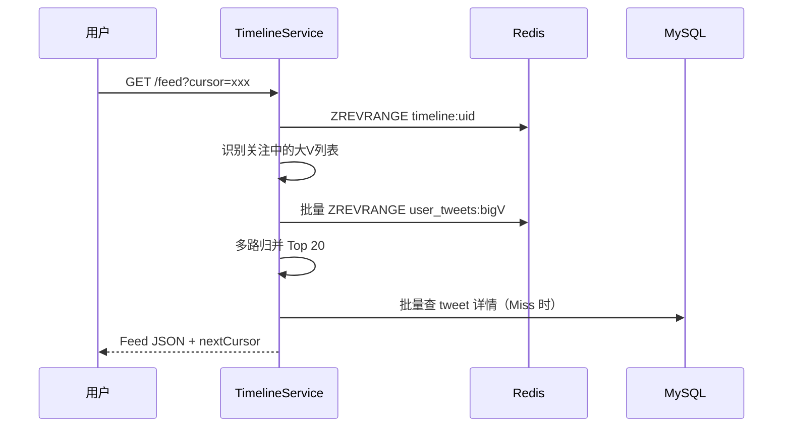

# Feed 流与时间线设计

<!-- 修改说明: 2026-06-30 按 EXPANSION-STANDARD 扩充 §0、Case 步骤表、ZSet 逐行读、FAQ≥12、闭卷自测、费曼检验 -->

> **文件编码**：UTF-8。  
> **定位**：社交类产品核心架构——在 [08 短链](./08-短链服务设计.md) 的读热点经验之上，学习 **Push / Pull / 混合** 模型、**扇出（Fan-out）** 与 **大 V 问题**。  
> **前置**：[03 缓存](./03-缓存架构设计.md)、[05 DB 扩展](./05-数据库扩展与读写分离.md)、[Java/07 Redis](../Java/07-Redis核心原理与缓存实战.md)、[Java/12 高并发](../Java/12-高并发与分布式系统基础.md)。  
> **可选扩展**：[Java/16 SSE 与 WebSocket](../Java/16-SSE与WebSocket实时通信.md) — 新帖实时推送。

---

## 0. 读前导读（零基础也能跟上）

### 0.1 用一句话弄懂本章

**一句话**：发帖是 **一对多扇出**——普通用户 **Push** 到粉丝 inbox，大 V **Pull** 合并；时间线用 **Redis ZSet**，分页用 **cursor** 防漏帖。

### 0.2 你需要提前知道什么

| 你已会 | 可以直接学本章 |
|--------|----------------|
| [08 短链](./08-短链服务设计.md) 读热点、Redis | ✅ 本章 |
| [04 MQ](./04-消息队列架构设计.md) 异步削峰 | ✅ 本章 |
| [Java/07 ZSet](../Java/07-Redis核心原理与缓存实战.md) | ✅ 本章 |
| [数据结构/07 堆](../数据结构/04-树形结构/05-堆.md) K 路归并 | ✅ 进阶 |
| 不懂关注关系建模 | 先读 §13.2 `follows` 表 |

### 0.3 本章知识地图（学完后应能勾选全部 ☐→☑）

- ☐ 3 分钟讲清 **Push / Pull / 混合**
- ☐ 解释 **大 V 问题** 为何不能纯 Push
- ☐ 写 **ZADD + ZREVRANGE** 读 Feed 伪代码
- ☐ 设计 **cursor 分页** API 与 Redis 命令
- ☐ 画 §14 完整架构 + 发帖/读 Feed 时序
- ☐ 闭卷自测（§24）≥ 8/10

### 0.4 建议学习时长与节奏

| 阶段 | 内容 | 建议时长 |
|------|------|----------|
| 第 1 天 | §1～§4 需求、估算、Push/Pull | 2.5 h |
| 第 2 天 | §5～§8 Fan-out、混合、大 V | 2.5 h |
| 第 3 天 | §9～§12 排序、ZSet、分页、缓存 | 2 h |
| 第 4 天 | §14 Case + 模拟 + 自测 | 2 h |

### 0.5 学完本章你能做什么（可验证的具体动作）

1. 估算纯 Push fan-out 为何「2000 亿条/天」不可行
2. 白板画混合模型：粉丝 <1 万 Push，≥1 万 Pull merge
3. 用 **小顶堆** 口述 200 路归并 Top 20 复杂度
4. 说明 offset 分页漏帖原因与 cursor 解法
5. 对比朋友圈（Push）与微博（混合）产品差异

### 0.6 核心术语三件套

**扇出（Fan-out）**：一次写扩散到多个读者的收件箱。  
**生活类比**：老师发通知——抄送每个学生家长（Push）vs 家长自己来公告栏看（Pull）。  
**为什么重要**：Feed 架构的核心矛盾。  
**本章用到的地方**：§5～§7

**写扩散（Push / Fan-out on Write）**：发帖时写入每个粉丝的 `timeline`。  
**生活类比**：给每个粉丝邮箱各发一封副本。  
**为什么重要**：读 Feed 极快 O(1) 拉 inbox。  
**本章用到的地方**：§5

**读扩散（Pull / Fan-out on Read）**：读 Feed 时聚合关注的人最近帖子。  
**生活类比**：打开 App 时再去 200 个朋友家问「最近有啥动态」。  
**为什么重要**：大 V 发帖写一次即可。  
**本章用到的地方**：§6

---

## 本章与上一章的关系

| 上一章（[08 短链服务设计](./08-短链服务设计.md)） | 本章（09） | 下一章（[10 面试总表](./10-面试专题与知识点总表.md)） |
|------------------------------------------------|------------|-----------------------------------------------------|
| 一对一映射：shortCode → URL | **一对多扩散**：发帖 → 粉丝时间线 | 全系列知识点索引 |
| 读多写少、O(1) 点查 | 写扩散 vs 读扩散、列表聚合 | 场景题冲刺 |
| Redis 缓存单 key | Redis **ZSet** 时间线 + 分页 | Mock 面试日程 |
| 异步统计 MQ | 异步 Fan-out、Ranking 服务 | 与 Java/14 对照 |

[08 短链](./08-短链服务设计.md) 是「一个 key 查一次」；Feed 是「**一个写操作影响 N 个读视图**」——架构复杂度跃升。短链用 Counter 生成 ID；Feed 用 **Snowflake 发推 ID** + **ZSet score=时间戳** 排序。



| 模块 | 链接 |
|------|------|
| Redis ZSet、排行榜 | [Java/07 Redis](../Java/07-Redis核心原理与缓存实战.md) |
| 读写分离、分片 | [05 DB 扩展](./05-数据库扩展与读写分离.md) |
| 缓存热点 | [03 缓存架构](./03-缓存架构设计.md) |
| 实时推送（可选） | [Java/16 SSE/WebSocket](../Java/16-SSE与WebSocket实时通信.md) |
| MQ 异步 | [04 MQ 架构](./04-消息队列架构设计.md) |

---

## 1. 这一章解决什么问题

**Feed 流（Timeline / News Feed）** 是 Twitter、微博、朋友圈、Instagram 的核心：用户打开 App，看到关注的人发布的内容按时间或算法排序的列表。

系统设计面试要你能讲清：

1. **Push（写扩散）** vs **Pull（读扩散）** vs **混合**
2. **Fan-out on write** vs **Fan-out on read** 的取舍
3. **大 V / celebrity 问题**（千万粉丝发一条推）
4. 时间线 **排序**（时间序 vs 算法序）
5. **Redis ZSet** 存时间线的工程细节
6. **游标分页** vs offset 分页
7. **热点 Feed 缓存** 与 **冷用户** 优化

---

## 2. 需求澄清

### 2.1 功能需求

| 优先级 | 功能 | 说明 |
|--------|------|------|
| P0 | 发帖 | 用户发布推文（文本、图片、视频元数据） |
| P0 | 首页 Feed | 拉取关注人的推文列表 |
| P0 | 关注 / 取关 | 维护关注关系 |
| P1 | 个人主页 | 某用户历史推文 |
| P1 | 点赞 / 转发 | 互动计数（可异步） |
| P2 | @、话题 # | 索引与检索 |
| P2 | 推荐 Feed | 非纯关注流（算法） |

### 2.2 非功能需求

| 维度 | 典型值 |
|------|--------|
| DAU | 1～5 亿（Twitter 级） |
| 每用户关注数 | 平均 200，上限 5000 |
| 每用户日发帖 | 0.5～2 条 |
| 每用户日刷 Feed | 20～100 次 |
| Feed 延迟 | 发帖后 **< 5s** 出现在粉丝 Feed（Push 模型） |
| 读 QPS | 远高于写 QPS |

### 2.3 澄清问题

```text
□ 纯时间序还是算法排序？
□ 是否单向关注（Twitter）还是双向好友（朋友圈）？
□ 粉丝上限？是否存在百万粉大 V？
□ 发帖后可见性延迟要求？
□ 是否需要「仅自己可见」「粉丝可见」？
```

---

## 3. 容量估算

### 3.1 假设（微博/Twitter 量级）

| 指标 | 数值 |
|------|------|
| DAU | 2 亿 |
| 平均关注 | 200 人 |
| 日发帖 | 1 亿条（2亿 × 0.5） |
| 日 Feed 刷新 | 40 亿次（2亿 × 20） |

### 3.2 QPS

```text
写 QPS（发帖）= 1亿 / 86400 ≈ 1157（平均），峰值 ×3 ≈ 3500

读 QPS（拉 Feed）= 40亿 / 86400 ≈ 46300（平均），峰值 ×3 ≈ 14 万
```

**结论**：读是写的主要压力；缓存与 Fan-out 策略围绕读优化。

### 3.3 存储（Push 模型 fan-out 箱）

若 **写扩散** 到每个粉丝 inbox：

```text
 worst case 单帖 fan-out = 粉丝数
 平均 fan-out ≈ 200（普通用户）
 日写扩散条数 = 1亿帖 × 200 = 2000 亿条/天  ← 不可接受！
```

因此 **纯 Push 不可全局使用**，必须 **混合** 或 **只 Push 普通用户**。

**Pull 模型** 仅存发帖表：

```text
 推文表日增 1亿 × 500B ≈ 50 GB/天
 关注关系 2亿用户 × 200 × 16B ≈ 640 GB（可分区）
```

### 3.4 Fan-out 数量级直觉

| 用户类型 | 粉丝数 | 发帖 fan-out 策略 |
|----------|--------|-------------------|
| 普通 | < 1 万 | Push 到粉丝 inbox |
| 大 V | 1 万～100 万 | **不 Push** 或 Push 到活跃粉丝 |
| 顶流 | > 100 万 | **Pull only** + 热点缓存 |

---

## 4. Push vs Pull vs 混合

### 4.1 三种模型对比

| 模型 | 发帖时 | 读 Feed 时 | 优点 | 缺点 |
|------|--------|------------|------|------|
| **Push（写扩散）** | 写入每个粉丝的 inbox | 直接读 inbox | **读极快** | 写放大；大 V 爆炸 |
| **Pull（读扩散）** | 只写发帖表 | 查关注列表 → 聚合各用户近期帖 | **写轻** | **读慢**、关注多时延迟高 |
| **混合** | 普通 Push；大 V Pull | 合并 inbox + 实时拉大 V | **平衡** | 实现复杂 |

### 4.2 图示



### 4.3 Twitter 演进（公开资料摘要）

- 早期偏 Pull
- 引入 **Fan-out on write** 服务（普通用户）
- **Fan-out on read** 处理大 V（如奥巴马、马斯克级）
- 混合 + **缓存 home timeline**

### 4.4 朋友圈 vs 微博

| 产品 | 关系 | 模型倾向 |
|------|------|----------|
| 微信朋友圈 | 双向好友，人数少 | Push 可行（好友上限 5000） |
| 微博/Twitter | 单向关注，大 V 多 | **必须混合** |
| Instagram | 关注 + 算法 | 混合 + Ranking |

---

## 5. Fan-out on Write 详解

### 5.1 流程

```text
1. 用户 A 发帖 → 生成 tweet_id（Snowflake）
2. 写入 tweets 表（持久化）
3. 查 A 的粉丝列表（可分页批量）
4. 对每个粉丝 B：LPUSH/ZADD 到 timeline:B
5. 可选：异步 MQ 削峰 fan-out 任务
```

### 5.2 Redis ZSet 存 Timeline

```text
Key:   timeline:{userId}
Score: tweet_id 或 发布时间戳（毫秒）
Member: tweet_id
```

**为何 ZSet**：

- 按 score **O(log N)** 插入
- **ZREVRANGE** 按时间倒序取 Top K — O(log N + M)
- 与 [Java/07 ZSet 排行榜](../Java/07-Redis核心原理与缓存实战.md) 同一数据结构

```redis
ZADD timeline:10001 1719756000000 9876543210987654321
ZREVRANGE timeline:10001 0 19 WITHSCORES
```

### 5.3 容量与裁剪

单用户 inbox 不能无限增长：

```text
ZADD 后 ZREMOVANGEBYRANK 保留最新 1000 条
或 EXPIRE + 定期 trim
```

### 5.4 异步 Fan-out



发帖 API **快速返回**；粉丝 Feed 秒级 eventual visible。

与 [04 MQ](./04-消息队列架构设计.md) 一致。

---

## 6. Fan-out on Read 详解

### 6.1 流程

```text
1. 用户 B 请求 Feed page=1
2. 查 B 的关注列表 [A1, A2, ..., A200]
3. 对每个 Ai：查最近 20 条 tweet（带缓存）
4. 200 × 20 = 4000 条候选 → **归并**取 Top 20
5.  Hydrate：批量查 tweet 正文、作者信息
```

### 6.2 归并优化

- 每个关注用户维护 **最近 N 条** ZSet 缓存 `user_tweets:{userId}`
- 200 路 **多路归并**（类似 merge K sorted lists — [数据结构/07 堆](../数据结构/04-树形结构/05-堆.md)）
- 用小顶堆维护 K=20：O(200 log 20)

### 6.3 适用场景

- 大 V 发帖（只写一条 tweet 表，不 fan-out）
- 关注数极多的用户读 Feed（inbox 合并 pull 大 V 列表）

---

## 7. 混合模型（工业界标准答案）

### 7.1 策略

```text
IF 作者粉丝数 < FANOUT_THRESHOLD（如 10000）:
    Push 到所有粉丝 inbox
ELSE:
    仅写入作者 user_tweets:{authorId}
    读者拉 Feed 时，inbox 合并 + 拉取关注的大 V 列表最近帖
```

### 7.2 合并读路径



### 7.3 粉丝数缓存

```text
Redis: follower_count:{userId}  INCR/DECR 关注时更新
发帖时 O(1) 判断 Push or Skip
```

---

## 8. Celebrity Problem（大 V 问题）

### 8.1 问题定义

大 V 有 **1000 万粉丝**，发 1 帖若 Push：

```text
1000 万次 Redis ZADD ≈ 即使 1ms/次也需要 10000 秒
```

不可行。

### 8.2 解决方案矩阵

| 方案 | 说明 |
|------|------|
| **不 Push** | 大 V 帖只在 Pull 路径合并 |
| **Push 活跃粉丝** | 仅 30 天内活跃粉丝 inbox |
| **分级 Fan-out** | 在线粉丝 SSE 推送；离线 Pull |
| **预计算 hot feed** | 全局热点榜单独 product |
| **限流发帖** | 产品层限制（不解决架构） |

### 8.3 微博实践（公开技术分享归纳）

- 普通用户：**推**模式
- 大 V：**拉**模式 + 缓存
- **关系服务** 与 **Timeline 服务** 拆分
- **Memcached** 多级缓存 timeline

---

## 9. 时间线排序与 Ranking

### 9.1 纯时间序（Chronological）

```text
score = publish_timestamp
ZREVRANGE 即最新在前
```

- 简单、可预期
- Twitter 曾提供「最新 / 推荐」切换

### 9.2 算法排序（Algorithmic Feed）

```text
score = f(时间衰减, 互动率, 亲密度, 内容质量)
```

| 因子 | 说明 |
|------|------|
| 时间衰减 | 越新越高 |
| 互动 | 赞转评加权 |
| 亲密度 | 常互动的人权重高 |
| 多样性 | 避免同一作者刷屏 |

**架构**：

```text
离线/近线：Ranking 服务对候选集打分
在线：Feed 召回（Push inbox + Pull）→ Ranking → 重排 → 返回
```

### 9.3 与 ZSet 的关系

- 时间序：score = timestamp
- 算法序：可 **每次读时重算**（inbox 存 tweet_id，score 不作为最终序）或 **二级排序服务**

---

## 10. Redis ZSet 工程细节

### 10.1 Key 设计

| Key | 类型 | 说明 |
|-----|------|------|
| `timeline:{uid}` | ZSet | 用户 home timeline |
| `user_tweets:{uid}` | ZSet | 用户发推历史 |
| `following:{uid}` | Set/ZSet | 关注列表 |
| `followers:{uid}` | Set | 粉丝列表（fan-out 用） |

### 10.2 命令与复杂度

| 操作 | 命令 | 复杂度 |
|------|------|--------|
| 插入 | ZADD | O(log N) |
| 最新 20 条 | ZREVRANGE 0 19 | O(log N + 20) |
| 分页 | ZREVRANGEBYSCORE | O(log N + M) |
| 裁剪 | ZREMRANGEBYRANK | O(log N + M) |

### 10.3 持久化与高可用

- Redis Cluster 按 `uid` 分片
- 热 key：`timeline:celebrity_fan` 可能过大 → 拆分或 Pull

详见 [Java/07 Redis](../Java/07-Redis核心原理与缓存实战.md)。

---

## 11. 分页：Offset vs Cursor

### 11.1 Offset 分页的问题

```http
GET /feed?page=2&size=20  → OFFSET 20 LIMIT 20
```

Feed **实时新增** 会导致：

- **重复**：翻页时新帖插入，第 2 页看到第 1 页已有内容
- **漏帖**：同理

### 11.2 游标（Cursor）分页 — 推荐

```http
GET /feed?limit=20
GET /feed?limit=20&cursor=9876543210987654321
```

**cursor** = 上一页最后一条的 `tweet_id` 或 `(score, tweet_id)`：

```redis
ZREVRANGEBYSCORE timeline:10001 (cursor_score -inf LIMIT 20
```

或使用 **Snowflake ID** 单调递减特性：`tweet_id < cursor`。

**响应**：

```json
{
  "tweets": [...],
  "nextCursor": "9876543210987654320",
  "hasMore": true
}
```

### 11.3 对比

| 方式 | 一致性 | 性能 |
|------|--------|------|
| Offset | 差 | OFFSET 大时慢 |
| **Cursor** | **好** | 稳定 O(log N + M) |

---

## 12. 热点 Feed 缓存

### 12.1 热点类型

| 热点 | 说明 |
|------|------|
| 热用户 Feed | 明星粉丝也疯狂刷新 |
| 热 tweet | 单条病毒传播 |
| 全局热点 | 热搜榜 |

### 12.2 缓存策略

```text
1. 完整 Feed 响应缓存（短 TTL 30s）：feed:cache:{uid}:{cursor}
2. tweet 正文缓存：tweet:{id}
3. 用户信息：user:{id}
4. 本地 Caffeine + Redis 二级
```

### 12.3 与 [03 缓存架构](./03-缓存架构设计.md) 一致

- **穿透**：不存在的 tweet_id 布隆过滤
- **击穿**：singleflight 加载热 tweet
- **雪崩**：TTL 加随机

### 12.4 冷用户优化

长时间不登录用户：

- inbox 过期清空
- 首次打开 **Pull 重建** 或 **只拉最近 7 天**

---

## 13. 数据库 Schema

### 13.1 推文表

```sql
CREATE TABLE tweets (
    id           BIGINT PRIMARY KEY COMMENT 'Snowflake',
    user_id      BIGINT NOT NULL,
    content      TEXT,
    media_urls   JSON,
    reply_to_id  BIGINT NULL,
    created_at   DATETIME NOT NULL,
    KEY idx_user_created (user_id, created_at DESC)
) ENGINE=InnoDB;
```

### 13.2 关注关系

```sql
CREATE TABLE follows (
    follower_id  BIGINT NOT NULL,
    followee_id  BIGINT NOT NULL,
    created_at   DATETIME NOT NULL,
    PRIMARY KEY (follower_id, followee_id),
    KEY idx_followee (followee_id)
) ENGINE=InnoDB;
```

- `follower_id` 查「我关注了谁」（Pull 用）
- `followee_id` 查「谁关注我」（Fan-out 用）

### 13.3 是否存 timeline 表

| 方案 | 说明 |
|------|------|
| 仅 Redis | 快，丢数据需重建 |
| Redis + MySQL timeline 表 | 持久化 inbox，成本高 |
| **Twitter 做法** | Redis/Memcached 为主，持久化 tweet 源 + 重建 |

与 [05 分库分表](./05-数据库扩展与读写分离.md)：`user_id` / `tweet_id` 分片。

---

## 14. 完整 Case Study：微博风格

### 14.1 架构图



### 14.2 发帖时序（混合 Fan-out）



### 14.3 读 Feed 时序



### 14.4 可选：实时推送

新帖 Fan-out 完成后，对 **在线粉丝** 通过 [SSE/WebSocket](../Java/16-SSE与WebSocket实时通信.md) 推送 `{type: "new_tweet", tweetId}`，客户端增量刷新或插入顶部。

```text
FanoutWorker 完成 ZADD →  Pub/Sub 或 Push 服务 → WS 连接
```

非必须，但面试加分。

### 14.5 Case Study 手把手步骤表

| 步骤 | 场景 | 你的动作 | 预期结果 | 若不对 |
|------|------|----------|----------|--------|
| 1 | 发帖 | INSERT `tweets` + ZADD `user_tweets:author` | tweet 持久化 | 只写 Redis → 丢数据 |
| 2 | 发帖 | GET `follower_count:author` | 判断 Push/Pull | 每次扫粉丝表 → 慢 |
| 3 | 发帖 | 粉丝 <1万：发 MQ FanoutTask | API 快速 201 | 同步 fan-out → 超时 |
| 4 | Fan-out | 分页读粉丝列表批量 ZADD | 粉丝 inbox 更新 | 一次拉千万粉丝 → OOM |
| 5 | 发帖 | 大 V：跳过 Push | 只写 author 时间线 | 强 Push → 小时级延迟 |
| 6 | 读 Feed | ZREVRANGE `timeline:uid` | Push 部分候选 | 无裁剪 → ZSet 无限涨 |
| 7 | 读 Feed | 批量拉大 V `user_tweets` | Pull 部分候选 | 漏 merge → 看不到大 V |
| 8 | 读 Feed | 小顶堆归并 Top 20 | 统一排序 | offset 分页 → 漏帖 |
| 9 | 读 Feed | Hydrate 批量查正文 | 完整 JSON | N+1 查询 → RT 爆炸 |
| 10 | 可选 | WS 推 `{new_tweet}` 给在线粉丝 | 近实时 | 强依赖 Push 完成 |

### 14.6 Redis ZSet 读 Feed 逐行读

| 命令/代码 | 含义 | 改错会怎样 |
|-----------|------|------------|
| `ZADD timeline:uid score tweetId` | score 常用时间戳 ms | score 乱序 → 时间线乱 |
| `ZREVRANGE 0 19` | 最新 20 条 | 用 RANGE 升序 → 旧帖在前 |
| `ZREMRANGEBYRANK` 保留 1000 | 裁剪 inbox | 不裁剪 → 内存爆 |
| `ZREVRANGEBYSCORE (cursor -inf` | cursor 分页 | 用 OFFSET → 漏帖重复 |
| `ZADD` 幂等 | 同 tweetId 重复 fan-out | 无幂等 → 重复条目 |

---

## 15. 与 Twitter 风格对照

| 维度 | Twitter 早期 | Twitter 混合 | 微信朋友圈 |
|------|--------------|--------------|------------|
| 关系 | 单向 | 单向 | 双向 |
| 模型 | Pull 为主 | Push + Pull 大V | Push |
| 排序 | 时间 + 推荐 | Algorithmic | 时间 |
| 分页 | Cursor | Cursor | Cursor |
| 存储 | Manhattan + Redis | 多层 cache | 定制 |

### 15.1 Case Study 变体：微信朋友圈（纯 Push）

**场景**：双向好友、平均 150 人、上限 5000；**无大 V** 问题；纯时间序。

```text
发帖 → 查好友列表（≤5000）→ 同步或 MQ Push 到每个好友 timeline
读 Feed → 直接 ZREVRANGE timeline:uid
```

| 对比微博混合模型 | 朋友圈 |
|------------------|--------|
| 关系 | 双向 vs 单向 |
| Fan-out 上限 | 5000 有界 |
| 大 V | 基本无 |
| 模型 | **纯 Push 可行** |
| 存储 | 可按用户分片 inbox |

**面试话术**：「若面试官说朋友圈，我会先确认 **双向好友 + 人数上限**，则 Push 简单可行；微博必须混合。」

---

## 16. 15 分钟模拟面试提纲

```text
1. 需求（2 min）：发帖、Feed、关注；读 QPS >> 写
2. 模型（3 min）：Push 读快写放大；Pull 相反；混合阈值
3. 大 V（2 min）：不 Push；读时 merge
4. 存储（2 min）：tweet 表 + Redis ZSet timeline；Schema
5. 分页（1 min）：cursor + ZREVRANGEBYSCORE
6. 扩展（3 min）：MQ 异步 fan-out、Ranking、缓存
7. 取舍（2 min）：最终一致 timeline；5s 可见可接受
```

---

## 17. 常见面试追问

### Q1：Push 和 Pull 怎么选？

**答**：没有银弹。关注少、读多、延迟敏感 → Push；大 V 多 → 混合。朋友圈 Push；微博/Twitter 混合。

### Q2：Fan-out 失败怎么办？

**答**：MQ 重试 + 死信；粉丝 inbox 可重建（从 follow 表 + tweet 表 Pull 修复）。

### Q3：取消关注后 timeline 怎么处理？

**答**：Lazy 删除（读时过滤）或异步 ZREM 该作者 tweet_id（需维护 tweet→author 映射）。

### Q4：如何保证不漏帖？

**答**：Push 路径靠 MQ 至少一次 + 幂等 ZADD；Pull 路径靠多路归并完整性；cursor 分页防重复漏。

### Q5：Feed 和搜索区别？

**答**：Feed 是关注闭集内的时序/排序；搜索是全站 ES 倒排索引，架构分离。

### Q6：朋友圈为什么可以纯 Push？

**双向好友**、人数上限约 5000，fan-out 有界；微博/Twitter **单向关注 + 大 V** 必须混合。

### Q7：Fan-out Worker 分区键怎么设？

按 **authorId** 分区保证同作者发帖顺序；消费者 **水平扩展**；批量大小 500～2000 粉丝/批 权衡 RT 与吞吐。

### Q8：timeline 存 Redis 丢了怎么办？

tweet **源表 MySQL 持久化**；inbox 可从 `follows` + `tweets` **重建**（慢路径）；生产 Redis 持久化 + 多副本。

### Q9：算法排序和时间序能共存吗？

**双模式**产品开关；inbox 存 tweet_id，**读时 Ranking 打分重排**；或维护两套 timeline（成本高）。

### Q10：冷用户首次打开慢怎么优化？

inbox 过期后 **Pull 重建**最近 7 天；或 **懒加载**第一屏 + 后台预热。

### Q11：与 08 短链的 Redis 用法差异？

短链 **String GET** 点查；Feed **ZSet 范围查询** + 归并；Feed key 更多、内存更大。

### Q12：读 Feed 的 QPS 14 万怎么扛？

**缓存** feed 响应短 TTL、tweet 正文缓存、**cursor** 稳定查询；热用户 **本地缓存**；Ranking **离线预计算**减负。

---

## 18. 分级练习

### 18.1 基础档

1. 画 Push vs Pull 对比表（写路径、读路径、优缺点）
2. 解释为何大 V 不能纯 Push
3. 写 Redis ZADD + ZREVRANGE 读 Feed 伪代码

### 18.2 进阶档

1. 设计 `follows` + `tweets` 表及索引
2. 200 关注 Pull 模型：如何用堆归并 Top 20
3. 设计 cursor 分页 API 与 `ZREVRANGEBYSCORE` 参数

### 18.3 挑战档

1. 完整混合 Fan-out：阈值 1 万，画 Mermaid 架构
2. 设计 Fan-out Worker 批量大小、MQ 分区键
3. 45 分钟模拟 Feed + 算法排序 Ranking 服务

### 18.4 参考答案要点

**混合阈值**：粉丝 < 1万 Push；≥ 1万 Pull merge。

**Cursor**：用 `(score, tweet_id)` 元组；下一页 `ZREVRANGEBYSCORE key (last_score (last_id`。

---

## 19. 学完标准

| 标准 | 自检 |
|------|------|
| ⬜ 知道 | Push/Pull 定义、大 V 问题、ZSet 存 timeline |
| 🔶 会用 | 画混合架构；写 cursor 分页；设计 follows 表 |
| ✅ 会讲 | 15 分钟 Case；对比 Twitter/微博；讲 Fan-out 异步 |

**量化目标**：

- [ ] 3 分钟讲清 Push vs Pull vs 混合
- [ ] 5 分钟画完整架构 + 发帖/读 Feed 时序
- [ ] 能答大 V、分页、缓存三个追问
- [ ] 知道 ZSet score 用 timestamp 还是 tweet_id

---

## 20. 与其他章节的关系

| 章节 | 关联 |
|------|------|
| [03 缓存](./03-缓存架构设计.md) | 热 Feed、tweet 正文缓存 |
| [04 MQ](./04-消息队列架构设计.md) | 异步 Fan-out |
| [05 DB 扩展](./05-数据库扩展与读写分离.md) | tweet、follow 分片 |
| [06 CAP](./06-分布式一致性与CAP.md) | Timeline 最终一致 |
| [08 短链](./08-短链服务设计.md) | 读热点、Redis、MQ 统计类比 |

---

## 21. 我的笔记区

```text
Push/Pull 选择：
大 V 阈值：
分页方案：
是否算法排序：
模拟面试日期：
```

---

## 23. 闭卷自测

完成后再看 §23.1 参考答案。

1. **概念** Push 与 Pull 在写路径、读路径各做什么？
2. **概念** 为何大 V 不能对千万粉丝纯 Push？
3. **概念** 混合模型阈值（如 1 万粉）两侧策略是什么？
4. **概念** Redis ZSet 存 timeline 时 score 常用什么？
5. **概念** offset 分页为何漏帖？cursor 如何解决？
6. **概念** 异步 Fan-out 对发帖 API 的意义？
7. **动手** 写 `ZADD` + `ZREVRANGE` 读最新 20 条伪代码。
8. **动手** `follows` 表两个索引分别服务什么查询？
9. **综合** 200 关注 Pull 模型如何用堆归并 Top 20？
10. **综合** 取消关注后 timeline 如何处理？（Lazy vs ZREM）

### 23.1 自测参考答案

1. Push 写时扩散到粉丝 inbox；Pull 读时聚合关注者近期帖。  
2. 千万次 ZADD 不可完成；写放大爆炸。  
3. <1万 Push；≥1万只写 author，读者 merge Pull。  
4. 发布时间戳 ms 或 Snowflake tweet_id（单调）。  
5. 翻页时新帖插入导致位移；cursor 用最后一条 score/id 锚定。  
6. 发帖 API 毫秒返回，fan-out 后台完成，削峰。  
7. `ZADD timeline:uid ts tweetId`；`ZREVRANGE timeline:uid 0 19`。  
8. `follower_id` 查关注谁；`followee_id` 查粉丝列表 fan-out。  
9. 200 路各取头元素入最小堆，弹堆顶 20 次，O(200 log 20)。  
10. Lazy 读时过滤；或异步 ZREM 该作者 tweet_id 集合。

---

## 24. 费曼检验

请在不看资料的情况下，用 **3 分钟**向朋友解释：**「发微博后，粉丝多久能在首页看到？系统背后分几步？」**

**对照提纲（能说到即过关）**：

1. **发帖** 先落 DB，API 快速返回。  
2. **普通用户** MQ 异步 fan-out 写粉丝 `timeline` ZSet。  
3. **大 V** 不 push，粉丝读时 **pull merge**。  
4. **最终一致** 秒级可见；在线可选 WS 推送增量。

---

## 25. 延伸阅读

- [Java/07 Redis ZSet](../Java/07-Redis核心原理与缓存实战.md)
- [Java/16 SSE/WebSocket](../Java/16-SSE与WebSocket实时通信.md) — 可选实时推送
- [数据结构/07 堆](../数据结构/04-树形结构/05-堆.md) — K 路归并
- Twitter Engineering Blog（Fan-out 相关文章）
- [Java/14 场景面试](../Java/14-高频场景设计与面试专题.md)

---

上一章：[08-短链服务设计](./08-短链服务设计.md)  
下一章：[10-面试专题与知识点总表](./10-面试专题与知识点总表.md)

*本章已按 EXPANSION-STANDARD 扩充（§0+Case 步骤表+ZSet 逐行读+FAQ+闭卷自测+费曼）。*

**EXPANSION-STANDARD 自检**：☑ §0 ☑ Case 步骤表 §14.5 ☑ ZSet 逐行读 §14.6 ☑ FAQ≥12 ☑ 闭卷 10 题 §23 ☑ 费曼 §24
