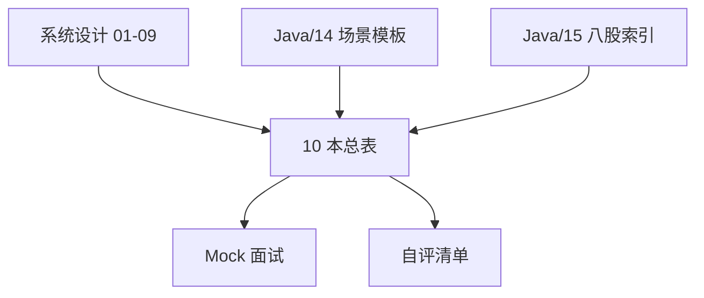
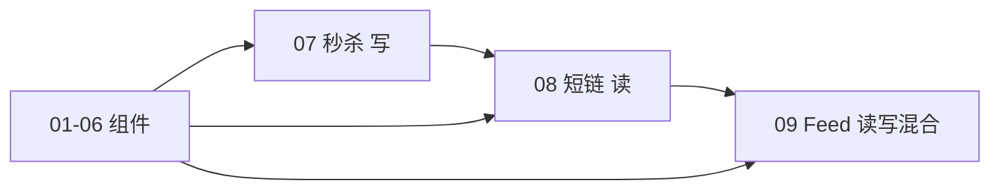

# 面试专题与知识点总表

<!-- 修改说明: 2026-06-30 按 EXPANSION-STANDARD 扩充 §0 读前导读、Case 对照深化、FAQ≥12、二轮复习、闭卷自测、费曼检验；系统设计 01～09 收官 -->

> **文件编码**：UTF-8。复习索引：详细讲解见对应编号文档。建议学完一轮后逐项自评 **⬜知道 / 🔶会用 / ✅会讲**。  
> 与 [Java/14 高频场景](../Java/14-高频场景设计与面试专题.md)、[Java/15 补充知识点](../Java/15-补充知识点总表.md)、[数据结构/12 面试总表](../数据结构/09-综合复习/README.md) 结构对齐，范围为 **系统设计 01～09 全章**。

---

## 0. 读前导读（零基础也能跟上）

### 0.1 用一句话弄懂本章

**一句话**：**系统设计 01～09 的「总复习 + 抽题剧本」**——用自评表、场景题库、Mock 日程把方法论、组件、三大 Case（秒杀/短链/Feed）收成 **面试前 60 分钟能刷完** 的索引。

**生活类比——驾考科目四 + 路考口诀**：

| 本篇块 | 类比 |
|--------|------|
| §3 知识点总表 | 科目四分类题库 |
| §4 场景题 | 模拟路况应急 |
| §6 综合速查 | 考前 10 分钟背口诀 |
| §7 Mock 日程 | 两周冲刺课表 |
| §9 Case 对比 | 轿车/SUV/货车选型对照 |
| 闭卷自测 | 模考 90 分线 |

### 0.2 你需要提前知道什么

| 条件 | 说明 |
|------|------|
| **最低** | 过完 **01 方法论 + 07 秒杀** 可先刷 §4.2、§6.2 |
| **推荐** | **01～09 全部学完** 再闭卷自测 |
| **最佳** | 配合 [Java/14](../Java/14-高频场景设计与面试专题.md) 各模拟 15 分钟 |

### 0.3 本章知识地图（☐→☑）

- [ ] §3 各章自评表 **≥80%** 达 🔶
- [ ] §4 场景题能 **抽 3 题** 用 4+1 框架答
- [ ] §6 速查表 **闭卷复述**
- [ ] §7 完成 **Mock 1 + Mock 2**
- [ ] §9 说出 07/08/09 **三维差异**（读写、Redis、一致性）
- [ ] 闭卷自测 §18 **≥ 8/10**

### 0.4 建议使用方式（时间盒）

| 场景 | 时间 | 动作 |
|------|------|------|
| 单章学完 | 15 min | 回 §3 对应行打勾 |
| 09 章后 | 2 h | §8 自评总表 + 弱项回章 |
| 面试前 3 天 | 每天 1 h | §4 抽题 + §6 速查 |
| 面试前 60 min | 速览 | §6 + §9 Case 对比 + §12 抽题 |

### 0.5 读完本章你能做什么

1. 随机抽「秒杀/短链/Feed」**15 分钟**白板讲架构。
2. 拿到「设计下单」题，**2 分钟内**开始需求澄清 + QPS 估算。
3. 对照 [Java/14](../Java/14-高频场景设计与面试专题.md) 说出每场景对应的 **系统设计章号**。
4. 用 §7 Rubric 自评 Mock，定位「估算弱」或「深入弱」。

### 0.6 资料建设进度速查

| 编号 | 文件名 | 建设状态 | 重点内容 |
|------|--------|----------|----------|
| 00 | 学习路线图与说明 | ✅ EXPANSION-STANDARD | 顺序、与 Java 分工 |
| 01 | 系统设计方法论与面试框架 | ✅ EXPANSION-STANDARD | 4+1 步、容量估算 |
| 02 | 限流熔断与降级 | ✅ EXPANSION-STANDARD | 令牌桶、Sentinel |
| 03 | 缓存架构设计 | ✅ EXPANSION-STANDARD | 多级缓存、一致性 |
| 04 | 消息队列架构设计 | ✅ EXPANSION-STANDARD | 异步、幂等、顺序 |
| 05 | 数据库扩展与读写分离 | ✅ EXPANSION-STANDARD | 分片、读副本 |
| 06 | 分布式一致性与 CAP | ✅ EXPANSION-STANDARD | CAP、最终一致 |
| 07 | 秒杀系统简化设计 | ✅ EXPANSION-STANDARD | Case Study |
| 08 | 短链服务设计 | ✅ EXPANSION-STANDARD | Hash、302、布隆 |
| 09 | Feed 流与时间线设计 | ✅ EXPANSION-STANDARD | Push/Pull、ZSet |
| 10 | 本总表 | ✅ EXPANSION-STANDARD | 索引 + 场景题 + Mock |

**图例**：⬜ 知道概念 · 🔶 能画架构/写方案 · ✅ 能 15 分钟面试讲清取舍

**系统设计路线 11/11 已全部按 EXPANSION-STANDARD 扩充完成。**

---

## 0.7 资料建设进度速查（归档）

*已合并至 §0.6，保留兼容锚点。*

## 1. 这份文件的作用

- **查漏补缺**：01～09 学完后逐项勾选
- **面试前 60 分钟**：过薄弱专题 + 场景题清单
- **定位章节**：不会的点回到 [00～09 章](./00-学习路线图与说明.md) 重学
- **与 Java 路线配合**：设计深度看本系列，答题模板看 [Java/14](../Java/14-高频场景设计与面试专题.md)，八股索引看 [Java/15](../Java/15-补充知识点总表.md)



---

## 2. 全章索引（01～09 一句话 + 链接）

| 编号 | 文档 | 一句话 | Java 扩展 |
|------|------|--------|-----------|
| 01 | [方法论与面试框架](./01-系统设计方法论与面试框架.md) | 需求→估算→API→Schema→扩展 | [12 高并发](../Java/12-高并发与分布式系统基础.md)、[14 场景](../Java/14-高频场景设计与面试专题.md) |
| 02 | [限流熔断与降级](./02-限流熔断与降级.md) | 流量过载保护 | [12 限流](../Java/12-高并发与分布式系统基础.md) |
| 03 | [缓存架构设计](./03-缓存架构设计.md) | 多级缓存与一致性 | [07 Redis](../Java/07-Redis核心原理与缓存实战.md) |
| 04 | [消息队列架构设计](./04-消息队列架构设计.md) | 异步削峰与可靠 | [08 RabbitMQ](../Java/08-RabbitMQ与消息队列实战.md) |
| 05 | [数据库扩展与读写分离](./05-数据库扩展与读写分离.md) | 分片与读副本 | [06 MySQL](../Java/06-MySQL基础索引与事务.md) |
| 06 | [分布式一致性与 CAP](./06-分布式一致性与CAP.md) | CAP、最终一致、事务选型 | [12 CAP](../Java/12-高并发与分布式系统基础.md) |
| 07 | [秒杀系统简化设计](./07-秒杀系统简化设计.md) | 高并发写 Case | 14 秒杀模板 |
| 08 | [短链服务设计](./08-短链服务设计.md) | 读热点 + 统计 Case | [07 Redis](../Java/07-Redis核心原理与缓存实战.md)、[05 哈希表](../数据结构/03-哈希表/README.md) |
| 09 | [Feed 流与时间线设计](./09-Feed流与时间线设计.md) | Push/Pull Case | [07 ZSet](../Java/07-Redis核心原理与缓存实战.md)、[16 SSE 可选](../Java/16-SSE与WebSocket实时通信.md) |

---

## 3. 知识点总表（按章节）

### 3.1 方法论与估算（01）

| 知识点 | 文档 | 掌握标准 | 自评 |
|--------|------|----------|------|
| 4+1 设计步 | 01 | 需求、估算、API、Schema、扩展 | ⬜ |
| 功能 vs 非功能需求 | 01 | 各举 3 例 | ⬜ |
| QPS 估算 | 01 | DAU × 操作/天 ÷ 86400 × 峰值系数 | ⬜ |
| 存储估算 | 01 | 条数 × 单条大小 × 年限 | ⬜ |
| 带宽估算 | 01 | QPS × 响应体大小 | ⬜ |
| 读写比 | 01 | 读多写少 vs 写多读少 | ⬜ |
| 延迟 vs 一致 | 01 | 澄清优先级 | ⬜ |
| API 设计 REST | 01 | 资源、动词、状态码 | ⬜ |

### 3.2 限流熔断降级（02）

| 知识点 | 文档 | 掌握标准 | 自评 |
|--------|------|----------|------|
| 固定窗口 | 02 | 边界双倍问题 | ⬜ |
| 滑动窗口 | 02 | 计数器实现 | ⬜ |
| 令牌桶 | 02 | 允许突发 | ⬜ |
| 漏桶 | 02 | 平滑输出 | ⬜ |
| 熔断三状态 | 02 | 关闭/打开/半开 | ⬜ |
| 降级策略 | 02 | 默认值、缓存、关功能 | ⬜ |
| 网关 vs 服务限流 | 02 | 分层防护 | ⬜ |
| Sentinel/Hystrix | 02 | 概念即可 | ⬜ |

**速查表 — 限流算法**

| 算法 | 突发 | 实现难度 | 典型场景 |
|------|------|----------|----------|
| 固定窗口 | 边界突发 | 低 | 粗粒度配额 |
| 滑动窗口 | 较平滑 | 中 | API 限流 |
| 令牌桶 | **允许突发** | 中 | Guava、网关 |
| 漏桶 | 严格平滑 | 中 | 下游保护 |

### 3.3 缓存架构（03）

| 知识点 | 文档 | 掌握标准 | 自评 |
|--------|------|----------|------|
| Cache Aside | 03 | 先更 DB 再删缓存 | ⬜ |
| Read/Write Through | 03 | 缓存层代理 | ⬜ |
| 穿透 | 03 | 布隆 / 空对象 | ⬜ |
| 击穿 | 03 | 互斥锁 / 逻辑过期 | ⬜ |
| 雪崩 | 03 | TTL 随机、集群 HA | ⬜ |
| 多级缓存 | 03 | 本地 + Redis + CDN | ⬜ |
| 热点 key | 03 | 本地缓存、拆分 | ⬜ |
| 一致性延迟 | 03 | 可接受业务窗口 | ⬜ |

**速查表 — 缓存问题**

| 现象 | 原因 | 对策 |
|------|------|------|
| 穿透 | key 不存在 | 布隆过滤器、空值短 TTL |
| 击穿 | 热 key 过期 | singleflight、逻辑过期 |
| 雪崩 | 大量同时过期 | TTL 随机、限流降级 |

### 3.4 消息队列（04）

| 知识点 | 文档 | 掌握标准 | 自评 |
|--------|------|----------|------|
| 削峰填谷 | 04 | 秒杀、Fan-out | ⬜ |
| 异步解耦 | 04 | 下单后发 MQ | ⬜ |
| 至少一次 | 04 | 重复消费 + 幂等 | ⬜ |
| 顺序消息 | 04 | 同 key 单分区 | ⬜ |
| 延迟消息 | 04 | 关单、定时 | ⬜ |
| 死信队列 | 04 | 重试失败处理 | ⬜ |
| 幂等消费 | 04 | 业务号、状态机 | ⬜ |
| MQ 选型 | 04 | Kafka vs RabbitMQ 粗对比 | ⬜ |

**速查表 — MQ 使用场景**

| 场景 | 作用 | 对应章节 |
|------|------|----------|
| 下单通知 | 异步解耦 | 04、07 |
| 秒杀异步落库 | 削峰 | 07 |
| 短链点击统计 | 异步聚合 | 08 |
| Feed Fan-out | 写扩散削峰 | 09 |
| 延迟关单 | 延迟队列 | 04、Java/14 |

### 3.5 数据库扩展（05）

| 知识点 | 文档 | 掌握标准 | 自评 |
|--------|------|----------|------|
| 读写分离 | 05 | 主写从读、复制延迟 | ⬜ |
| 垂直分库 | 05 | 按业务拆 | ⬜ |
| 水平分表 | 05 | shard key 选择 | ⬜ |
| 分片路由 | 05 | hash / range | ⬜ |
| 跨分片查询 | 05 | 尽量避免 | ⬜ |
| 全局 ID | 05 | Snowflake、号段 | ⬜ |
| 单表上限 | 05 | 500万～2000万粗估 | ⬜ |

### 3.6 分布式一致性（06）

| 知识点 | 文档 | 掌握标准 | 自评 |
|--------|------|----------|------|
| CAP | 06 | 三选二、分区下 CP/AP | ⬜ |
| BASE | 06 | 基本可用、软状态、最终一致 | ⬜ |
| 强一致 vs 最终一致 | 06 | 库存 vs 统计 | ⬜ |
| 2PC/TCC/Saga | 06 | 能对比 | ⬜ |
| 本地消息表 | 06 | 出库流程 | ⬜ |
| Raft/Paxos | 06 | 知道用途 | ⬜ |

**速查表 — CAP 举例**

| 系统 | 选型 | 说明 |
|------|------|------|
| 秒杀库存 | CP 倾向 | 不能超卖 |
| 短链统计 | AP 倾向 | 统计可延迟 |
| Feed Timeline | AP | 秒级可见即可 |
| 配置中心 | CP | Etcd、Zookeeper |

### 3.7 秒杀（07）

| 知识点 | 文档 | 掌握标准 | 自评 |
|--------|------|----------|------|
| 静态化/CDN | 07 | 页面与 assets | ⬜ |
| 网关限流 | 07 | 入口防护 | ⬜ |
| Redis 预减 | 07 | 库存缓存 | ⬜ |
| DB 扣库存 SQL | 07 | WHERE num >= ? | ⬜ |
| MQ 异步下单 | 07 | 削峰 | ⬜ |
| 超卖方案 | 07 | 事务 + 乐观锁 | ⬜ |
| 热点隔离 | 07 | 独立队列/缓存 | ⬜ |

**速查表 — 秒杀三层防护**

```text
第一层：CDN + 静态页 + 按钮防重
第二层：网关限流 + Redis 预减库存
第三层：MQ 异步 + DB 事务扣减 + 幂等
```

### 3.8 短链（08）

| 知识点 | 文档 | 掌握标准 | 自评 |
|--------|------|----------|------|
| Hash vs Counter | 08 | 碰撞 vs 单点 | ⬜ |
| Base62 | 08 | URL 友好编码 | ⬜ |
| 301 vs 302 | 08 | 统计 vs 缓存 | ⬜ |
| 布隆过滤器 | 08 | 防穿透 | ⬜ |
| 异步点击统计 | 08 | MQ + 聚合 | ⬜ |
| short_code 分片 | 08 | hash 路由 | ⬜ |
| CDN 302 | 08 | 短 TTL 折中 | ⬜ |

**速查表 — 短码方案**

| 方案 | 优点 | 缺点 |
|------|------|------|
| Hash | 无中心 ID | 碰撞 |
| Counter+Base62 | 简单无碰撞 | 需分布式 ID |
| Snowflake | 大规模 | 实现复杂 |

### 3.9 Feed 流（09）

| 知识点 | 文档 | 掌握标准 | 自评 |
|--------|------|----------|------|
| Push 写扩散 | 09 | 读快写放大 | ⬜ |
| Pull 读扩散 | 09 | 写轻读慢 | ⬜ |
| 混合模型 | 09 | 粉丝阈值 | ⬜ |
| 大 V 问题 | 09 | 不 Push / Pull merge | ⬜ |
| Redis ZSet timeline | 09 | ZADD/ZREVRANGE | ⬜ |
| Cursor 分页 | 09 | 防重复漏 | ⬜ |
| 算法排序 | 09 | Ranking 服务 | ⬜ |
| 异步 Fan-out | 09 | MQ Worker | ⬜ |

**速查表 — Feed 模型**

| 模型 | 写 | 读 | 适用 |
|------|----|----|------|
| Push | 重 | 轻 | 普通用户、朋友圈 |
| Pull | 轻 | 重 | 大 V、关注多 |
| 混合 | 中 | 中 | Twitter/微博 |

---

## 4. 场景题库（按主题）

### 4.1 基础架构类

| 场景题 | 核心考点 | 本系列章节 | Java/14 对应 |
|--------|----------|------------|--------------|
| 设计登录系统 | JWT、BCrypt、限流 | 01、02 | §2 登录 |
| 设计商品详情 | Cache Aside、三大问题 | 03 | §3 商品缓存 |
| 慢接口排查 | 分层定位 | 03、05 | §9 慢接口 |
| 设计验证码 | Redis TTL、防刷 | 02、03 | §13 验证码 |
| 设计排行榜 | ZSet | 03、09 | §14 排行榜 |

### 4.2 交易与高并发类

| 场景题 | 核心考点 | 本系列章节 | Java/14 对应 |
|--------|----------|------------|--------------|
| 设计下单接口 | 事务、幂等、MQ | 04、06 | §4 下单 |
| 防重复下单 | 前端+接口+DB | 04 | §5 防重 |
| 超卖问题 | SQL、乐观锁、Redis | 07 | §22 下单 |
| 设计秒杀 | 全链路 | 07 | 07 全文 |
| 延迟关单 | 延迟 MQ / 扫描 | 04 | §15 延迟关单 |

### 4.3 存储与中间件类

| 场景题 | 核心考点 | 本系列章节 | Java/14 对应 |
|--------|----------|------------|--------------|
| DB 扛不住 | 索引、缓存、读写分离、分表 | 03、05 | §6 DB |
| Redis 挂了 | 降级、限流、HA | 03、02 | §7 Redis |
| MQ 重复消费 | 幂等 | 04 | §8 重复消费 |
| 缓存一致性 | 先更 DB 删缓存 | 03、06 | §16 一致性 |

### 4.4 经典系统设计题

| 场景题 | 核心考点 | 本系列章节 | 备注 |
|--------|----------|------------|------|
| 设计短链服务 | Base62、302、布隆 | **08 全文** | 08 Case |
| 设计 Feed/Twitter | Push/Pull、大 V | **09 全文** | 09 Case |
| 设计 URL Shortener | 同短链 | 08 | 国际面试常考 |
| 设计朋友圈 | Push 可行 | 09 | 双向关注少 |
| 设计分布式 ID | Snowflake | 05、08 | 号段、UUID |

### 4.5 场景题万能答题框架

```text
1. 需求澄清（2 min）— 功能、用户量、一致性、延迟
2. 容量估算（2 min）— QPS、存储、带宽数量级
3. API 设计（1 min）— 核心接口
4. 数据模型（2 min）— 核心表 / Redis key
5. 架构图（3 min）— 组件 + 数据流
6. 深入 2～3 难点（5 min）— 缓存/MQ/分片/扇出
7. 权衡与不足（1 min）— 没有银弹
```

与 [Java/14 §19](../Java/14-高频场景设计与面试专题.md) STAR + 技术分层一致。

---

## 5. 与 Java/14、Java/15 对照映射

### 5.1 Java/14 场景 → 系统设计章节

| Java/14 章节/场景 | 深入学习的系统设计章 |
|-------------------|----------------------|
| 登录系统 | 01 + 02 |
| 商品详情缓存 | 03 全文 |
| 下单 / 超卖 | 04 + 06 + 07 |
| 防重复下单 | 04 幂等 |
| MQ 重复消费 | 04 |
| 慢接口排查 | 03 + 05 |
| 验证码 | 02 + 03 |
| 排行榜 | 03 + 09 ZSet |
| 延迟关单 | 04 |
| 缓存一致性 | 03 + 06 |
| （14 未单独列）秒杀 | **07 全文** |
| （14 未单独列）短链 | **08 全文** |
| （14 未单独列）Feed | **09 全文** |

### 5.2 Java/15 八股 → 系统设计章节

| Java/15 主题（节选） | 系统设计对应 |
|----------------------|--------------|
| Redis 五种类型 | 03、08、09 |
| MySQL 索引事务 | 05、07、08 |
| Spring 事务 | 07 扣库存 |
| 线程池 | 02 隔离、09 Fan-out Worker |
| JVM | 面试加分，非 SD 核心 |
| 分布式锁 | 03 击穿、07 秒杀 |

完整八股清单见 [Java/15](../Java/15-补充知识点总表.md)。

### 5.3 学习路径建议

```text
平时：系统设计 01～09 系统学（每周 1～2 章）
考前 3 天：本总表自评 + Java/14 场景模板
考前 1 天：07/08/09 各 15 分钟 mock 一遍
考前 2 小时：速查表 §3.2～3.9 + 薄弱项 ⬜→🔶
```

---

## 6. 综合速查表（面试前 10 分钟）

### 6.1 限流 / 缓存 / MQ 一句话

| 主题 | 一句话 |
|------|--------|
| **限流** | 入口保护；令牌桶允许突发；网关 + 服务双层 |
| **缓存** | Cache Aside；先更 DB 删缓存；穿透击穿雪崩 |
| **MQ** | 异步削峰；至少一次 + 消费幂等；Fan-out/秒杀/统计 |

### 6.2 CAP / 秒杀 / 短链 / Feed 一句话

| 主题 | 一句话 |
|------|--------|
| **CAP** | 分区必发生；CP 保一致（库存）；AP 保可用（统计、Feed） |
| **秒杀** | CDN → 限流 → Redis 预减 → MQ → DB 事务 |
| **短链** | INCR+Base62；302+Redis；布隆防穿透；MQ 统计 |
| **Feed** | 混合 Push/Pull；大 V 不 Push；ZSet+cursor 分页 |

### 6.3 组件选型速查

| 需求 | 首选组件 | 章节 |
|------|----------|------|
| 热数据读 | Redis | 03 |
| 排行榜/时间线 | Redis ZSet | 07 Java、09 |
| 异步任务 | Kafka/RabbitMQ | 04 |
| 持久化映射 | MySQL + 分片 | 05、08 |
| 点击/行为分析 | MQ → ClickHouse | 08 |
| 全文搜索 | Elasticsearch | 09 扩展 |
| 实时推送 | SSE/WebSocket | Java/16 |

---

## 7. Mock 面试日程（2 周冲刺）

### 7.1 第一周：方法论 + 组件

| 天 | 复习内容 | 练习 | 时长 |
|----|----------|------|------|
| D1 | 01 方法论 | 估算「微博发帖」QPS | 2h |
| D2 | 02 限流 | 对比四种算法 + 画熔断状态机 | 2h |
| D3 | 03 缓存 | 口述 Cache Aside + 三大问题 | 2h |
| D4 | 04 MQ | 画下单发 MQ 时序图 | 2h |
| D5 | 05 DB | 设计 user_id 分表规则 | 2h |
| D6 | 06 CAP | CP/AP 各举 2 系统 | 2h |
| D7 | **Mock 1** | 随机：商品缓存 + 下单（30min） | 3h |

### 7.2 第二周：Case Study + 总复习

| 天 | 复习内容 | 练习 | 时长 |
|----|----------|------|------|
| D8 | 07 秒杀 | 15min 默讲 + 画架构图 | 2h |
| D9 | 08 短链 | 15min 默讲 Hash vs Counter | 2h |
| D10 | 09 Feed | 15min 默讲 Push/Pull/大V | 2h |
| D11 | 本总表 §4 场景题 | 抽 3 题用框架答 | 2h |
| D12 | Java/14 对照 | 过 14 章 §20～23 参考答案 | 2h |
| D13 | 薄弱项 | ⬜ 项回对应章重学 | 2h |
| D14 | **Mock 2** | 完整 45min：秒杀 or 短链 or Feed | 3h |

### 7.3 Mock 评分 Rubric（自评）

| 维度 | 权重 | ✅ 标准 |
|------|------|---------|
| 需求澄清 | 15% | 主动问 DAU、读写比、一致性 |
| 容量估算 | 15% | 数量级正确（差 10 倍内） |
| 架构完整 | 25% | API + 存储 + 缓存/MQ |
| 深入难点 | 25% | 至少 2 点讲取舍 |
| 表达结构 | 10% | 分层清晰、不跳步 |
| 权衡意识 | 10% | 提到不足与备选方案 |

---

## 8. 全系列自评总表

学完 01～09 后，目标 **≥ 80%** 达到 🔶 或以上：

| 章节 | ⬜ | 🔶 | ✅ | 备注 |
|------|----|----|-----|------|
| 01 方法论 | | | | |
| 02 限流 | | | | |
| 03 缓存 | | | | |
| 04 MQ | | | | |
| 05 DB | | | | |
| 06 CAP | | | | |
| 07 秒杀 | | | | |
| 08 短链 | | | | |
| 09 Feed | | | | |

**统计**：✅ 数量 ___ / 9；🔶 数量 ___ / 9

---

## 9. 07 / 08 / 09 Case 对比表

| 维度 | 07 秒杀 | 08 短链 | 09 Feed |
|------|---------|---------|---------|
| 读写特点 | 写热点 | 读热点 | 读远大于写 |
| 核心瓶颈 | 库存扣减 | 跳转 QPS | Fan-out |
| Redis 用法 | 预减库存 | 映射缓存 | ZSet timeline |
| MQ 用法 | 异步下单 | 点击统计 | Fan-out 任务 |
| 一致性 | 强一致库存 | 映射强一致 | Timeline 最终一致 |
| 典型算法 | 限流、事务 | Base62、布隆 | Push/Pull、归并 |
| 面试时长 | 15～20 min | 15 min | 15～20 min |



### 9.1 三大 Case 面试答题步骤对照

| 步骤 | 07 秒杀 | 08 短链 | 09 Feed |
|------|---------|---------|---------|
| 需求澄清 | 库存、限购、峰值 QPS | 读写比、统计延迟、302 | 关注模型、大 V、延迟 |
| 估算 | 5万 QPS，5000 库存 | 读 5000 QPS，TB 存储 | 读 14万 QPS，fan-out |
| 核心 API | POST 抢购 | POST 创建、GET 跳转 | POST 发帖、GET feed |
| 第一难点 | Redis Lua + MQ | 302 + 布隆 + 缓存 | Push/Pull 混合 |
| 第二难点 | 三层防超卖 | 异步统计 | 大 V + cursor |
| 一致性 | 库存 CP 倾向 | 映射强、统计弱 | Timeline 最终一致 |
| 降级 | Redis 熔断 503 | 统计可丢、跳转优先 | Fan-out 积压仍可读 |

### 9.2 Case 组合追问速记

```text
秒杀 + CAP     → 超卖零容忍，Redis+DB 兜底
短链 + 缓存    → 穿透布隆、击穿 singleflight
Feed + MQ      → 异步 fan-out，作者 ID 分区
Feed + Redis   → ZSet timeline，热 key 裁剪
短链 + 限流    → 创建防刷，跳转 CDN
秒杀 + 限流    → 网关第一道坝
```

---

## 10. 常见面试组合题

| 组合 | 考法 | 应对 |
|------|------|------|
| 短链 + 限流 | 防刷创建 | 02 令牌桶 + 用户配额 |
| 短链 + 缓存 | 穿透击穿 | 03 布隆 + singleflight |
| Feed + MQ | 异步 Fan-out | 04 分区 + 幂等 ZADD |
| Feed + Redis | 热 timeline | 03 热点 + 09 ZSet |
| 秒杀 + MQ + DB | 全链路 | 07 标准答案 |
| 秒杀 + CAP | 超卖 vs 可用 | 06 CP 库存 |

---

## 11. 表达模板（30 秒 / 3 分钟 / 15 分钟）

### 11.1 30 秒 elevator pitch

「这是一个 **[读多写少 / 写热点]** 的系统。核心路径是 **[跳转 / 扣库存 / 拉 Feed]**，我会用 **[Redis + MQ + MySQL 分片]**，难点在 **[防超卖 / 统计 / 大 V fan-out]**，一致性上 **[强一致 / 最终一致]**。」

### 11.2 3 分钟（Java/14 风格）

需求 30s → 架构 60s → 核心流程 60s → 一个难点 30s

### 11.3 15 分钟（本系列 Case 风格）

按 [01 方法论 4+1 步](./01-系统设计方法论与面试框架.md) 完整展开，含估算与 Mermaid 口述。

---

## 12. 推荐 Mock 题目清单（抽题用）

```text
1.  设计秒杀系统（07）
2.  设计短链服务（08）
3.  设计 Twitter Feed（09）
4.  设计朋友圈（09 Push 变体）
5.  商品详情高并发读（03）
6.  下单防超卖（07+04）
7.  缓存与 DB 不一致（03+06）
8.  设计分布式 ID 发号器（05+08）
9.  设计延迟任务系统（04）
10. 设计登录 + 限流（01+02）
11. 设计排行榜（03 ZSet）
12. 短链如何扛 1 万 QPS 单链（08 热点）
13. 1000 万粉丝发推（09 大 V）
14. 读写分离延迟导致脏读（05+06）
15. 如何设计 API 网关（02 限流）
16. 设计评论系统（09 推拉 + 分页）
17. 设计站内通知（04 MQ + 04 延迟）
18. 设计搜索建议（03 缓存 + ES 扩展）
```

### 12.1 场景题难度分级

| 难度 | 题目示例 | 建议时长 |
|------|----------|----------|
| ⭐ | 商品缓存、验证码 | 15 min |
| ⭐⭐ | 秒杀、短链、下单 | 20～30 min |
| ⭐⭐⭐ | Feed、大 V、多活 | 35～45 min |
| ⭐⭐ | 缓存一致性、读写延迟 | 20 min（深挖） |

### 12.2 白板必备组件贴纸

```text
□ Client  □ CDN  □ API Gateway  □ LB
□ Service（无状态）  □ Redis  □ MQ  □ MySQL
□ 分片箭头  □ 异步虚线  □ 降级红色叉
```

---

## 13. 资料交叉链接总表

| 类型 | 路径 |
|------|------|
| 路线图 | [00-学习路线图与说明](./00-学习路线图与说明.md) |
| Java 后端 | [Java/00 路线图](../Java/00-学习路线图与说明.md) |
| 场景模板 | [Java/14 高频场景](../Java/14-高频场景设计与面试专题.md) |
| 八股总表 | [Java/15 补充知识点](../Java/15-补充知识点总表.md) |
| 算法结构 | [数据结构/12 面试总表](../数据结构/09-综合复习/README.md) |
| 哈希原理 | [数据结构/05 哈希表](../数据结构/03-哈希表/README.md) |
| Redis 实战 | [Java/07 Redis](../Java/07-Redis核心原理与缓存实战.md) |
| MySQL | [Java/06 MySQL](../Java/06-MySQL基础索引与事务.md) |
| 实时推送 | [Java/16 SSE/WebSocket](../Java/16-SSE与WebSocket实时通信.md) |

---

## 14. 学完后你应该能做哪些事

- [ ] 01～09 自评表 ≥ 80% 🔶 以上
- [ ] **15 分钟**讲完 07/08/09 中至少 **两个** Case
- [ ] 拿到任意场景题能 **2 分钟内** 澄清需求并开始估算
- [ ] 速查表（限流/缓存/MQ/CAP/秒杀/短链/Feed）**闭卷复述**
- [ ] 知道每题去 **哪一章** 复习，而非死记硬背

---

## 15. 我的冲刺笔记区

```text
Mock 1 日期 / 得分 / 薄弱点：
Mock 2 日期 / 得分 / 薄弱点：
必考公司常考场景：
⬜ 待攻克清单：
计划正式面试日期：
```

---

## 16. FAQ

### Q1：系统设计 10 和 Java/14 先看哪个？

**答**：先系统学 01～09，再用 10 自评；Java/14 随时当「答题口语模板」。考前两本对照刷。

### Q2：07/08/09 哪个最重要？

**答**：国内后端 **秒杀 > 短链 > Feed** 出现频率略高；外企 SD 轮 **短链、Feed** 更常见。三题都应能 15 分钟讲。

### Q3：需要画多细的架构图？

**答**：面试白板：**客户端 → 网关 → 服务 → Redis/DB/MQ** 即可；Case 题加一条核心时序。不必画机房。

### Q4：算法要学到什么程度？

**答**：系统设计不考 LeetCode Hard；但 **哈希、ZSet、多路归并**（[数据结构 05/07](../数据结构/03-哈希表/README.md)）要能讲清楚复杂度。

### Q5：Mock 面试需要录音吗？

**强烈推荐**。回听能发现「跳步」「没估算」「只堆名词」；对照 §7.3 Rubric 打分。

### Q6：校招实习要掌握到哪一级？

**07 秒杀 + 03 缓存 + 04 MQ** 达 🔶 通常够用；有余力 **08 短链**；大厂 SD 轮加 **09 Feed**。

### Q7：和 Java/15 八股怎么分配时间？

**15** 每天碎片背；**本系列** 周末整块画架构；考前 **14 模板 + 10 索引** 合练。

### Q8：估算差一个数量级会挂吗？

差 **2～5 倍** 通常可接受，要说清假设；差 **100 倍** 暴露无直觉，需重练 [01 估算](./01-系统设计方法论与面试框架.md)。

### Q9：二轮复习怎么安排？

见 **§17 二轮复习计划**（距面试 7～14 天）。

### Q10：三大 Case 只背一个够吗？

不够；**07 写热点、08 读热点、09 扇出** 代表三类瓶颈，面试官常换壳考同一套路。

### Q11：需要学 K8s 吗？

本章 **01～09 不依赖 K8s**；面试提「无状态服务水平扩展 + HPA」即可，深入可学 [Linux 12 Docker](../Linux/12-Docker容器基础.md)。

### Q12：系统设计 10 章学完后下一步？

横向 [Java/14](../Java/14-高频场景设计与面试专题.md) 模拟；纵向选 notehub 项目把 **03 缓存 + 04 MQ** 落代码；按 §7 执行 Mock 日程。

---

## 17. 二轮复习计划（7～14 天）

| 天 | 主题 | 动作 | 产出 |
|----|------|------|------|
| D-14 | 01～02 | 4+1 默写 + 限流算法表 | 估算 1 题手算 |
| D-13 | 03～04 | Cache Aside + MQ 时序图 | 各画 1 张 Mermaid |
| D-12 | 05～06 | 分片 key + CAP 举例 | 口述 outbox |
| D-11 | 07 秒杀 | 15 min 录音 | Rubric 自评 |
| D-10 | 08 短链 | 15 min 录音 | 301/302 必答 |
| D-9 | 09 Feed | 15 min 录音 | 大 V 混合模型 |
| D-8 | 薄弱项 | ⬜ 项回章 | 笔记 1 页 |
| D-7 | §4 场景题 | 抽 5 题 | 4+1 提纲 |
| D-6 | Java/14 | 对照 §5.1 | 交叉表填空 |
| D-5 | §6 速查 | 闭卷 | 错项清单 |
| D-4 | Mock 3 | 45 min 完整 Case | 同伴反馈 |
| D-3 | 07+08 | 连考 30 min | 不看书 |
| D-2 | 09+组合题 | §10 组合 | 各 1 题 |
| D-1 | 休息 | 只看 §6 + §9.2 | 早睡 |

---

## 18. 闭卷自测

完成后再看 §18.1 参考答案。

1. **概念** 4+1 设计步是哪五步？
2. **概念** 令牌桶与漏桶的核心区别？
3. **概念** Cache Aside 更新时为何「先更 DB 再删缓存」？
4. **概念** MQ「至少一次」如何做到消费语义上的恰好一次？
5. **概念** CAP 分区时互联网 C 端多数选什么？库存扣减呢？
6. **概念** 秒杀三层防护分别是什么？
7. **动手** 短链跳转核心 Redis 命令与 key 命名？
8. **动手** Feed cursor 分页比 offset 好的原因一句话？
9. **综合** 对比 07/08/09 的读写特点与 Redis 用法。
10. **综合** 设计「下单扣库存」涉及本系列哪几章？各解决什么？

### 18.1 自测参考答案

1. 需求→估算→API→Schema→+1 扩展。  
2. 令牌桶允许突发；漏桶平滑恒定输出。  
3. 先删缓存可能把旧 DB 值写回；先更 DB 则 miss 读到新值。  
4. 消费者幂等（唯一索引/状态机/dedup 表）。  
5. C 端 AP+最终一致；库存 CP 倾向（Redis+DB 不超卖）。  
6. 网关限流；Redis Lua；MQ+DB 乐观锁+唯一索引。  
7. `GET url:{shortCode}`；miss 查 DB 再 SET EX。  
8. Feed 实时新增导致 offset 位移漏帖/重复；cursor 锚定最后一条。  
9. 07 写热点/String+Lua；08 读热点/String 映射；09 读写混合/ZSet timeline。  
10. 01 方法论、04 MQ 异步、06 一致性/outbox、07 秒杀模式、03 缓存可选。

---

## 19. 费曼检验

请在不看资料的情况下，用 **3 分钟**向朋友解释：**「系统设计面试和普通八股有什么不同？你怎么准备？」**

**对照提纲（能说到即过关）**：

1. **八股** 考知识点记忆；**系统设计** 考 **假设→估算→架构→取舍** 链条。  
2. **不能只会堆 Redis/MQ**，要先澄清 DAU、读写比、一致性。  
3. **准备法**：01～09 系统学 → 10 自评 → Java/14 练口语 → Mock 录音。

---

上一章：[09-Feed流与时间线设计](./09-Feed流与时间线设计.md)  
回到路线图：[00-学习路线图与说明](./00-学习路线图与说明.md)

*本章已按 EXPANSION-STANDARD 扩充（§0+Case 对照§9.1+二轮§17+FAQ+闭卷自测+费曼）。*

**EXPANSION-STANDARD 自检**：☑ §0 ☑ Case 对照 §9.1 ☑ 二轮 §17 ☑ FAQ≥12 ☑ 闭卷 10 题 §18 ☑ 费曼 §19 ☑ 索引章 800+ 行
